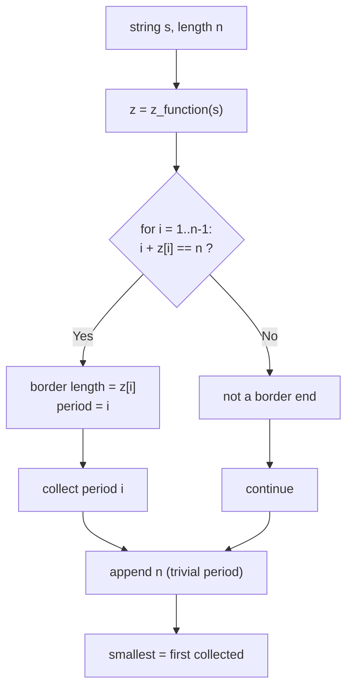

# Distinct String Periods with the Z-Function

| Meta | Value |
|------|-------|
| Source | Classic / Self-contained |
| Difficulty | Medium |
| Topics | Strings, Z-Function, Periods, Borders |
| Time | $O(n)$ |
| Space | $O(n)$ |
| Link | — (self-contained) |

---

## Problem Statement
Given a string `s` of length `n`, find **all periods** of `s` and, in particular, the **smallest
period**. A length `p` (with `1 <= p <= n`) is a *period* of `s` if shifting `s` by `p` leaves
the overlapping region unchanged:

$$
s[i] = s[i + p] \quad \text{for all } 0 \le i < n - p
$$

Equivalently `p` is a period iff `s` has a **border** of length `n - p` (a proper prefix equal to
a proper suffix). The smallest period is the most compressed "rhythm" of the string.

**Example**
```
s = "abcabcab"   (n = 8)
Periods: 3, 6, 8
Smallest period = 3        ("abc" repeated, with a partial tail "ab")
```

---

## Why the Z-Function?

Borders are exactly the suffixes that are also prefixes — and `z[i]` measures how long the suffix
starting at `i` matches the prefix. So a suffix that runs all the way to the end **and** equals a
prefix is detected by:

$$
i + z[i] = n \;\Longrightarrow\; s[i \ldots n-1] \text{ is a border of length } z[i]
$$

and the corresponding **period is `i`** (since `period = n - border = n - z[i] = i`). Sweep all
`i`, collect those satisfying `i + z[i] = n`, append the trivial period `n`, and you have every
period in sorted order. The smallest is simply the first such `i`.

This is $O(n)$ versus the naive $O(n^2)$ of testing every candidate period by full comparison.

---

## Solution (Paired Python + C++)

```python
def z_function(s):
    n = len(s)
    z = [0] * n
    l, r = 0, 0
    for i in range(1, n):
        if i < r:
            z[i] = min(r - i, z[i - l])
        while i + z[i] < n and s[z[i]] == s[i + z[i]]:
            z[i] += 1
        if i + z[i] > r:
            l, r = i, i + z[i]
    return z

def all_periods(s):
    n = len(s)
    z = z_function(s)
    periods = []
    for i in range(1, n):
        if i + z[i] == n:        # suffix s[i..] is a prefix -> border length z[i]
            periods.append(i)    # period = n - border = i
    periods.append(n)            # the trivial full-length period
    return periods               # strictly increasing

def smallest_period(s):
    periods = all_periods(s)
    return periods[0]            # first (smallest) period
```

```cpp
#include <bits/stdc++.h>
using namespace std;

vector<int> z_function(const string& s) {
    int n = (int)s.size();
    vector<int> z(n, 0);
    int l = 0, r = 0;
    for (int i = 1; i < n; ++i) {
        if (i < r)
            z[i] = min(r - i, z[i - l]);
        while (i + z[i] < n && s[z[i]] == s[i + z[i]])
            ++z[i];
        if (i + z[i] > r) {
            l = i;
            r = i + z[i];
        }
    }
    return z;
}

vector<int> all_periods(const string& s) {
    int n = (int)s.size();
    vector<int> z = z_function(s);
    vector<int> periods;
    for (int i = 1; i < n; ++i)
        if (i + z[i] == n)        // suffix s[i..] is a prefix -> border length z[i]
            periods.push_back(i); // period = n - border = i
    periods.push_back(n);         // the trivial full-length period
    return periods;               // strictly increasing
}

int smallest_period(const string& s) {
    vector<int> periods = all_periods(s);
    return periods.front();       // first (smallest) period
}
```

---

## Trace — `s = "abcabcab"` (n = 8)

Compute `z`:

```
index: 0  1  2  3  4  5  6  7
s:     a  b  c  a  b  c  a  b
z:     0  0  0  5  0  0  2  0
```

Check `i + z[i] == n` (n = 8):

- `i = 3`: `3 + 5 = 8` ✓ → border length `z[3] = 5` (`"abcab"`), period `3`.
- `i = 6`: `6 + 2 = 8` ✓ → border length `z[6] = 2` (`"ab"`), period `6`.
- all other `i`: `i + z[i] != 8`.

Append trivial period `n = 8`. Periods = `[3, 6, 8]`. **Smallest period = 3**.

Sanity check: period 3 means `s[i] = s[i+3]`. Indeed `a b c | a b c | a b` overlaps cleanly, and
since `3` does **not** divide `8`, the string is *not* a pure repetition — only the smallest
period that divides `n` would give an exact `block^k` form (here none below 8 does).

---

## Mermaid: From Z to Periods



---

## Math & Complexity

The set of periods corresponds bijectively to the set of borders:

$$
\{\, \text{periods of } s \,\} = \{\, n - b : b \text{ is a border length of } s \,\} \cup \{n\}
$$

`s` is a perfect repetition `block^k` (k ≥ 2) **iff** its smallest period `p` satisfies
`p \mid n`; then `block = s[0..p-1]` and `k = n / p`.

| Step | Time |
|------|------|
| Z-function | $O(n)$ |
| Scan for `i + z[i] = n` | $O(n)$ |
| **Total** | $O(n)$ |

Space is $O(n)$ for the Z-array.

---

## Takeaway
A border that reaches the end of the string is the signature of a period, and the Z-function spots
it with the single condition `i + z[i] == n`. Collecting those `i` gives **all periods** in sorted
order in $O(n)$; the first one is the **smallest period**, and it reveals an exact repetition
exactly when it divides `n`.
