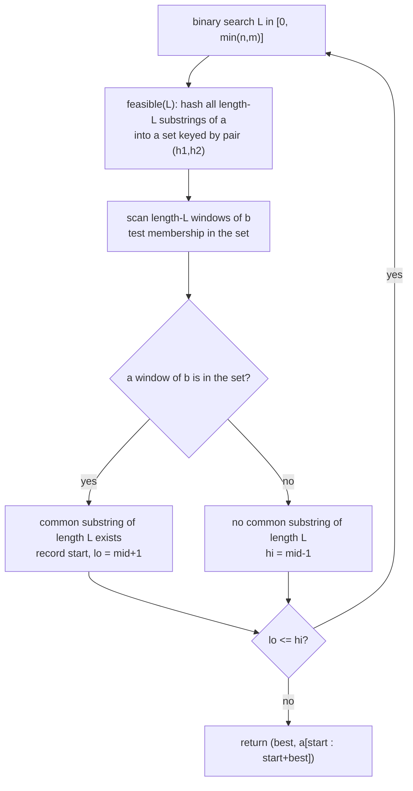

# Longest Common Substring via Binary Search + Hashing

| Meta | Value |
|------|-------|
| Source | Classic two-string problem (self-contained) |
| Difficulty | Medium–Hard |
| Topics | Polynomial Hashing, Binary Search on Answer, Sets |
| Link | — (canonical exercise; cf. SPOJ LCS via suffix automaton) |

---

## Problem Statement
Given two strings `a` and `b`, find the length of their **longest common substring** — the longest
contiguous block that appears in **both** strings. (Return the substring itself if desired.) This is
distinct from the *longest common subsequence*, which allows gaps.

We solve it with **binary search on the length** plus **hashing**: for a candidate length `L`, hash
all length-`L` substrings of `a` into a set, then check whether any length-`L` substring of `b` is
in that set. The classic linear solution uses a generalized suffix automaton; the hashing approach
is simpler and runs in `O((n+m) log(min(n,m)))`.

**Example**
```text
a = "abcde", b = "zzbcdz"
Longest common substring = "bcd"   → length 3
```

---

## Approach (WHY)

**Monotone predicate.** If `a` and `b` share a common substring of length `L`, they also share one
of every length `< L` (any prefix of that block). So "do they share a substring of length `L`?" is
monotone in `L` ⇒ **binary search the length** in `[0, min(|a|, |b|)]`.

**Feasibility test in O(n+m).** For a fixed `L`, put the hashes of all length-`L` substrings of `a`
into a hash set, then scan `b`'s length-`L` windows and test membership. Each test is `O(1)` thanks
to prefix hashing, so one feasibility check is `O(n + m)`. With `O(log)` checks the total is
`O((n+m) log(min(n,m)))`.

**Why double hashing.** We compare windows *across two strings*; a single-modulus collision would
report a **false** common substring (claiming a match that doesn't exist), corrupting the binary
search. The pair `(h1, h2)` under two primes drives the false-match probability to negligible, so a
set hit can be trusted (no character re-check needed).

```python
def longest_common_substring(a: str, b: str):
    MOD1, MOD2 = 1_000_000_007, 998_244_353
    B1, B2 = 131, 137

    def build(s):
        n = len(s)
        p1 = [0]*(n+1); p2 = [0]*(n+1)
        w1 = [1]*(n+1); w2 = [1]*(n+1)
        for i in range(n):
            c = ord(s[i])
            p1[i+1] = (p1[i]*B1 + c) % MOD1
            p2[i+1] = (p2[i]*B2 + c) % MOD2
            w1[i+1] = (w1[i]*B1) % MOD1
            w2[i+1] = (w2[i]*B2) % MOD2
        return p1, p2, w1, w2

    pa1, pa2, wa1, wa2 = build(a)
    pb1, pb2, wb1, wb2 = build(b)

    def hashes(p1, p2, w1, w2, n, L):
        out = []
        for i in range(0, n - L + 1):
            h1 = (p1[i+L] - p1[i]*w1[L]) % MOD1
            h2 = (p2[i+L] - p2[i]*w2[L]) % MOD2
            out.append((i, (h1, h2)))
        return out

    def feasible(L):                    # returns start index in 'a', or -1
        if L == 0:
            return 0
        seen = {key: i for i, key in hashes(pa1, pa2, wa1, wa2, len(a), L)}
        for _, key in hashes(pb1, pb2, wb1, wb2, len(b), L):
            if key in seen:
                return seen[key]
        return -1

    lo, hi, best, start = 0, min(len(a), len(b)), 0, 0
    while lo <= hi:
        mid = (lo + hi) // 2
        pos = feasible(mid)
        if pos != -1:
            best, start = mid, pos
            lo = mid + 1
        else:
            hi = mid - 1
    return best, a[start:start+best]
```

```cpp
#include <bits/stdc++.h>
using namespace std;

const long long MOD1 = 1e9 + 7, MOD2 = 998244353;
const long long B1 = 131, B2 = 137;

struct PH {
    vector<long long> p1, p2, w1, w2;
    PH(const string &s) {
        int n = (int)s.size();
        p1.assign(n+1, 0); p2.assign(n+1, 0);
        w1.assign(n+1, 1); w2.assign(n+1, 1);
        for (int i = 0; i < n; i++) {
            long long c = (unsigned char)s[i];
            p1[i+1] = ((__int128)p1[i]*B1 + c) % MOD1;
            p2[i+1] = ((__int128)p2[i]*B2 + c) % MOD2;
            w1[i+1] = (__int128)w1[i]*B1 % MOD1;
            w2[i+1] = (__int128)w2[i]*B2 % MOD2;
        }
    }
    unsigned long long sub(int i, int L) const {
        long long h1 = (p1[i+L] - (__int128)p1[i]*w1[L] % MOD1) % MOD1;
        long long h2 = (p2[i+L] - (__int128)p2[i]*w2[L] % MOD2) % MOD2;
        if (h1 < 0) h1 += MOD1;
        if (h2 < 0) h2 += MOD2;
        return (unsigned long long)h1 * MOD2 + h2;
    }
};

pair<int,string> longest_common_substring(const string &a, const string &b) {
    PH ha(a), hb(b);
    int n = (int)a.size(), m = (int)b.size();
    auto feasible = [&](int L) -> int {        // start index in 'a', or -1
        if (L == 0) return 0;
        unordered_map<unsigned long long,int> seen;
        seen.reserve(2*(n - L + 1) + 1);
        for (int i = 0; i + L <= n; i++) seen[ha.sub(i, L)] = i;
        for (int j = 0; j + L <= m; j++) {
            auto it = seen.find(hb.sub(j, L));
            if (it != seen.end()) return it->second;
        }
        return -1;
    };
    int lo = 0, hi = min(n, m), best = 0, start = 0;
    while (lo <= hi) {
        int mid = (lo + hi) / 2;
        int pos = feasible(mid);
        if (pos != -1) { best = mid; start = pos; lo = mid + 1; }
        else hi = mid - 1;
    }
    return {best, a.substr(start, best)};
}
```

---

## Trace (`a = "abcde"`, `b = "zzbcdz"`, `min len = 5`)

| `mid` (length) | substrings of `a` set | any `b` window matches? | action |
|----------------|------------------------|-------------------------|--------|
| 2 | ab, bc, cd, de | "bc" (b[2..3]) ✓ | best=2, `lo=3` |
| 3 | abc, bcd, cde | "bcd" (b[2..4]) ✓ | best=3, `lo=4` |
| 4 | abcd, bcde | none in `b` | `hi=3` |
| `lo>hi` | — | — | stop, answer length 3 → "bcd" |

Binary search settles on `best = 3` with substring `"bcd"`.

---

## Mermaid



---

## Math / Complexity

Let `n = |a|`, `m = |b|`. Binary search runs $O(\log(\min(n,m)))$ iterations; each feasibility test
builds and probes a set over $O(n + m)$ windows with $O(1)$ hashing. Total:

$$
O\big((n + m)\,\log(\min(n, m))\big)
$$

Space is $O(n + m)$ for prefix tables and the per-iteration set. With double hashing the
false-match probability per check is about $\dfrac{nm}{M_1 M_2} \approx 10^{-8}$ for $n, m \le 10^5$,
so a set hit reliably indicates a real common substring.

---

## Takeaway
Longest *common substring* (contiguous, unlike LCS subsequence) fits the **binary-search-on-length +
hashing** template: hash one string's length-`L` windows into a set, probe the other's. Use **double
hashing** because cross-string comparisons make false positives especially damaging — a single
spurious match would inflate the binary-search result.
