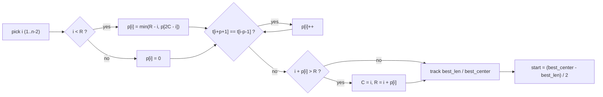

# Longest Palindromic Substring via Manacher (Self-Contained)

| Meta | Value |
|------|-------|
| Source | Classic / self-contained |
| Difficulty | Medium |
| Topics | String, Manacher, Palindrome |
| Link | (technique reference) https://leetcode.com/problems/longest-palindromic-substring/ |

---

## Problem Statement
Given a string `s`, return the **longest contiguous substring** that is a palindrome, computed in
**linear time** with Manacher's algorithm.

> This file is distinct from [0005-longest-palindromic-substring.md](0005-longest-palindromic-substring.md),
> which solves the same task with $O(n^2)$ expand-around-center. Here we use the $O(n)$ Manacher
> machinery from [../guide/06-manacher.md](../guide/06-manacher.md).

**Example**
```
Input:  s = "babad"
Output: "bab"   (or "aba" — either valid)
```

---

## WHY Manacher

Expand-around-center is $O(n^2)$ because each center can expand up to $O(n)$. Manacher reuses the
mirror of the current rightmost palindrome to initialize each radius, making total expansion work
$O(n)$. We compute the radius array `p` over the transformed string `^#...#$`, then the answer is the
substring around the index with the **maximum** radius.

The index mapping back to the original string is the only subtle part:

$$
\text{length in } s = p[i], \qquad \text{start in } s = \frac{i - p[i]}{2}
$$

---

## Code

```python
def longest_palindrome(s):
    if not s:
        return ""
    t = "^#" + "#".join(s) + "#$"
    n = len(t)
    p = [0] * n
    C = R = 0
    best_len, best_center = 0, 0
    for i in range(1, n - 1):
        if i < R:
            p[i] = min(R - i, p[2 * C - i])
        while t[i + p[i] + 1] == t[i - p[i] - 1]:
            p[i] += 1
        if i + p[i] > R:
            C, R = i, i + p[i]
        if p[i] > best_len:
            best_len, best_center = p[i], i
    start = (best_center - best_len) // 2
    return s[start:start + best_len]
```

```cpp
#include <bits/stdc++.h>
using namespace std;

string longest_palindrome(const string& s) {
    if (s.empty()) return "";
    string t = "^#";
    for (char c : s) { t += c; t += '#'; }
    t += '$';
    int n = (int)t.size();
    vector<int> p(n, 0);
    int C = 0, R = 0;
    int best_len = 0, best_center = 0;
    for (int i = 1; i < n - 1; i++) {
        if (i < R) {
            p[i] = min(R - i, p[2 * C - i]);
        }
        while (t[i + p[i] + 1] == t[i - p[i] - 1]) {
            p[i]++;
        }
        if (i + p[i] > R) {
            C = i;
            R = i + p[i];
        }
        if (p[i] > best_len) {
            best_len = p[i];
            best_center = i;
        }
    }
    int start = (best_center - best_len) / 2;
    return s.substr(start, best_len);
}
```

---

## Trace — `s = "babad"`

Transformed `t = "^#b#a#b#a#d#$"` (indices `0..11`).

| `i` | `t[i]` | `p[i]` | running best |
|----:|:------:|-------:|:-------------|
| 1 | `#` | 0 | — |
| 2 | `b` | 1 | len 1 |
| 3 | `#` | 0 | — |
| 4 | `a` | 3 | len 3 @ center 4 |
| 5 | `#` | 0 | — |
| 6 | `b` | 1 | — |
| 7 | `#` | 0 | — |
| 8 | `a` | 1 | — |
| 9 | `d` | 1 | — |

Best is `best_len = 3` at `best_center = 4`. Mapping back:
`start = (4 - 3) // 2 = 0`, so the answer is `s[0:3] = "bab"`. (`"aba"` at center `6` would tie if it
reached length 3; either is accepted.)

---

## Mermaid



---

## Math / Complexity

- Time: $O(n)$ — the right boundary `R` only advances, so total expansion comparisons are $O(n)$.
- Space: $O(n)$ — transformed string and radius array.
- Index mapping: each original character `k` lives at transformed index `2k + 2`, so the palindrome
  starting at transformed `best_center - best_len` maps to original start `(best_center - best_len)/2`.

---

## Takeaway

Manacher turns the $O(n^2)$ longest-palindrome scan into $O(n)$: compute radii once, track the max,
and convert the winning center back with `start = (center - len) / 2`. The padded `^#...#$` layout is
what makes that conversion a clean integer halving.
