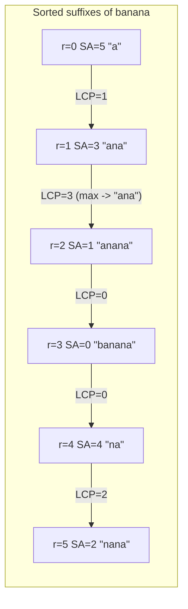

# Longest Repeated Substring (Suffix Array + LCP)

| Meta | Value |
|------|-------|
| Source | Classic string problem (self-contained) |
| Difficulty | Medium |
| Topics | Suffix Array, LCP Array, Kasai's Algorithm |
| Link | — (canonical exercise; cf. LeetCode 1044, suffix-tree variants) |

---

## Problem Statement
Given a string `s`, find the **longest substring that occurs at least twice** in `s` (occurrences may
overlap). If no character repeats, the answer is the empty string. If several substrings tie for the
maximum length, returning any one of them is acceptable.

```text
s = "banana"
Longest repeated substring: "ana"   (occurs at positions 1 and 3)
```

```text
s = "abcabcd"
Longest repeated substring: "abc"   (positions 0 and 3)
```

---

## Approach (WHY)

A substring **repeats** if and only if it is a common prefix of two *different* suffixes of `s`. Among
all pairs of suffixes, the longest common prefix is maximized by some pair that is **adjacent in
sorted order** — because the LCP of any two suffixes equals the minimum adjacent LCP between them, so
the overall maximum LCP is attained on an adjacent pair. That means:

$$\text{answer length} = \max_r \mathrm{LCP}[r],$$

and the substring itself is `s[SA[r*] : SA[r*] + LCP[r*]]` where $r^\*$ maximizes the LCP array.

Intuition: sorting clusters suffixes that begin with the same characters next to each other, so the
single longest shared run between neighbors *is* the longest substring that appears more than once. We
build the suffix array by **rank doubling** and the LCP by **Kasai's algorithm**, then take the
argmax.

```python
def build_suffix_array(s):
    n = len(s)
    sa = list(range(n))
    rank = [ord(c) for c in s]
    tmp = [0] * n
    k = 1
    while True:
        def key(i):
            return (rank[i], rank[i + k] if i + k < n else -1)
        sa.sort(key=key)
        tmp[sa[0]] = 0
        for j in range(1, n):
            tmp[sa[j]] = tmp[sa[j - 1]] + (1 if key(sa[j]) != key(sa[j - 1]) else 0)
        rank = tmp[:]
        if rank[sa[-1]] == n - 1:
            break
        k <<= 1
    return sa

def build_lcp_kasai(s, sa):
    n = len(s)
    rank = [0] * n
    for r in range(n):
        rank[sa[r]] = r
    lcp = [0] * n
    h = 0
    for i in range(n):
        if rank[i] > 0:
            j = sa[rank[i] - 1]
            while i + h < n and j + h < n and s[i + h] == s[j + h]:
                h += 1
            lcp[rank[i]] = h
            if h > 0:
                h -= 1
        else:
            h = 0
    return lcp

def longest_repeated_substring(s):
    n = len(s)
    if n < 2:
        return ""
    sa = build_suffix_array(s)
    lcp = build_lcp_kasai(s, sa)
    best_len, best_r = 0, 0
    for r in range(1, n):
        if lcp[r] > best_len:
            best_len, best_r = lcp[r], r
    return s[sa[best_r]: sa[best_r] + best_len]

if __name__ == "__main__":
    print(longest_repeated_substring("banana"))   # "ana"
    print(longest_repeated_substring("abcabcd"))   # "abc"
```

```cpp
#include <bits/stdc++.h>
using namespace std;

vector<int> build_suffix_array(const string& s) {
    int n = (int)s.size();
    vector<int> sa(n), rank(n), tmp(n);
    for (int i = 0; i < n; i++) { sa[i] = i; rank[i] = s[i]; }
    for (int k = 1; ; k <<= 1) {
        auto cmp = [&](int a, int b) {
            if (rank[a] != rank[b]) return rank[a] < rank[b];
            int ra = (a + k < n) ? rank[a + k] : -1;
            int rb = (b + k < n) ? rank[b + k] : -1;
            return ra < rb;
        };
        sort(sa.begin(), sa.end(), cmp);
        tmp[sa[0]] = 0;
        for (int j = 1; j < n; j++)
            tmp[sa[j]] = tmp[sa[j - 1]] + (cmp(sa[j - 1], sa[j]) ? 1 : 0);
        rank = tmp;
        if (rank[sa[n - 1]] == n - 1) break;
    }
    return sa;
}

vector<int> build_lcp_kasai(const string& s, const vector<int>& sa) {
    int n = (int)s.size();
    vector<int> rank(n), lcp(n, 0);
    for (int r = 0; r < n; r++) rank[sa[r]] = r;
    int h = 0;
    for (int i = 0; i < n; i++) {
        if (rank[i] > 0) {
            int j = sa[rank[i] - 1];
            while (i + h < n && j + h < n && s[i + h] == s[j + h]) h++;
            lcp[rank[i]] = h;
            if (h > 0) h--;
        } else {
            h = 0;
        }
    }
    return lcp;
}

string longest_repeated_substring(const string& s) {
    int n = (int)s.size();
    if (n < 2) return "";
    vector<int> sa = build_suffix_array(s);
    vector<int> lcp = build_lcp_kasai(s, sa);
    int best_len = 0, best_r = 0;
    for (int r = 1; r < n; r++) {
        if (lcp[r] > best_len) { best_len = lcp[r]; best_r = r; }
    }
    return s.substr(sa[best_r], best_len);
}

int main() {
    cout << longest_repeated_substring("banana") << "\n";   // ana
    cout << longest_repeated_substring("abcabcd") << "\n";  // abc
    return 0;
}
```

---

## Trace — `s = "banana"` (n = 6)

```text
SA = [5, 3, 1, 0, 4, 2]

r  SA[r]  suffix     LCP[r]
0    5     a           0
1    3     ana         1
2    1     anana       3   <- maximum
3    0     banana      0
4    4     na          0
5    2     nana        2

max LCP = 3 at r=2, SA[2]=1  ->  s[1:1+3] = "ana"
```

The winning pair is the adjacent suffixes `ana` (start 3) and `anana` (start 1): both begin with the
3-character run `ana`, which is therefore the longest substring occurring twice.

---

## Mermaid



---

## Math & Complexity

- Answer length $= \max_r \mathrm{LCP}[r]$; substring $= s[\mathrm{SA}[r^\*]\,..\,\mathrm{SA}[r^\*]+\mathrm{LCP}[r^\*])$.
- Suffix array (doubling): $O(n \log^2 n)$; LCP (Kasai): $O(n)$; argmax scan: $O(n)$.
- Total $O(n \log^2 n)$ time, $O(n)$ space.
- Overlapping occurrences are allowed; to require **non-overlapping** repeats you would additionally
  check that the two start positions differ by at least the candidate length.

---

## Takeaway
The longest repeated substring is just the **maximum entry of the LCP array** — a single linear scan
after building the suffix array. Adjacency in sorted order guarantees the global maximum LCP is found
between neighbors.
