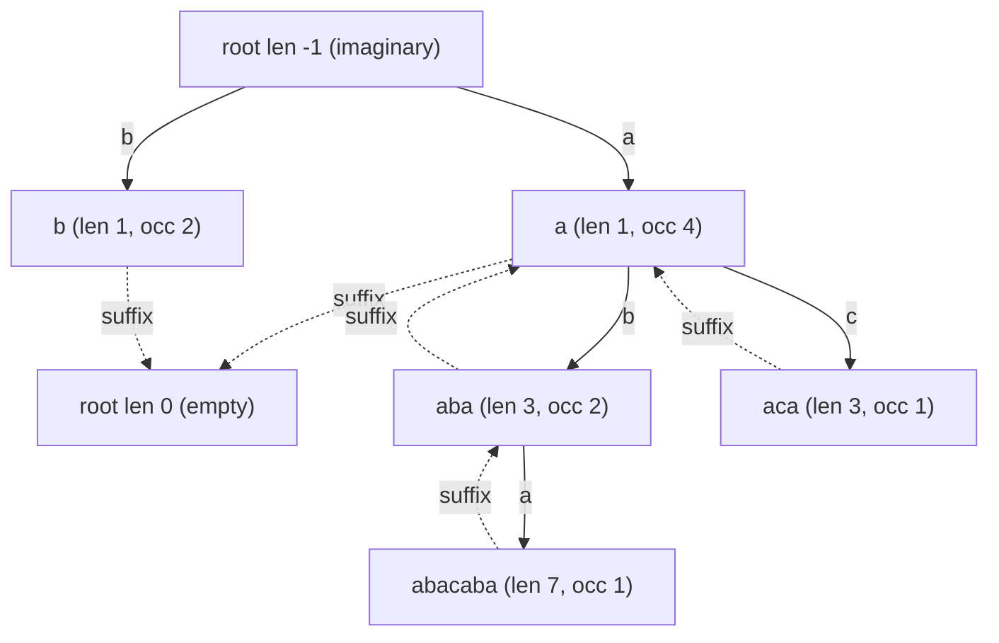

# Most Frequent / Most Valuable Palindrome — max(occurrences × length) (Eertree)

| Meta | Value |
|------|-------|
| Source | APIO-style "longest × frequency" (self-contained) |
| Difficulty | Hard |
| Topics | Palindromic Tree (Eertree), Suffix Links, Count Propagation |
| Link | — (cf. APIO 2014 "Palindromes") |

---

## Problem Statement
Given a lowercase string `s`, consider every **distinct** palindromic substring `P`. Let `occ(P)` be
the number of times `P` occurs in `s` and `len(P)` its length. Compute the maximum **value**

$$\max_{P \text{ palindrome}} \; occ(P) \times len(P).$$

This is the classic APIO "Palindromes" measure: the most "valuable" palindrome trades off being long
against occurring often. We build the **palindromic tree (eertree)**, propagate occurrence counts along
suffix links to get exact `occ(P)`, then take the max of `occ × len` over all real nodes.

**Example**
```text
s = "abacaba"
Palindromes & occurrences:
  "a" occurs 4 times -> value 4*1 = 4
  "b" occurs 2 times -> value 2*1 = 2
  "aba" occurs 2 times -> value 2*3 = 6
  "aca" occurs 1 time  -> value 1*3 = 3
  "abacaba" occurs 1 time -> value 1*7 = 7
Maximum value = 7   (the whole string)
```

---

## Approach (WHY)

**Why the eertree.** Each distinct palindrome is one node, and after a suffix-link propagation pass each
node `v` stores both `len[v]` and the exact `occ = cnt[v]`. So the answer is a one-line max over the
real nodes — no separate occurrence-counting machinery is needed.

**Why propagation gives true occurrences.** During the build, `cnt[v]` only counts the times `v` was the
**direct longest** palindromic suffix. Each append also produces occurrences of every shorter palindromic
suffix, reachable via suffix links. Pushing counts up the suffix-link tree in **decreasing index order**
(a suffix link always points to a shorter palindrome with a smaller index) finalizes a node before it
contributes to its parent:

$$\texttt{cnt[suff[v]]} \mathrel{+}= \texttt{cnt[v]}.$$

**Why use `long long`.** With `occ` up to `n` and `len` up to `n`, the product `occ × len` can reach
`~n^2`, which overflows 32-bit for `n` beyond ~46000. Accumulate the answer in a 64-bit integer.

```python
def most_valuable_palindrome(s):
    n = len(s)
    if n == 0:
        return 0
    SZ = n + 5
    length = [0] * SZ
    suff   = [0] * SZ
    cnt    = [0] * SZ
    to     = [dict() for _ in range(SZ)]

    length[0] = -1; suff[0] = 0      # imaginary root
    length[1] = 0;  suff[1] = 0      # empty root
    num = 2
    last = 1

    def get_link(x, i):
        while True:
            l = length[x]
            if i - l - 1 >= 0 and s[i - l - 1] == s[i]:
                return x
            x = suff[x]

    for i in range(n):
        ch = s[i]
        x = get_link(last, i)
        if ch in to[x]:
            last = to[x][ch]
            cnt[last] += 1
            continue
        cur = num; num += 1
        length[cur] = length[x] + 2
        if length[cur] == 1:
            suff[cur] = 1
        else:
            y = get_link(suff[x], i)
            suff[cur] = to[y].get(ch, 1)
        to[x][ch] = cur
        cnt[cur] = 1
        last = cur

    # propagate occurrence counts along suffix links, high index -> low
    for v in range(num - 1, 1, -1):
        cnt[suff[v]] += cnt[v]

    best = 0
    for v in range(2, num):
        best = max(best, cnt[v] * length[v])   # occurrences * length
    return best


if __name__ == "__main__":
    print(most_valuable_palindrome("abacaba"))  # 7
```

```cpp
#include <bits/stdc++.h>
using namespace std;

long long mostValuablePalindrome(const string &s) {
    int n = (int)s.size();
    if (n == 0) return 0;
    const int K = 26;
    vector<array<int, K>> to(n + 2);
    for (auto &row : to) row.fill(0);
    vector<int> len(n + 2, 0), suff(n + 2, 0);
    vector<long long> cnt(n + 2, 0);

    len[0] = -1; suff[0] = 0;        // imaginary root
    len[1] = 0;  suff[1] = 0;        // empty root
    int num = 2, last = 1;

    auto getLink = [&](int x, int i) {
        while (true) {
            int l = len[x];
            if (i - l - 1 >= 0 && s[i - l - 1] == s[i]) return x;
            x = suff[x];
        }
    };

    for (int i = 0; i < n; i++) {
        int c = s[i] - 'a';
        int x = getLink(last, i);
        if (to[x][c] != 0) {
            last = to[x][c];
            cnt[last]++;
            continue;
        }
        int cur = num++;
        len[cur] = len[x] + 2;
        if (len[cur] == 1) {
            suff[cur] = 1;
        } else {
            int y = getLink(suff[x], i);
            suff[cur] = (to[y][c] != 0) ? to[y][c] : 1;
        }
        to[x][c] = cur;
        cnt[cur] = 1;
        last = cur;
    }

    // propagate occurrence counts along suffix links, high index -> low
    for (int v = num - 1; v >= 2; v--)
        cnt[suff[v]] += cnt[v];

    long long best = 0;
    for (int v = 2; v < num; v++)
        best = max(best, cnt[v] * (long long)len[v]); // occurrences * length
    return best;
}

int main() {
    cout << mostValuablePalindrome("abacaba") << "\n"; // 7
    return 0;
}
```

---

## Trace — `s = "abacaba"`

The build creates nodes `a`, `b`, `aba`, `aca`, `abacaba`. After propagation along suffix links:

| node | palindrome | `len` | `occ` (after propagation) | value `occ × len` |
|------|-----------|-------|---------------------------|--------------------|
| 2 | a | 1 | 4 | 4 |
| 3 | b | 1 | 2 | 2 |
| 4 | aba | 3 | 2 | **6** |
| 5 | aca | 3 | 1 | 3 |
| 6 | abacaba | 7 | 1 | **7** |

`occ("a") = 4` because the shorter palindrome `a` collects counts pushed up from `aba` and `abacaba`
along the suffix links. The maximum value is `7` from `abacaba` itself (occurs once, length 7). ✓

---

## Mermaid

Eertree for `s = "abacaba"` with `len` and propagated occurrence counts.



Best value = `max(occ × len)` over nodes = `7` (node `abacaba`), edging out `aba`'s `6`.

---

## Math & Complexity

After the suffix-link propagation, each node holds exact `occ(P)` and `len(P)`, so

$$\text{answer} = \max_{v \ge 2} \; cnt[v] \cdot len[v].$$

| Resource | Cost |
|----------|------|
| Time | $O(n)$ amortized build + $O(n)$ propagation + $O(n)$ scan |
| Space | $O(n \cdot \sigma)$ array edges (or $O(n)$ map edges) |
| Overflow | use 64-bit (`long long`): product up to $\Theta(n^2)$ |

---

## Takeaway
"Most valuable palindrome" is a one-liner on the eertree once occurrences are propagated: keep `len[v]`
and the propagated `cnt[v]`, then take `max(cnt[v] * len[v])`. Remember 64-bit accumulation — the
`occ × len` product is quadratic in `n`.
