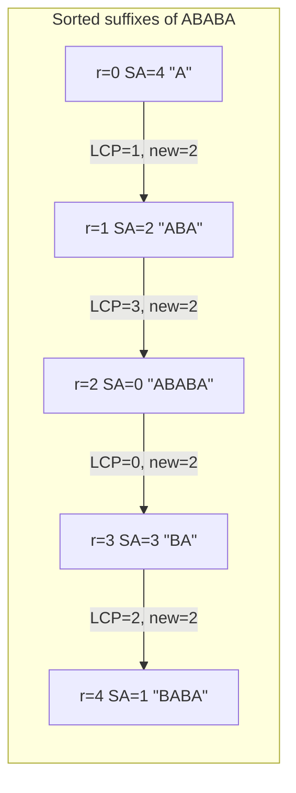

# SPOJ DISUBSTR — Distinct Substrings (Suffix Array + LCP)

| Meta | Value |
|------|-------|
| Source | SPOJ |
| Problem ID | DISUBSTR |
| Difficulty | Medium |
| Topics | Suffix Array, LCP Array, Kasai's Algorithm, Counting |
| Link | https://www.spoj.com/problems/DISUBSTR/ |

---

## Problem Statement
Given a string, count the number of **distinct** non-empty substrings. Identical substrings appearing
at different positions are counted once. There are several test cases; each is a single string of
uppercase letters (length up to a few thousand).

```text
Input
2
CCCCC
ABABA

Output
5
9
```

For `CCCCC` the distinct substrings are `C, CC, CCC, CCCC, CCCCC` → 5.
For `ABABA` they are `A, B, AB, BA, ABA, BAB, ABAB, BABA, ABABA` → 9.

---

## Approach (WHY)

Every substring of `s` is a **prefix of exactly one suffix**. If we sort the suffixes (the suffix
array), then suffix `SA[r]` has length `n - SA[r]` and therefore contributes `n - SA[r]` prefixes.
But adjacent sorted suffixes can *share* a leading run of characters: exactly `LCP[r]` of suffix
`SA[r]`'s prefixes already appeared as prefixes of suffix `SA[r-1]`. Subtracting those duplicates
leaves the count of **new** distinct substrings introduced at rank `r`:

$$(n - \mathrm{SA}[r]) - \mathrm{LCP}[r].$$

Summed over all ranks this telescopes to the closed form

$$\#\text{distinct} \;=\; \frac{n(n+1)}{2} - \sum_r \mathrm{LCP}[r],$$

because $\sum_r (n - \mathrm{SA}[r]) = 1 + 2 + \dots + n = \tfrac{n(n+1)}{2}$ counts *all* prefixes of
*all* suffixes, and $\sum_r \mathrm{LCP}[r]$ removes precisely the ones counted more than once.

We build the suffix array by **rank doubling** ($O(n \log^2 n)$) and the LCP array by **Kasai's
algorithm** ($O(n)$), then evaluate the formula.

```python
def build_suffix_array(s):
    n = len(s)
    sa = list(range(n))
    rank = [ord(c) for c in s]
    tmp = [0] * n
    k = 1
    while True:
        def key(i):
            return (rank[i], rank[i + k] if i + k < n else -1)
        sa.sort(key=key)
        tmp[sa[0]] = 0
        for j in range(1, n):
            tmp[sa[j]] = tmp[sa[j - 1]] + (1 if key(sa[j]) != key(sa[j - 1]) else 0)
        rank = tmp[:]
        if rank[sa[-1]] == n - 1:
            break
        k <<= 1
    return sa

def build_lcp_kasai(s, sa):
    n = len(s)
    rank = [0] * n
    for r in range(n):
        rank[sa[r]] = r
    lcp = [0] * n
    h = 0
    for i in range(n):
        if rank[i] > 0:
            j = sa[rank[i] - 1]
            while i + h < n and j + h < n and s[i + h] == s[j + h]:
                h += 1
            lcp[rank[i]] = h
            if h > 0:
                h -= 1
        else:
            h = 0
    return lcp

def count_distinct_substrings(s):
    n = len(s)
    if n == 0:
        return 0
    sa = build_suffix_array(s)
    lcp = build_lcp_kasai(s, sa)
    return n * (n + 1) // 2 - sum(lcp)

if __name__ == "__main__":
    import sys
    data = sys.stdin.read().split()
    t = int(data[0])
    out = []
    for idx in range(1, t + 1):
        out.append(str(count_distinct_substrings(data[idx])))
    print("\n".join(out))
```

```cpp
#include <bits/stdc++.h>
using namespace std;

vector<int> build_suffix_array(const string& s) {
    int n = (int)s.size();
    vector<int> sa(n), rank(n), tmp(n);
    for (int i = 0; i < n; i++) { sa[i] = i; rank[i] = s[i]; }
    for (int k = 1; ; k <<= 1) {
        auto cmp = [&](int a, int b) {
            if (rank[a] != rank[b]) return rank[a] < rank[b];
            int ra = (a + k < n) ? rank[a + k] : -1;
            int rb = (b + k < n) ? rank[b + k] : -1;
            return ra < rb;
        };
        sort(sa.begin(), sa.end(), cmp);
        tmp[sa[0]] = 0;
        for (int j = 1; j < n; j++)
            tmp[sa[j]] = tmp[sa[j - 1]] + (cmp(sa[j - 1], sa[j]) ? 1 : 0);
        rank = tmp;
        if (rank[sa[n - 1]] == n - 1) break;
    }
    return sa;
}

vector<int> build_lcp_kasai(const string& s, const vector<int>& sa) {
    int n = (int)s.size();
    vector<int> rank(n), lcp(n, 0);
    for (int r = 0; r < n; r++) rank[sa[r]] = r;
    int h = 0;
    for (int i = 0; i < n; i++) {
        if (rank[i] > 0) {
            int j = sa[rank[i] - 1];
            while (i + h < n && j + h < n && s[i + h] == s[j + h]) h++;
            lcp[rank[i]] = h;
            if (h > 0) h--;
        } else {
            h = 0;
        }
    }
    return lcp;
}

long long count_distinct_substrings(const string& s) {
    int n = (int)s.size();
    if (n == 0) return 0;
    vector<int> sa = build_suffix_array(s);
    vector<int> lcp = build_lcp_kasai(s, sa);
    long long total = (long long)n * (n + 1) / 2;
    for (int v : lcp) total -= v;
    return total;
}

int main() {
    int t;
    if (!(cin >> t)) return 0;
    while (t--) {
        string s; cin >> s;
        cout << count_distinct_substrings(s) << "\n";
    }
    return 0;
}
```

---

## Trace — `s = "ABABA"` (n = 5)

Suffixes and their sorted order:

```text
index  suffix
  4     A
  2     ABA
  0     ABABA
  3     BA
  1     BABA

SA = [4, 2, 0, 3, 1]

r  SA[r]  suffix    n-SA[r]   LCP[r]   new = (n-SA[r]) - LCP[r]
0    4     A          1         0        1
1    2     ABA        3         1        2     (share "A")
2    0     ABABA      5         3        2     (share "ABA")
3    3     BA         2         0        2
4    1     BABA       4         2        2     (share "BA")
                                        ----
                              total new = 9
```

Closed form check: $\tfrac{5 \cdot 6}{2} = 15$, $\sum \mathrm{LCP} = 0 + 1 + 3 + 0 + 2 = 6$, so
$15 - 6 = 9$. ✔

---

## Mermaid



---

## Math & Complexity

- Distinct count: $\dfrac{n(n+1)}{2} - \sum_r \mathrm{LCP}[r]$.
- Suffix array (doubling): $O(n \log^2 n)$; LCP (Kasai): $O(n)$.
- Per test case: $O(n \log^2 n)$ time, $O(n)$ space.
- Use `long long` for the sum: $\tfrac{n(n+1)}{2}$ exceeds 32-bit once $n \gtrsim 65536$.

---

## Takeaway
Distinct-substring counting is a **one-formula** consequence of the suffix array plus LCP: total
prefixes minus shared prefixes. Kasai's linear LCP makes the whole solution efficient and short.
