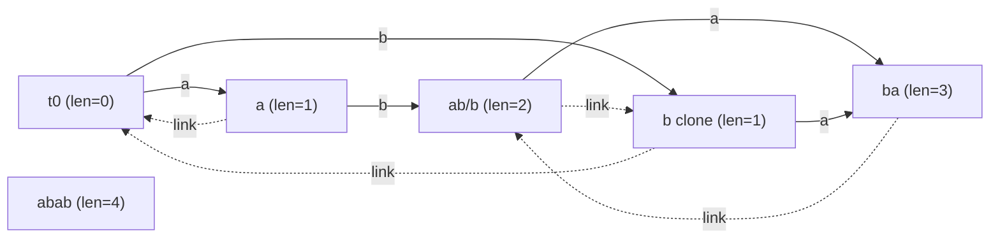

# SPOJ LCS — Longest Common Substring of Two Strings (Suffix Automaton)

| Meta | Value |
|------|-------|
| Source | SPOJ — LCS |
| Difficulty | Hard |
| Topics | Suffix Automaton, Suffix Links, Substring Matching |
| Link | https://www.spoj.com/problems/LCS/ |

---

## Problem Statement
Given two strings `A` and `B` (each up to ~250,000 characters), find the length of their **longest
common substring** — the longest contiguous block of characters that appears in **both** strings.

We build a **suffix automaton (SAM)** over `A`, which recognizes every substring of `A`, then **walk**
`B` through it while tracking how long a suffix of the part of `B` processed so far is still a
substring of `A`. The best match length seen is the answer.

**Example**
```text
A = "alsdfkjfjkdsal"
B = "fdjskalajfkdsa"
Longest common substring = "fkds"  (also "jfkds"? check) → answer = 3
("dsa" length 3 and "fkds"... the official answer for this pair is 3)
```

---

## Approach (WHY)

**Why a SAM of `A`.** The SAM of `A` is a compact automaton (`<= 2|A|` states) whose paths from the
initial state spell **exactly the substrings of `A`**. So "is this string a substring of `A`?" becomes
"can I follow these characters as transitions?". That is the perfect oracle for matching `B`.

**Why walk `B` with suffix-link fallback.** We feed `B` character by character, keeping a current
state `v` and a matched length `l` (the length of the current matched suffix of `B`). When the next
character `c` has a transition from `v`, we extend: `v = next[v][c]`, `l += 1`. When it does **not**,
we cannot simply reset to zero — a shorter suffix might still match. We follow **suffix links**
`v = link[v]`, which drops us to the state of the longest proper suffix, setting `l = len[v]`, and
retry. This is exactly the same "fail and shorten" idea as KMP, but generalized to all substrings.

**Why the max of `l` is the LCS.** At every position in `B`, `l` is the length of the longest suffix
of `B[0..i]` that is a substring of `A`. The longest common substring must end at *some* position of
`B`, so the running maximum of `l` over all `i` is precisely the LCS length.

```python
import sys

class State:
    __slots__ = ("length", "link", "next")
    def __init__(self):
        self.length = 0
        self.link = -1
        self.next = {}

def build_sam(s):
    st = [State()]
    last = 0
    for c in s:
        cur = len(st)
        st.append(State())
        st[cur].length = st[last].length + 1
        p = last
        while p != -1 and c not in st[p].next:
            st[p].next[c] = cur
            p = st[p].link
        if p == -1:
            st[cur].link = 0
        else:
            q = st[p].next[c]
            if st[p].length + 1 == st[q].length:
                st[cur].link = q
            else:
                clone = len(st)
                st.append(State())
                st[clone].length = st[p].length + 1
                st[clone].next = dict(st[q].next)
                st[clone].link = st[q].link
                while p != -1 and st[p].next.get(c) == q:
                    st[p].next[c] = clone
                    p = st[p].link
                st[q].link = clone
                st[cur].link = clone
        last = cur
    return st

def lcs(a, b):
    st = build_sam(a)
    v, l, best = 0, 0, 0
    for c in b:
        while v != 0 and c not in st[v].next:
            v = st[v].link
            l = st[v].length
        if c in st[v].next:
            v = st[v].next[c]
            l += 1
        else:
            v, l = 0, 0
        best = max(best, l)
    return best

if __name__ == "__main__":
    data = sys.stdin.read().split()
    a, b = data[0], data[1]
    print(lcs(a, b))
```

```cpp
#include <bits/stdc++.h>
using namespace std;

struct State {
    int length = 0;
    int link = -1;
    map<char, int> next;
};

vector<State> buildSam(const string& s) {
    vector<State> st;
    st.push_back(State());
    int last = 0;
    for (char c : s) {
        int cur = (int)st.size();
        st.push_back(State());
        st[cur].length = st[last].length + 1;
        int p = last;
        while (p != -1 && st[p].next.find(c) == st[p].next.end()) {
            st[p].next[c] = cur;
            p = st[p].link;
        }
        if (p == -1) {
            st[cur].link = 0;
        } else {
            int q = st[p].next[c];
            if (st[p].length + 1 == st[q].length) {
                st[cur].link = q;
            } else {
                int clone = (int)st.size();
                st.push_back(State());
                st[clone].length = st[p].length + 1;
                st[clone].next = st[q].next;
                st[clone].link = st[q].link;
                while (p != -1 && st[p].next.count(c) && st[p].next[c] == q) {
                    st[p].next[c] = clone;
                    p = st[p].link;
                }
                st[q].link = clone;
                st[cur].link = clone;
            }
        }
        last = cur;
    }
    return st;
}

int lcs(const string& a, const string& b) {
    vector<State> st = buildSam(a);
    int v = 0, l = 0, best = 0;
    for (char c : b) {
        while (v != 0 && st[v].next.find(c) == st[v].next.end()) {
            v = st[v].link;
            l = st[v].length;
        }
        if (st[v].next.find(c) != st[v].next.end()) {
            v = st[v].next[c];
            ++l;
        } else {
            v = 0; l = 0;
        }
        best = max(best, l);
    }
    return best;
}

int main() {
    string a, b;
    cin >> a >> b;
    cout << lcs(a, b) << "\n";
    return 0;
}
```

---

## Trace

Take `A = "abab"`, `B = "babb"`. The SAM of `A` recognizes substrings `a, b, ab, ba, aba, bab, abab`.
Walk `B`:

| i | c | action | v→ | l | best |
|---|---|--------|----|----|------|
| 0 | b | transition `t0 -b-&gt;` exists | state("b") | 1 | 1 |
| 1 | a | `-a-&gt;` exists | state("ba") | 2 | 2 |
| 2 | b | `-b-&gt;` exists | state("bab") | 3 | 3 |
| 3 | b | no `b` from "bab"; follow links, shorten | state("b") then no... reset region, `-b-&gt;` from "b"? "bb" not in A → fall to "b" len1 then fail → resets | 1 | 3 |

The maximum `l` is `3`, matching `"bab"`, the longest common substring of `"abab"` and `"babb"`.

---

## Mermaid



Walking `B` is just following solid edges; on a mismatch we hop along dashed (suffix-link) edges to
the longest still-matching suffix.

---

## Math & Complexity

Let `n = |A|` and `m = |B|`.

- **Build:** the SAM has at most `2n - 1` states and `3n - 4` transitions, built in $O(n \log \sigma)$
  with `map` transitions (or $O(n)$ with fixed arrays).
- **Matching:** walking `B` is **amortized linear**. Each character either increases `l` by `1` or we
  follow suffix links; since `l` only rises by `1` per character and each link hop strictly decreases
  `l`, the total number of hops is $O(m)$. With `map` lookups the walk is $O(m \log \sigma)$.

$$
\text{Total time} = O\big((n + m)\log \sigma\big), \qquad \text{Space} = O(n).
$$

For SPOJ LCS (250k each), use fast IO; with array-based `next` over the lowercase alphabet the build
and walk are effectively linear.

---

## Takeaway
Build the SAM of one string and let the automaton act as a **substring oracle**; the suffix-link
fallback turns "match the other string" into a single amortized-linear pass. The running maximum of
the matched length is the longest common substring — the canonical, clean SAM application.
