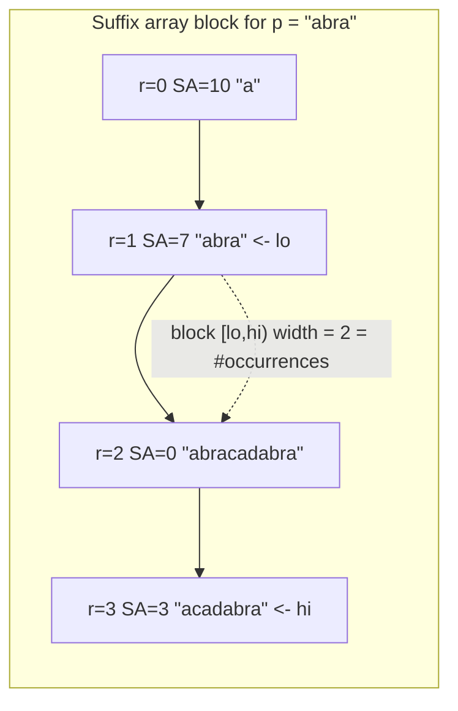

# Pattern Search via Binary Search on a Suffix Array

| Meta | Value |
|------|-------|
| Source | Classic string problem (self-contained) |
| Difficulty | Medium |
| Topics | Suffix Array, Binary Search, Pattern Matching |
| Link | — (canonical exercise; cf. suffix-array substring search) |

---

## Problem Statement
Given a text `s` and a pattern `p`, count **how many times `p` occurs** as a substring of `s`
(overlaps allowed), and report the range of starting positions. Multiple patterns may be queried
against the same text, so we preprocess `s` once and answer each query quickly.

```text
s = "abracadabra"
p = "abra"   -> occurs 2 times, at positions {0, 7}
p = "a"      -> occurs 5 times, at positions {0, 3, 5, 7, 10}
p = "xyz"    -> occurs 0 times
```

---

## Approach (WHY)

Every occurrence of `p` in `s` is the **prefix of some suffix** of `s`. Since the suffix array lists
suffixes in sorted order, all suffixes that start with `p` form one **contiguous block** in `SA`
(sorting groups equal prefixes together). The number of occurrences is exactly the width of that
block.

We locate the block with two binary searches over `SA`:

- **lower bound** — the first rank `r` whose suffix is $\ge p$ (treating `p` as if compared only over
  its own length: a suffix *qualifies* when its first `|p|` characters are $\ge p$).
- **upper bound** — the first rank `r` whose first `|p|` characters are strictly greater than `p`.

The half-open block `[lo, hi)` contains every suffix that begins with `p`, so the occurrence count is
`hi - lo`, and the starting positions are `SA[lo .. hi-1]`.

Each comparison of `p` against a probed suffix costs $O(|p|)$, and binary search does $O(\log n)$
probes, so a query is $O(|p| \log n)$ after the one-time $O(n \log^2 n)$ suffix-array build.

```python
def build_suffix_array(s):
    n = len(s)
    sa = list(range(n))
    rank = [ord(c) for c in s]
    tmp = [0] * n
    k = 1
    while True:
        def key(i):
            return (rank[i], rank[i + k] if i + k < n else -1)
        sa.sort(key=key)
        tmp[sa[0]] = 0
        for j in range(1, n):
            tmp[sa[j]] = tmp[sa[j - 1]] + (1 if key(sa[j]) != key(sa[j - 1]) else 0)
        rank = tmp[:]
        if rank[sa[-1]] == n - 1:
            break
        k <<= 1
    return sa

def _suffix_cmp_prefix(s, start, p):
    # compare suffix s[start:] against p over at most len(p) chars
    # returns -1, 0, +1 for (suffix-prefix) < / == / > p
    n, m = len(s), len(p)
    for j in range(m):
        if start + j >= n:
            return -1            # suffix ran out -> it is smaller
        if s[start + j] < p[j]:
            return -1
        if s[start + j] > p[j]:
            return 1
    return 0                     # first |p| chars equal p

def count_occurrences(s, sa, p):
    n, m = len(s), len(p)
    if m == 0 or m > n:
        return 0, []
    # lower bound: first rank whose suffix-prefix is >= p (i.e. cmp >= 0)
    lo, hi = 0, n
    while lo < hi:
        mid = (lo + hi) // 2
        if _suffix_cmp_prefix(s, sa[mid], p) < 0:
            lo = mid + 1
        else:
            hi = mid
    left = lo
    # upper bound: first rank whose suffix-prefix is > p (i.e. cmp > 0)
    lo, hi = left, n
    while lo < hi:
        mid = (lo + hi) // 2
        if _suffix_cmp_prefix(s, sa[mid], p) <= 0:
            lo = mid + 1
        else:
            hi = mid
    right = lo
    positions = sorted(sa[left:right])
    return right - left, positions

if __name__ == "__main__":
    s = "abracadabra"
    sa = build_suffix_array(s)
    for p in ["abra", "a", "xyz"]:
        cnt, pos = count_occurrences(s, sa, p)
        print(p, cnt, pos)
```

```cpp
#include <bits/stdc++.h>
using namespace std;

vector<int> build_suffix_array(const string& s) {
    int n = (int)s.size();
    vector<int> sa(n), rank(n), tmp(n);
    for (int i = 0; i < n; i++) { sa[i] = i; rank[i] = s[i]; }
    for (int k = 1; ; k <<= 1) {
        auto cmp = [&](int a, int b) {
            if (rank[a] != rank[b]) return rank[a] < rank[b];
            int ra = (a + k < n) ? rank[a + k] : -1;
            int rb = (b + k < n) ? rank[b + k] : -1;
            return ra < rb;
        };
        sort(sa.begin(), sa.end(), cmp);
        tmp[sa[0]] = 0;
        for (int j = 1; j < n; j++)
            tmp[sa[j]] = tmp[sa[j - 1]] + (cmp(sa[j - 1], sa[j]) ? 1 : 0);
        rank = tmp;
        if (rank[sa[n - 1]] == n - 1) break;
    }
    return sa;
}

// compare suffix s[start:] against p over at most |p| chars: -1 / 0 / +1
int suffix_cmp_prefix(const string& s, int start, const string& p) {
    int n = (int)s.size(), m = (int)p.size();
    for (int j = 0; j < m; j++) {
        if (start + j >= n) return -1;          // suffix ran out -> smaller
        if (s[start + j] < p[j]) return -1;
        if (s[start + j] > p[j]) return 1;
    }
    return 0;
}

pair<long long, vector<int>> count_occurrences(const string& s, const vector<int>& sa, const string& p) {
    int n = (int)s.size(), m = (int)p.size();
    if (m == 0 || m > n) return {0, {}};
    int lo = 0, hi = n;
    while (lo < hi) {                            // lower bound: cmp >= 0
        int mid = (lo + hi) / 2;
        if (suffix_cmp_prefix(s, sa[mid], p) < 0) lo = mid + 1;
        else hi = mid;
    }
    int left = lo;
    lo = left; hi = n;
    while (lo < hi) {                            // upper bound: cmp > 0
        int mid = (lo + hi) / 2;
        if (suffix_cmp_prefix(s, sa[mid], p) <= 0) lo = mid + 1;
        else hi = mid;
    }
    int right = lo;
    vector<int> positions(sa.begin() + left, sa.begin() + right);
    sort(positions.begin(), positions.end());
    return {(long long)(right - left), positions};
}

int main() {
    string s = "abracadabra";
    vector<int> sa = build_suffix_array(s);
    for (string p : {string("abra"), string("a"), string("xyz")}) {
        auto [cnt, pos] = count_occurrences(s, sa, p);
        cout << p << " " << cnt << " {";
        for (size_t i = 0; i < pos.size(); i++) cout << pos[i] << (i + 1 < pos.size() ? "," : "");
        cout << "}\n";
    }
    return 0;
}
```

---

## Trace — `s = "abracadabra"`, `p = "abra"`

Sorted suffixes (only the ranks and starts that matter shown):

```text
r  SA[r]  suffix
0   10    a
1    7    abra          <- first suffix-prefix >= "abra"  (lower bound = 1)
2    0    abracadabra   <- also starts with "abra"
3    3    acadabra      <- first-4 chars "acad" > "abra"  (upper bound = 3)
4    5    adabra
...
```

Binary search for the **lower bound** lands on `r=1` (suffix `abra`), the first whose first 4
characters are $\ge$ `abra`. The **upper bound** lands on `r=3` (suffix `acadabra`, prefix `acad` >
`abra`). The block is `[1, 3)`, width `2`, so `p` occurs twice — at `SA[1]=7` and `SA[2]=0`, i.e.
positions `{0, 7}`. ✔

---

## Mermaid



---

## Math & Complexity

- Occurrences of `p` $= \mathrm{hi} - \mathrm{lo}$, the width of the contiguous SA block whose suffixes
  start with `p`.
- Preprocess (suffix array): $O(n \log^2 n)$ once.
- Per query: two binary searches, each $O(\log n)$ probes $\times\ O(|p|)$ per comparison $= O(|p| \log n)$.
- Listing positions costs $O(\text{occ} \log \text{occ})$ if sorted; the *count* alone is $O(|p| \log n)$.

---

## Takeaway
On a sorted suffix array, the matches of any pattern form **one contiguous range**; two bound-finding
binary searches pin it down. Build once, then answer many pattern queries in $O(|p| \log n)$ each.
