# Which Patterns Occur (Aho–Corasick)

| Meta | Value |
|------|-------|
| Source | Self-contained (multi-pattern membership) |
| Difficulty | Medium |
| Topics | String, Trie, Aho–Corasick |
| Link | — |

---

## Problem Statement
You are given $k$ patterns $p_0, p_1, \dots, p_{k-1}$ (lowercase `a..z`) and a text $t$. Report
**which patterns occur in $t$ at least once** — return a boolean array `present[0..k-1]` where
`present[i]` is `true` iff $p_i$ appears in $t$ as a substring. We only care about *whether* each
pattern occurs, not how many times.

**Example**
```text
patterns = ["he", "she", "hers", "abc"]
text     = "ushers"

"he"   occurs (indices 2..3)        -> true
"she"  occurs (indices 1..3)        -> true
"hers" occurs (indices 2..5)        -> true
"abc"  does not occur               -> false

present = [true, true, true, false]
```

---

## Why Aho–Corasick?

This is multi-pattern membership. We want to scan the text once and mark every pattern we hit. As
the automaton processes the text, each visited node's `out` list (plus its dictionary-link chain)
names the patterns ending there. We set those patterns' flags to `true`.

A subtle efficiency point: a single position can end many patterns via the dict-link chain, and we
might revisit the same nodes many times across the text. Naively walking the chain every time can be
$O(n \cdot \text{depth})$. The clean linear trick: during the scan, just mark the **node itself** as
"seen". Afterwards, propagate the seen flag **up the fail tree** (the fail links form a tree rooted
at `0`) in reverse-BFS order, so a node is reported whenever any of its fail-descendants was seen.
Then read off each pattern's terminal node.

---

## Solution — Paired Python + C++

### Build trie + fail links (record BFS order)

```python
from collections import deque

ALPHA = 26

class Aho:
    def __init__(self):
        self.nxt = [[0] * ALPHA]
        self.fail = [0]
        self.pat_at = [[]]    # pattern ids whose terminal node is this node
        self.order = []       # nodes in BFS order (root excluded)

    def _new_node(self):
        self.nxt.append([0] * ALPHA)
        self.fail.append(0)
        self.pat_at.append([])
        return len(self.nxt) - 1

    def add(self, word, pid):
        cur = 0
        for ch in word:
            c = ord(ch) - 97
            if self.nxt[cur][c] == 0:
                self.nxt[cur][c] = self._new_node()
            cur = self.nxt[cur][c]
        self.pat_at[cur].append(pid)
        return cur

    def build(self):
        q = deque()
        for c in range(ALPHA):
            v = self.nxt[0][c]
            if v:
                self.fail[v] = 0
                self.order.append(v)
                q.append(v)
        while q:
            u = q.popleft()
            for c in range(ALPHA):
                v = self.nxt[u][c]
                if v:
                    self.fail[v] = self.nxt[self.fail[u]][c]
                    self.order.append(v)
                    q.append(v)
                else:
                    self.nxt[u][c] = self.nxt[self.fail[u]][c]
```

```cpp
#include <bits/stdc++.h>
using namespace std;

const int ALPHA = 26;

struct Aho {
    vector<array<int, ALPHA>> nxt;
    vector<int> fail;
    vector<vector<int>> pat_at;   // pattern ids whose terminal node is this node
    vector<int> order;            // nodes in BFS order (root excluded)

    Aho() { new_node(); }

    int new_node() {
        nxt.push_back({});
        fail.push_back(0);
        pat_at.push_back({});
        return (int)nxt.size() - 1;
    }

    int add(const string& word, int pid) {
        int cur = 0;
        for (char ch : word) {
            int c = ch - 'a';
            if (nxt[cur][c] == 0)
                nxt[cur][c] = new_node();
            cur = nxt[cur][c];
        }
        pat_at[cur].push_back(pid);
        return cur;
    }

    void build() {
        queue<int> q;
        for (int c = 0; c < ALPHA; c++) {
            int v = nxt[0][c];
            if (v) {
                fail[v] = 0;
                order.push_back(v);
                q.push(v);
            }
        }
        while (!q.empty()) {
            int u = q.front(); q.pop();
            for (int c = 0; c < ALPHA; c++) {
                int v = nxt[u][c];
                if (v) {
                    fail[v] = nxt[fail[u]][c];
                    order.push_back(v);
                    q.push(v);
                } else {
                    nxt[u][c] = nxt[fail[u]][c];
                }
            }
        }
    }
};
```

### Scan, then propagate `seen` up the fail tree

```python
def which_present(patterns, text):
    a = Aho()
    term = []
    for pid, p in enumerate(patterns):
        term.append(a.add(p, pid))
    a.build()

    seen = [False] * len(a.nxt)
    node = 0
    for ch in text:
        node = a.nxt[node][ord(ch) - 97]
        seen[node] = True          # mark only the landing node

    # reverse BFS order: children before parents-on-fail-tree
    for v in reversed(a.order):
        if seen[v]:
            seen[a.fail[v]] = True  # push seen up toward the root

    present = [False] * len(patterns)
    for pid, node in enumerate(term):
        present[pid] = seen[node]
    return present
```

```cpp
vector<char> which_present(const vector<string>& patterns, const string& text) {
    Aho a;
    vector<int> term;
    for (int pid = 0; pid < (int)patterns.size(); pid++)
        term.push_back(a.add(patterns[pid], pid));
    a.build();

    vector<char> seen(a.nxt.size(), false);
    int node = 0;
    for (char ch : text) {
        node = a.nxt[node][ch - 'a'];
        seen[node] = true;          // mark only the landing node
    }

    // reverse BFS order: children before parents-on-fail-tree
    for (int i = (int)a.order.size() - 1; i >= 0; i--) {
        int v = a.order[i];
        if (seen[v])
            seen[a.fail[v]] = true;  // push seen up toward the root
    }

    vector<char> present(patterns.size(), false);
    for (int pid = 0; pid < (int)patterns.size(); pid++)
        present[pid] = seen[term[pid]];
    return present;
}
```

Why this is correct: pattern $p_i$ occurs in $t$ iff its terminal node is an ancestor (via fail
links) of some node the scan landed on. Reverse-BFS propagation along fail links pushes every
landed node's "seen" flag up to all of its fail-ancestors exactly once, giving overall $O(n + m)$.

---

## Trace

`patterns = ["he","she","hers","abc"]`, `text = "ushers"`.

Scan lands on nodes (then `seen=true` on each): `s`, `sh`, `she`, `her`, `hers`. Terminal nodes:
`he`, `she`, `hers`, `abc`.

Reverse-BFS propagation along fail links:

| node seen | fail link | marks |
|-----------|-----------|-------|
| `hers` | `s` | `s` (already) |
| `her` | `er`→… | — |
| `she` | `he` | **`he`** now seen |
| `sh` | `h` | `h` |
| `s` | root | — |

After propagation `he` is seen. Reading terminal nodes:

| pattern | terminal seen? | present |
|---------|----------------|---------|
| `he` | yes (via `she`→`he`) | true |
| `she` | yes | true |
| `hers` | yes | true |
| `abc` | no | false |

Result `present = [true, true, true, false]`.

---

## Mermaid

Trie for `{he, she, hers, abc}`; the dashed `she ⟶ he` fail link is the one that marks `he` as
present.

```mermaid
flowchart LR
    R(("root"))
    H["h"]
    HE["he &#10003;"]
    HER["her"]
    HERS["hers &#10003;"]
    S["s"]
    SH["sh"]
    SHE["she &#10003;"]
    A["a"]
    AB["ab"]
    ABC["abc &#10003;"]

    R -->|h| H
    H -->|e| HE
    HE -->|r| HER
    HER -->|s| HERS
    R -->|s| S
    S -->|h| SH
    SH -->|e| SHE
    R -->|a| A
    A -->|b| AB
    AB -->|c| ABC

    SHE -.fail.-> HE
    SH -.fail.-> H
```



---

## Math & Complexity

With $m = \sum |p_i|$, $n = |t|$, $\Sigma = 26$:

$$
T = O(m\,\Sigma + n + m), \qquad S = O(m\,\Sigma)
$$

The scan is $O(n)$ (one transition + one mark per character), and the fail-tree propagation visits
each node once, $O(m)$. This beats the naive dict-link walk at every position, whose worst case is
$O(n \cdot \text{depth})$.

---

## Takeaway

For "which patterns appear at least once", don't walk the dictionary-link chain at every text
position. Mark only the landed node during the scan, then push `seen` flags up the **fail tree** in
reverse-BFS order. Each pattern's presence is then a single lookup at its terminal node, all in
linear time.
