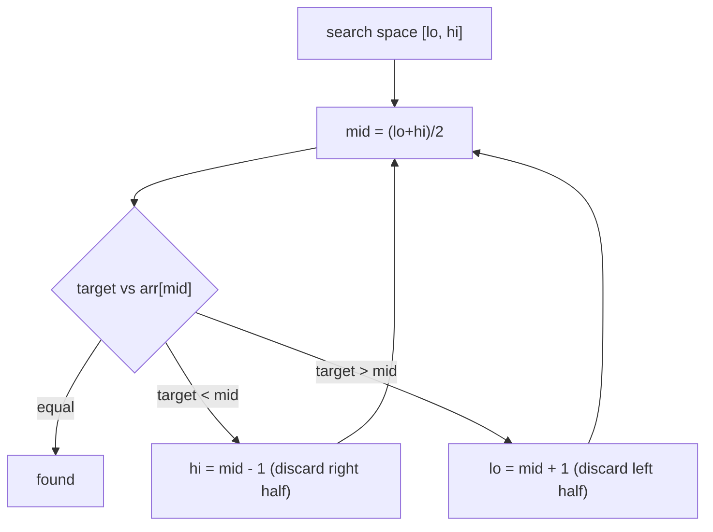

# Binary Search — Complete Guide (Beginner → Advanced)

> Binary search repeatedly halves a search space, finding answers in **O(log n)**. Its real
> power lies beyond sorted arrays: "**binary search on the answer**" solves a huge class of
> optimization problems.

---

## Table of Contents
1. [The Core Idea](#1-the-core-idea)
2. [Classic Binary Search](#2-classic-binary-search)
3. [Avoiding the Off-by-One Trap](#3-avoiding-the-off-by-one-trap)
4. [Lower Bound / Upper Bound](#4-lower-bound--upper-bound)
5. [Binary Search on the Answer](#5-binary-search-on-the-answer)
6. [Binary Search on Rotated/2D Data](#6-binary-search-on-rotated2d-data)
7. [Pitfalls & Cheat Sheet](#7-pitfalls--cheat-sheet)

---

## 1. The Core Idea

If a search space is **monotonic** (sorted, or a predicate that flips from false→true exactly
once), we can discard **half** of it with a single comparison. After `k` halvings, `n / 2^k`
candidates remain; we stop when one remains:

$$
\frac{n}{2^k} = 1 \;\Longrightarrow\; k = \log_2 n
$$

So the work is **O(log n)** — for `n = 1,000,000`, only ~20 steps.



---

## 2. Classic Binary Search

Find `target` in a sorted array; return its index or −1.

```python
def binary_search(arr, target):
    lo, hi = 0, len(arr) - 1
    while lo <= hi:                  # inclusive range [lo, hi]
        mid = lo + (hi - lo) // 2    # avoids integer overflow
        if arr[mid] == target:
            return mid
        elif arr[mid] < target:
            lo = mid + 1
        else:
            hi = mid - 1
    return -1
```

```cpp
int binary_search(const vector<int>& arr, int target) {
    int lo = 0, hi = (int)arr.size() - 1;
    while (lo <= hi) {                   // inclusive range [lo, hi]
        int mid = lo + (hi - lo) / 2;    // avoids integer overflow
        if (arr[mid] == target)
            return mid;
        else if (arr[mid] < target)
            lo = mid + 1;
        else
            hi = mid - 1;
    }
    return -1;
}
```

### Why `lo + (hi - lo) // 2` instead of `(lo + hi) // 2`?
In fixed-width integer languages, `lo + hi` can **overflow**. The equivalent
`lo + (hi - lo) // 2` never exceeds `hi`, so it's overflow-safe. (Python has big ints, but it's
a good universal habit.)

---

## 3. Avoiding the Off-by-One Trap

The two correct, consistent templates:

| Style | Range | Loop | Shrink |
|-------|-------|------|--------|
| **Inclusive** | `[lo, hi]` | `while lo <= hi` | `hi = mid - 1` / `lo = mid + 1` |
| **Half-open** | `[lo, hi)` | `while lo < hi`  | `hi = mid` / `lo = mid + 1` |

Pick one and stay consistent. Mixing them causes infinite loops or missed elements. The most
common bug is a loop that never shrinks (e.g. `hi = mid` with `lo <= hi`).

---

## 4. Lower Bound / Upper Bound

- **lower_bound(x):** first index with `arr[i] >= x`.
- **upper_bound(x):** first index with `arr[i] > x`.

These handle duplicates and ranges. Count of `x` = `upper_bound(x) − lower_bound(x)`.

```python
def lower_bound(arr, x):
    lo, hi = 0, len(arr)         # half-open [lo, hi)
    while lo < hi:
        mid = lo + (hi - lo) // 2
        if arr[mid] < x:
            lo = mid + 1         # mid too small, exclude it
        else:
            hi = mid             # mid is a candidate, keep it
    return lo                    # first index where arr[i] >= x
```

```cpp
int lower_bound(const vector<int>& arr, int x) {
    int lo = 0, hi = (int)arr.size();    // half-open [lo, hi)
    while (lo < hi) {
        int mid = lo + (hi - lo) / 2;
        if (arr[mid] < x)
            lo = mid + 1;                // mid too small, exclude it
        else
            hi = mid;                    // mid is a candidate, keep it
    }
    return lo;                           // first index where arr[i] >= x
}
```

---

## 5. Binary Search on the Answer

The most powerful idea: when the answer is a number in a range and there's a **monotonic
feasibility predicate** `feasible(x)` (false for small `x`, true once `x` is big enough — or
vice versa), binary search the *answer space* directly.

```
feasible:  F F F F T T T T
                  ^ first True = the answer
```

Template:
```python
def min_feasible(lo, hi, feasible):
    while lo < hi:
        mid = lo + (hi - lo) // 2
        if feasible(mid):
            hi = mid           # mid works; maybe smaller does too
        else:
            lo = mid + 1       # mid too small
    return lo
```

```cpp
long long min_feasible(long long lo, long long hi, function<bool(long long)> feasible) {
    while (lo < hi) {
        long long mid = lo + (hi - lo) / 2;
        if (feasible(mid))
            hi = mid;          // mid works; maybe smaller does too
        else
            lo = mid + 1;      // mid too small
    }
    return lo;
}
```

Classic applications:
- **Koko eating bananas** (min eating speed) — `feasible(speed)` = can finish in `H` hours.
- **Split array / books allocation** — minimize the maximum subarray sum.
- **Capacity to ship packages within D days.**
- **Smallest divisor given a threshold.**

The trick is recognizing the **monotonicity**: if speed `s` works, every `s' > s` also works.

---

## 6. Binary Search on Rotated/2D Data

- **Rotated sorted array** (LeetCode 33): one half is always sorted; decide which half holds the
  target and recurse there.
- **2D matrix** (row- and column-sorted): treat as a flattened sorted array
  (`row = mid // cols`, `col = mid % cols`) or do staircase search from a corner.
- **Find peak element:** compare `mid` with `mid+1`; move toward the higher side — a peak must
  exist there.

---

## 7. Pitfalls & Cheat Sheet

| Pitfall | Fix |
|---------|-----|
| Infinite loop | Ensure the range strictly shrinks each iteration |
| Overflow in `mid` | `mid = lo + (hi - lo) // 2` |
| Wrong boundary update | Match `<=`/`<` to inclusive/half-open consistently |
| Forgetting monotonicity check | Verify predicate is truly monotonic before BSing the answer |

```
Classic search ......... O(log n) on sorted data
lower/upper bound ...... first >= x / first > x
Answer-space search .... find first x where feasible(x) is True
Rotated array .......... identify the sorted half, then decide
Always: mid = lo + (hi-lo)//2 ; keep range invariant consistent
```

> **Mental model:** Binary search isn't about arrays — it's about **monotonic decision spaces**.
> Anytime "if X works, anything bigger works," you can binary search for the boundary.
