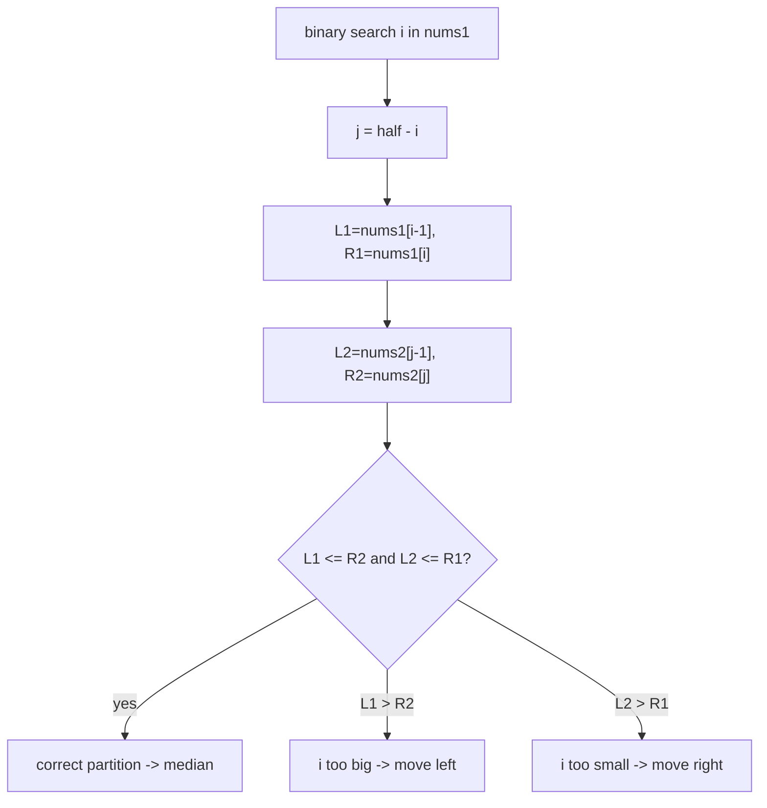

# Median of Two Sorted Arrays

| Meta | Value |
|------|-------|
| Source | LeetCode #4 |
| Difficulty | Hard |
| Topics | Binary Search, Divide & Conquer |
| Link | https://leetcode.com/problems/median-of-two-sorted-arrays/ |

---

## Problem Statement
Given two sorted arrays `nums1` and `nums2`, return the **median** of their combined sorted
order. Required: **O(log(m + n))**.

**Example**
```
nums1 = [1, 3], nums2 = [2]       -> median 2.0   (merged [1,2,3])
nums1 = [1, 2], nums2 = [3, 4]    -> median 2.5   (merged [1,2,3,4])
```

---

## Why Not Just Merge?
Merging is O(m + n). The challenge demands **O(log(m + n))**, achieved by binary searching for
the correct **partition** of the two arrays.

---

## Key Insight — Partition Both Arrays

The median splits the combined `m + n` elements into a **left half** and a **right half** of
equal size, where every element in the left ≤ every element in the right.

We choose a cut in `nums1` (after `i` elements) and a cut in `nums2` (after `j` elements) such
that the left side has exactly `(m + n + 1) / 2` elements:

$$
i + j = \left\lfloor \frac{m + n + 1}{2} \right\rfloor
$$

So `j` is **determined** by `i` — we only binary search `i` (on the **smaller** array to keep it
O(log min(m,n))).

```
nums1:  L1 | R1          (i elements on left)
nums2:  L2 | R2          (j elements on left)

Valid partition requires:
   maxLeft1 <= minRight2   AND   maxLeft2 <= minRight1
```



---

## Code

```python
def find_median_sorted_arrays(nums1, nums2):
    A, B = nums1, nums2
    if len(A) > len(B):
        A, B = B, A                       # binary search the smaller array
    m, n = len(A), len(B)
    half = (m + n + 1) // 2
    lo, hi = 0, m
    while lo <= hi:
        i = (lo + hi) // 2                # cut in A
        j = half - i                      # cut in B

        L1 = A[i - 1] if i > 0 else float('-inf')
        R1 = A[i]     if i < m else float('inf')
        L2 = B[j - 1] if j > 0 else float('-inf')
        R2 = B[j]     if j < n else float('inf')

        if L1 <= R2 and L2 <= R1:          # correct partition
            if (m + n) % 2 == 1:
                return max(L1, L2)         # odd total -> left max
            return (max(L1, L2) + min(R1, R2)) / 2   # even -> average
        elif L1 > R2:
            hi = i - 1                     # took too many from A
        else:
            lo = i + 1                     # took too few from A
    raise ValueError("inputs not sorted")
```

```cpp
double find_median_sorted_arrays(vector<int> nums1, vector<int> nums2) {
    vector<int> A = nums1, B = nums2;
    if (A.size() > B.size())
        swap(A, B);                       // binary search the smaller array
    int m = (int)A.size(), n = (int)B.size();
    int half = (m + n + 1) / 2;
    int lo = 0, hi = m;
    while (lo <= hi) {
        int i = (lo + hi) / 2;            // cut in A
        int j = half - i;                 // cut in B

        long long L1 = (i > 0) ? A[i - 1] : LLONG_MIN;
        long long R1 = (i < m) ? A[i]     : LLONG_MAX;
        long long L2 = (j > 0) ? B[j - 1] : LLONG_MIN;
        long long R2 = (j < n) ? B[j]     : LLONG_MAX;

        if (L1 <= R2 && L2 <= R1) {        // correct partition
            if ((m + n) % 2 == 1)
                return (double)max(L1, L2);              // odd total -> left max
            return (max(L1, L2) + min(R1, R2)) / 2.0;    // even -> average
        } else if (L1 > R2) {
            hi = i - 1;                    // took too many from A
        } else {
            lo = i + 1;                    // took too few from A
        }
    }
    throw invalid_argument("inputs not sorted");
}
```

The `±inf` sentinels elegantly handle cuts at the very start or end (empty left/right).

---

## Trace — `A = [1, 2]`, `B = [3, 4]`

`m=2, n=2, half = (4+1)//2 = 2`. Search `i ∈ [0, 2]`.

| lo | hi | i | j=2−i | L1 | R1 | L2 | R2 | L1≤R2 & L2≤R1? | action |
|----|----|---|-------|----|----|----|----|-----------------|--------|
| 0 | 2 | 1 | 1 | A[0]=1 | A[1]=2 | B[0]=3 | B[1]=4 | 1≤4 ✓ but 3≤2? **no** | L2>R1 → lo=2 |
| 2 | 2 | 2 | 0 | A[1]=2 | +inf | −inf | B[0]=3 | 2≤3 ✓ and −inf≤+inf ✓ | correct! |

Even total → median = `(max(L1,L2) + min(R1,R2)) / 2 = (max(2,−inf) + min(+inf,3)) / 2 =
(2 + 3)/2 = 2.5` ✓

---

## Why It's O(log(min(m, n)))

We binary search only the **smaller** array's cut position `i ∈ [0, m]`, halving the range each
step. `j` is computed directly, never searched. So the number of iterations is `O(log m)` where
`m = min(|nums1|, |nums2|)`.

---

## Complexity

| Approach | Time | Space |
|----------|------|-------|
| Merge then index | O(m + n) | O(m + n) |
| **Partition binary search** | **O(log min(m, n))** | O(1) |

## Takeaway
The median problem becomes tractable by searching for a **balanced partition** rather than the
value itself. The two cross-conditions `L1 ≤ R2` and `L2 ≤ R1` are the heart of the method — they
certify that all left elements precede all right elements without merging.
