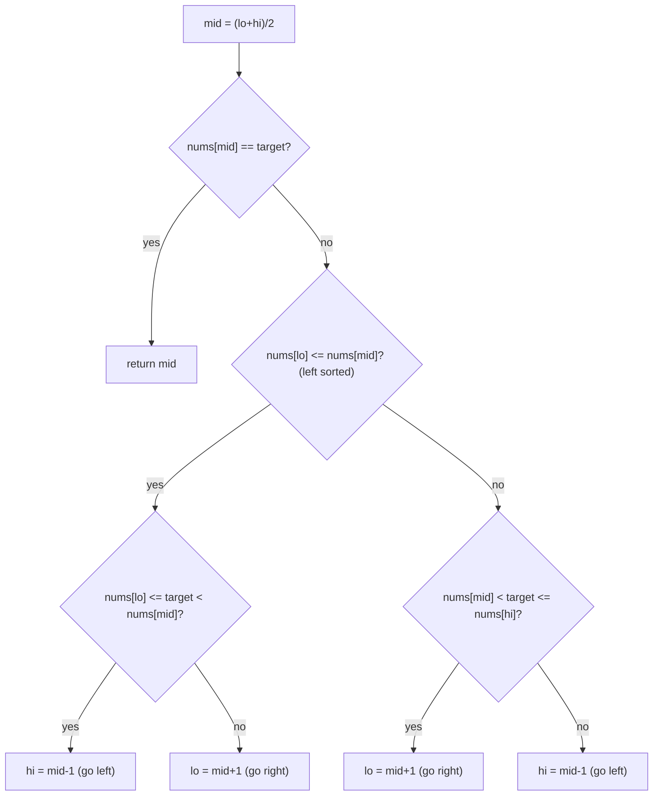

# Search in Rotated Sorted Array

| Meta | Value |
|------|-------|
| Source | LeetCode #33 |
| Difficulty | Medium |
| Topics | Binary Search, Array |
| Link | https://leetcode.com/problems/search-in-rotated-sorted-array/ |

---

## Problem Statement
A sorted array was rotated at an unknown pivot. Given the rotated array `nums` (distinct values)
and a `target`, return its index or `−1`. Must run in **O(log n)**.

**Example**
```
Input:  nums = [4, 5, 6, 7, 0, 1, 2], target = 0
Output: 4
```

---

## Key Insight — One Half Is Always Sorted

When you split a rotated sorted array at `mid`, **at least one half** `[lo..mid]` or
`[mid..hi]` is **fully sorted** (no pivot inside it). We:
1. Identify which half is sorted (compare endpoints to `nums[mid]`).
2. Check if the target lies **within** that sorted half's range.
3. Recurse into the half that must contain the target.

```
[4, 5, 6, 7, 0, 1, 2]
 lo       mid       hi
left half [4,5,6,7] is sorted (nums[lo]=4 <= nums[mid]=7)
```



---

## Code

```python
def search(nums, target):
    lo, hi = 0, len(nums) - 1
    while lo <= hi:
        mid = lo + (hi - lo) // 2
        if nums[mid] == target:
            return mid
        if nums[lo] <= nums[mid]:            # left half [lo..mid] sorted
            if nums[lo] <= target < nums[mid]:
                hi = mid - 1                 # target in sorted left
            else:
                lo = mid + 1                 # target in right
        else:                                # right half [mid..hi] sorted
            if nums[mid] < target <= nums[hi]:
                lo = mid + 1                 # target in sorted right
            else:
                hi = mid - 1                 # target in left
    return -1
```

```cpp
int search(const vector<int>& nums, int target) {
    int lo = 0, hi = (int)nums.size() - 1;
    while (lo <= hi) {
        int mid = lo + (hi - lo) / 2;
        if (nums[mid] == target)
            return mid;
        if (nums[lo] <= nums[mid]) {              // left half [lo..mid] sorted
            if (nums[lo] <= target && target < nums[mid])
                hi = mid - 1;                    // target in sorted left
            else
                lo = mid + 1;                    // target in right
        } else {                                 // right half [mid..hi] sorted
            if (nums[mid] < target && target <= nums[hi])
                lo = mid + 1;                    // target in sorted right
            else
                hi = mid - 1;                    // target in left
        }
    }
    return -1;
}
```

---

## Iteration Trace — `nums = [4,5,6,7,0,1,2]`, `target = 0`

| lo | hi | mid | nums[mid] | sorted half | target in it? | action |
|----|----|-----|-----------|-------------|---------------|--------|
| 0 | 6 | 3 | 7 | left `[4..7]` (4≤7) | 0 in [4,7)? no | lo = 4 |
| 4 | 6 | 5 | 1 | left `[0..1]` (0≤1) | 0 in [0,1)? **yes** | hi = 4 |
| 4 | 4 | 4 | 0 | — | nums[mid]==target | **return 4** |

Found at index **4**.

Notice each step still discards half the array, so we keep the `O(log n)` guarantee despite the
rotation.

---

## Why the `<=` in `nums[lo] <= nums[mid]`?

When `lo == mid` (one-element half), `nums[lo] == nums[mid]`, and we still want to treat the left
as "sorted." Using `<=` handles this boundary correctly. With distinct values this is precise;
with duplicates the check weakens (see the follow-up).

---

## Follow-up: Duplicates (LeetCode 81)
If duplicates are allowed, `nums[lo] == nums[mid] == nums[hi]` makes it impossible to tell which
half is sorted. The fix: when `nums[lo] == nums[mid] == nums[hi]`, shrink both ends (`lo++`,
`hi--`). This degrades worst case to **O(n)** (e.g. all equal), but stays O(log n) on average.

---

## Complexity

| Metric | Value |
|--------|-------|
| Time   | O(log n) (distinct), O(n) worst with duplicates |
| Space  | O(1) |

## Takeaway
Rotation doesn't break binary search — you just add a step to **find the sorted half** before
deciding which way to go. The same "which side is well-ordered?" reasoning solves *find minimum
in rotated array* (LeetCode 153).
