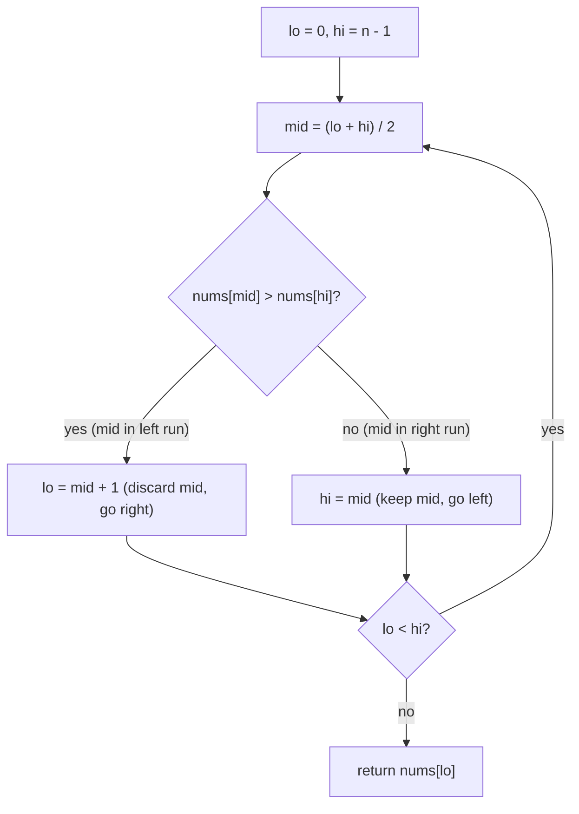

# Find Minimum in Rotated Sorted Array

| Meta | Value |
|------|-------|
| Source | LeetCode #153 |
| Difficulty | Medium |
| Topics | Binary Search, Arrays, Rotation Invariant |
| Link | https://leetcode.com/problems/find-minimum-in-rotated-sorted-array/ |

---

## Problem Statement

A sorted array of **distinct** integers is rotated at some unknown pivot. For example
`[0,1,2,4,5,6,7]` rotated 4 times becomes `[4,5,6,7,0,1,2]`. Return the **minimum** element
in `O(log n)` time.

**Example**
```
Input:  nums = [4, 5, 6, 7, 0, 1, 2]
Output: 0           # the pivot / smallest element sits at index 4

The array is two ascending runs glued together:
  [4, 5, 6, 7]  |  [0, 1, 2]
   left run         right run
                ^ minimum is the first element of the right run
```

---

## The Big Idea — Compare `mid` with `right`, Not `left`

A rotated sorted array is two ascending segments. Every element in the **left run** is strictly
greater than every element in the **right run**. The minimum is the single "drop" point where
the order resets.

The key invariant we maintain is:

> The minimum always lives inside the window `[lo, hi]`.

We compare `nums[mid]` with `nums[hi]` (the **right** boundary). Why the right boundary and not
the left? Because comparing against `nums[lo]` is ambiguous when the window is already fully
sorted, but comparing against `nums[hi]` cleanly tells us which run `mid` belongs to:

- **`nums[mid] > nums[hi]`** — `mid` sits in the **left (higher) run**. The drop point, and thus
  the minimum, must be to the **right** of `mid`. The element at `mid` cannot be the answer, so
  discard it: `lo = mid + 1`.
- **`nums[mid] < nums[hi]`** — `mid` sits in the **right (lower) run**, or the window is already
  sorted. The minimum is at `mid` **or to its left**. We must **keep** `mid` because it could be
  the answer: `hi = mid`.

Because the elements are distinct we never hit equality, so these two cases are exhaustive.



### Why `hi = mid` and never `hi = mid - 1`

When `nums[mid] < nums[hi]`, `mid` itself is a candidate minimum. If we wrote `hi = mid - 1` we
could step **past** the true minimum and lose it. The asymmetry is deliberate:

$$
\text{left run > all of right run} \implies \texttt{nums[mid] > nums[hi]} \Rightarrow \text{answer strictly right}
$$

so on that branch `lo = mid + 1` is safe; on the other branch we must retain `mid`.

The loop condition is `lo < hi` (not `<=`). It shrinks the window by at least one each step and
terminates when `lo == hi`, at which point a single element remains — the minimum.

---

## Solution — Binary Search on the Boundary

```python
from typing import List

class Solution:
    def findMin(self, nums: List[int]) -> int:
        lo, hi = 0, len(nums) - 1
        while lo < hi:                 # stop when the window is a single element
            mid = (lo + hi) // 2
            if nums[mid] > nums[hi]:   # mid is in the higher (left) run
                lo = mid + 1           # minimum is strictly to the right
            else:                      # mid is in the lower (right) run, keep it
                hi = mid               # minimum is mid or to its left
        return nums[lo]                # lo == hi points at the minimum
```

```cpp
#include <vector>
using namespace std;

class Solution {
public:
    int findMin(vector<int>& nums) {
        int lo = 0, hi = (int)nums.size() - 1;
        while (lo < hi) {                  // stop when the window is a single element
            int mid = lo + (hi - lo) / 2;  // avoids overflow vs (lo + hi) / 2
            if (nums[mid] > nums[hi]) {    // mid is in the higher (left) run
                lo = mid + 1;              // minimum is strictly to the right
            } else {                       // mid is in the lower (right) run, keep it
                hi = mid;                  // minimum is mid or to its left
            }
        }
        return nums[lo];                   // lo == hi points at the minimum
    }
};
```

Note the C++ uses `lo + (hi - lo) / 2` instead of `(lo + hi) / 2` to avoid integer overflow on
large indices — a habit worth keeping even when it cannot bite here.

---

## Iteration Trace

Running on `nums = [4, 5, 6, 7, 0, 1, 2]` (indices `0..6`):

| Step | lo | hi | mid | nums[mid] | nums[hi] | Comparison | Action |
|------|----|----|-----|-----------|----------|------------|--------|
| 1 | 0 | 6 | 3 | 7 | 2 | `7 > 2` | left run → `lo = mid + 1 = 4` |
| 2 | 4 | 6 | 5 | 1 | 2 | `1 < 2` | right run → `hi = mid = 5` |
| 3 | 4 | 5 | 4 | 0 | 1 | `0 < 1` | right run → `hi = mid = 4` |
| 4 | 4 | 4 | — | — | — | `lo == hi` | loop ends → return `nums[4] = 0` |

The window collapses `[0,6] → [4,6] → [4,5] → [4,4]`, halving each time.

---

## Complexity

| Approach | Time | Space |
|----------|------|-------|
| Linear scan | $O(n)$ | $O(1)$ |
| Binary search (above) | $O(\log n)$ | $O(1)$ |

Each iteration discards at least half of the remaining window, so after $k$ steps the window
size is $\le n / 2^{k}$. It reaches size 1 when $2^{k} \ge n$, i.e. $k = \lceil \log_2 n \rceil$,
giving the $O(\log n)$ bound.

---

## Takeaway

- A rotated sorted array is **two ascending runs**; the minimum is the single drop point.
- Compare `mid` against the **right** boundary `hi` — it unambiguously classifies which run
  `mid` is in, whereas comparing against `lo` is ambiguous for an already-sorted window.
- Use `lo = mid + 1` when `mid` is provably **not** the answer (it's in the higher run) and
  `hi = mid` when `mid` **could** be the answer (lower run). Mixing these up is the classic bug.
- Loop with `lo < hi` and return `nums[lo]`; the window always contains the answer (invariant).
