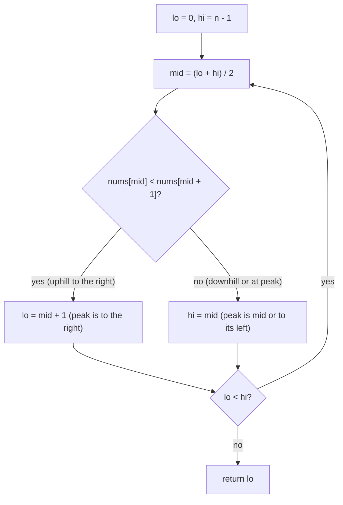

# Find Peak Element

| Meta | Value |
|------|-------|
| Source | LeetCode #162 |
| Difficulty | Medium |
| Topics | Binary Search, Arrays, Slope Climbing |
| Link | https://leetcode.com/problems/find-peak-element/ |

---

## Problem Statement

Given an integer array `nums` where **no two adjacent elements are equal**, a **peak** is any
element strictly greater than both of its neighbors. Return the index of **any one** peak.
Conceptually `nums[-1] = nums[n] = -infinity`, so the boundaries always slope "downhill" out of
the array. Solve in `O(log n)`.

**Example**
```
Input:  nums = [1, 2, 1, 3, 5, 6, 4]
Output: 5            # nums[5] = 6 > nums[4]=5 and > nums[6]=4  → a valid peak
                     # (index 1, value 2, is also a valid peak; ANY peak is accepted)

With virtual -inf walls on both ends:
  -inf  1  2  1  3  5  6  4  -inf
         ^peak           ^peak
```

---

## The Big Idea — Climb the Slope Toward a Peak

This array isn't sorted, yet binary search still works because of a **slope** argument rather
than an ordering argument. Imagine standing at index `mid` and looking at your right neighbor
`mid + 1`:

- **`nums[mid] < nums[mid + 1]`** — you're on an **uphill** slope. Walking right, the values are
  rising. Either they keep rising until the right wall (where `-inf` forces a turn down) or they
  rise then fall — **either way a peak exists somewhere to the right**, at index `> mid`. So
  discard the left half including `mid`: `lo = mid + 1`.
- **`nums[mid] > nums[mid + 1]`** — you're on a **downhill** slope (or at a peak). Walking left
  the values were rising up to `mid`. `mid` itself might be the peak, or the climb continues
  further left. **A peak exists at `mid` or to its left**, so keep `mid`: `hi = mid`.

### Why a peak is guaranteed to exist

Consider the chosen half. Its inner edge slopes **up into** the half and its outer edge is the
`-inf` wall sloping **down**. A sequence that goes up at one end and down at the other must reach
a local maximum in between. Formally, walking from the uphill edge you keep ascending; you cannot
ascend forever because the far boundary is $-\infty$, so at some index the value stops increasing
— that index is a peak. This is why we can always safely commit to the "uphill" direction.



### Why `hi = mid` and not `hi = mid - 1`

On the downhill branch, `mid` itself may be the peak. Writing `hi = mid - 1` would throw away the
only peak in the window. Conversely on the uphill branch `mid` is provably **not** a peak
(`nums[mid] < nums[mid + 1]`), so `lo = mid + 1` correctly discards it.

The condition `lo < hi` keeps the access `nums[mid + 1]` in bounds: when `lo < hi`, `mid` is
computed as $\lfloor (lo + hi)/2 \rfloor < hi$, so `mid + 1 <= hi <= n - 1` is always valid.

The invariant maintained throughout is:

$$
\textbf{Invariant:}\quad \text{a peak always exists within } [\,lo,\ hi\,]
$$

---

## Solution — Binary Search on the Slope

```python
from typing import List

class Solution:
    def findPeakElement(self, nums: List[int]) -> int:
        lo, hi = 0, len(nums) - 1
        while lo < hi:                       # window guaranteed to hold a peak
            mid = (lo + hi) // 2
            if nums[mid] < nums[mid + 1]:    # uphill slope to the right
                lo = mid + 1                 # a peak lies strictly to the right
            else:                            # downhill, or mid itself is a peak
                hi = mid                     # keep mid: peak is mid or to its left
        return lo                            # lo == hi is a peak index
```

```cpp
#include <vector>
using namespace std;

class Solution {
public:
    int findPeakElement(vector<int>& nums) {
        int lo = 0, hi = (int)nums.size() - 1;
        while (lo < hi) {                    // window guaranteed to hold a peak
            int mid = lo + (hi - lo) / 2;    // avoids overflow vs (lo + hi) / 2
            if (nums[mid] < nums[mid + 1]) { // uphill slope to the right
                lo = mid + 1;                // a peak lies strictly to the right
            } else {                         // downhill, or mid itself is a peak
                hi = mid;                    // keep mid: peak is mid or to its left
            }
        }
        return lo;                           // lo == hi is a peak index
    }
};
```

Because `lo < hi` ensures `mid < hi`, the neighbour access `nums[mid + 1]` is always in range —
no explicit boundary checks needed; the virtual `-inf` walls are handled implicitly by never
comparing past the array.

---

## Iteration Trace

Running on `nums = [1, 2, 1, 3, 5, 6, 4]` (indices `0..6`):

| Step | lo | hi | mid | nums[mid] | nums[mid+1] | Comparison | Action |
|------|----|----|-----|-----------|-------------|------------|--------|
| 1 | 0 | 6 | 3 | 3 | 5 | `3 < 5` | uphill → `lo = mid + 1 = 4` |
| 2 | 4 | 6 | 5 | 6 | 4 | `6 > 4` | downhill → `hi = mid = 5` |
| 3 | 4 | 5 | 4 | 5 | 6 | `5 < 6` | uphill → `lo = mid + 1 = 5` |
| 4 | 5 | 5 | — | — | — | `lo == hi` | loop ends → return `5` (nums[5] = 6) |

The window collapses `[0,6] → [4,6] → [4,5] → [5,5]`, landing on the peak at index 5.

---

## Complexity

| Approach | Time | Space |
|----------|------|-------|
| Linear scan | $O(n)$ | $O(1)$ |
| Binary search (above) | $O(\log n)$ | $O(1)$ |

Each step halves the window, so the number of iterations is $\lceil \log_2 n \rceil$, giving the
$O(\log n)$ time and $O(1)$ extra space.

---

## Takeaway

- Binary search does **not** require a sorted array — it requires a **decision that reliably
  points to a region still containing an answer**. Here the local slope does that.
- Compare `nums[mid]` with `nums[mid + 1]`: **uphill** means a peak is to the right
  (`lo = mid + 1`), **downhill/at peak** means a peak is at `mid` or left (`hi = mid`).
- The `-inf` boundary assumption guarantees a peak always exists in the chosen half — that's the
  invariant that justifies discarding the other half.
- Keep `mid` (`hi = mid`) whenever `mid` could be the answer; only do `lo = mid + 1` when `mid` is
  provably not a peak. The `lo < hi` loop also keeps `mid + 1` safely in bounds.
