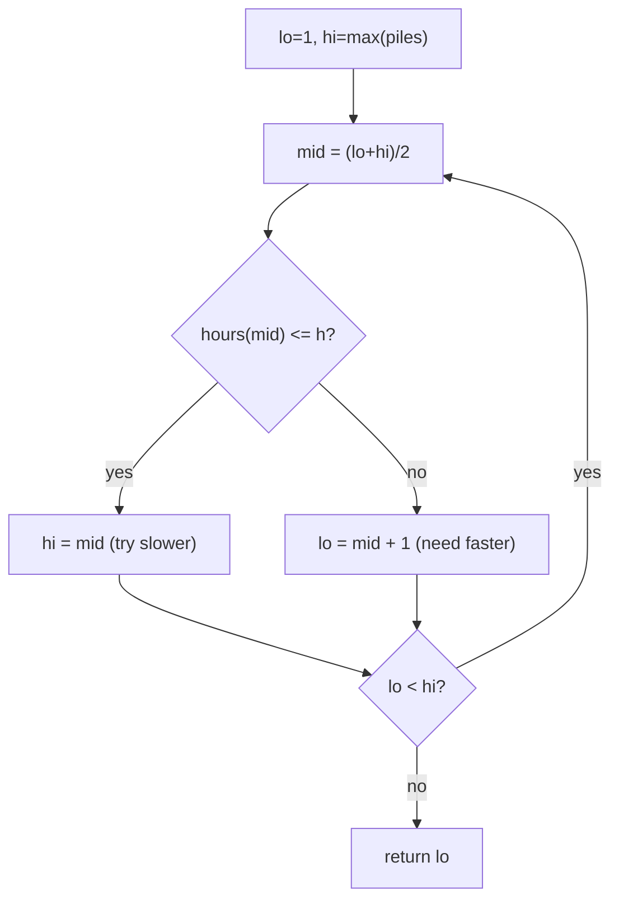

# Koko Eating Bananas (Binary Search on the Answer)

| Meta | Value |
|------|-------|
| Source | LeetCode #875 |
| Difficulty | Medium |
| Topics | Binary Search on Answer, Greedy |
| Link | https://leetcode.com/problems/koko-eating-bananas/ |

---

## Problem Statement
Koko has `piles[]` of bananas and `h` hours before the guards return. Each hour she eats up to
`k` bananas from **one** pile (if the pile has fewer, she eats it and stops for that hour).
Return the **minimum** integer eating speed `k` so she finishes all bananas within `h` hours.

**Example**
```
Input:  piles = [3, 6, 7, 11], h = 8
Output: 4
```

---

## The Big Idea — Search the Answer, Not the Array

The array isn't sorted and we're not looking *in* it. Instead, the **answer** `k` lives in a
range `[1, max(piles)]`, and the question "can Koko finish at speed `k`?" is **monotonic**:

> If speed `k` is fast enough, then every speed `> k` is also fast enough.

```
k:          1  2  3  4  5  6 ...
finishable: F  F  F  T  T  T ...
                     ^ first True = answer
```

So we **binary search** for the smallest `k` where `feasible(k)` becomes true.



---

## Feasibility Function — Hours Needed at Speed k

Eating a pile of size `p` at speed `k` takes `ceil(p / k)` hours (the last partial hour still
counts as a whole hour). Total hours:

$$
\text{hours}(k) = \sum_{p \in \text{piles}} \left\lceil \frac{p}{k} \right\rceil
$$

`feasible(k)` is `hours(k) <= h`.

```python
import math

def min_eating_speed(piles, h):
    def hours(k):
        return sum(math.ceil(p / k) for p in piles)

    lo, hi = 1, max(piles)          # answer range
    while lo < hi:
        mid = lo + (hi - lo) // 2
        if hours(mid) <= h:
            hi = mid                # mid works; try slower
        else:
            lo = mid + 1            # too slow; speed up
    return lo
```

```cpp
int min_eating_speed(const vector<int>& piles, int h) {
    auto hours = [&](long long k) {
        long long total = 0;
        for (int p : piles)
            total += (p + k - 1) / k;   // ceil(p / k) without floats
        return total;
    };

    long long lo = 1, hi = *max_element(piles.begin(), piles.end());  // answer range
    while (lo < hi) {
        long long mid = lo + (hi - lo) / 2;
        if (hours(mid) <= h)
            hi = mid;               // mid works; try slower
        else
            lo = mid + 1;           // too slow; speed up
    }
    return (int)lo;
}
```

> `ceil(p / k)` can be written without floats as `(p + k - 1) // k` to avoid precision issues.

---

## Iteration Trace — `piles = [3,6,7,11]`, `h = 8`

`lo = 1`, `hi = 11`.

| lo | hi | mid | hours(mid) = Σ ceil(p/mid) | ≤ 8? | action |
|----|----|-----|----------------------------|------|--------|
| 1 | 11 | 6 | 1+1+2+2 = 6 | yes | hi = 6 |
| 1 | 6 | 3 | 1+2+3+4 = 10 | no | lo = 4 |
| 4 | 6 | 5 | 1+2+2+3 = 8 | yes | hi = 5 |
| 4 | 5 | 4 | 1+2+2+3 = 8 | yes | hi = 4 |
| 4 | 4 | — | lo == hi → stop | | return **4** |

At `k = 4`: `ceil(3/4)=1, ceil(6/4)=2, ceil(7/4)=2, ceil(11/4)=3` → `1+2+2+3 = 8 ≤ 8` ✓.
At `k = 3`: total 10 > 8 ✗. So **4** is the minimum feasible speed.

---

## Why Monotonicity Holds

`hours(k)` is a **non-increasing** function of `k`: a higher speed never *increases* the time for
any pile (`ceil(p/k)` shrinks or stays as `k` grows). Therefore once `hours(k) <= h`, it stays
`<= h` for all larger `k`. This monotonic flip from infeasible→feasible is exactly what binary
search needs.

---

## Complexity

| Metric | Value |
|--------|-------|
| Time   | O(n · log(max(piles))) — `log M` binary-search steps, each `feasible` is O(n) |
| Space  | O(1) |

A brute-force scan over every speed from 1 to `max(piles)` would be `O(n · max(piles))` — binary
search replaces the linear answer-scan with a logarithmic one.

---

## Recognizing "Binary Search on the Answer"
Ask: *Is the answer a number in a range, and does a yes/no feasibility test flip monotonically?*
If yes, binary search the answer. Sibling problems: ship-within-D-days (1011), split-array-
largest-sum (410), minimum-time-to-complete-tasks.

## Takeaway
When you can't search the data directly, search the **space of possible answers**. Define a
monotonic `feasible(x)` and find its boundary in `O(log range)` evaluations.
