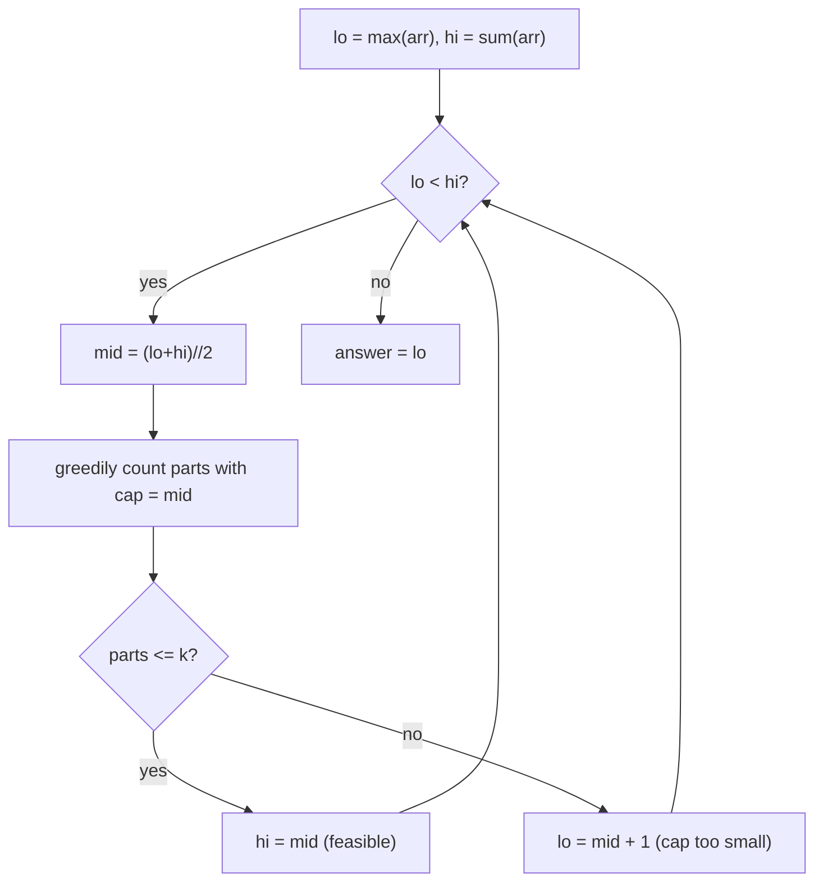

# Array Division (CSES — Minimize the Maximum Subarray Sum)

| Meta | Value |
|------|-------|
| Source | CSES Problem Set — Sorting and Searching |
| Difficulty | Medium |
| Topics | Binary Search on Answer, Greedy Partition |
| Link | https://cses.fi/problemset/task/1085 |

---

## Problem Statement
Split an array of `n` positive integers into **at most `k` contiguous subarrays**. Minimize the
**maximum subarray sum**. Output that minimized maximum.

**Example**
```
arr = [2, 4, 7, 3, 5], k = 3
Output: 8
```
One optimal split: `[2,4] | [7] | [3,5]` → sums `6, 7, 8` → max = 8. No split into ≤3 parts beats 8.

---

## Binary Search on the Maximum Allowed Sum

Let `cap` = the largest sum we permit any subarray to have. **More `cap` → fewer parts needed**
(monotone). Define a greedy feasibility check:

> Greedily fill subarrays left to right; start a new part whenever adding the next element would
> exceed `cap`. Count how many parts this needs. If `parts <= k`, then `cap` is **feasible**.

We binary-search the **smallest feasible `cap`**.

**Search bounds:**
- `lo = max(arr)` — no single element can be split, so the cap must be at least the largest element.
- `hi = sum(arr)` — one part containing everything.



```python
def array_division(arr, k):
    def parts_needed(cap):
        parts = 1
        cur = 0
        for v in arr:
            if cur + v > cap:           # would overflow this part -> start new part
                parts += 1
                cur = v
            else:
                cur += v
        return parts

    lo, hi = max(arr), sum(arr)
    while lo < hi:
        mid = (lo + hi) // 2
        if parts_needed(mid) <= k:
            hi = mid                    # feasible -> try a smaller cap
        else:
            lo = mid + 1                # too tight -> raise cap
    return lo
```

```cpp
long long array_division(const vector<long long>& arr, int k) {
    auto parts_needed = [&](long long cap) {
        int parts = 1;
        long long cur = 0;
        for (long long v : arr) {
            if (cur + v > cap) {        // would overflow this part -> start new part
                parts += 1;
                cur = v;
            } else {
                cur += v;
            }
        }
        return parts;
    };

    long long lo = *max_element(arr.begin(), arr.end());
    long long hi = accumulate(arr.begin(), arr.end(), 0LL);
    while (lo < hi) {
        long long mid = (lo + hi) / 2;
        if (parts_needed(mid) <= k)
            hi = mid;                   // feasible -> try a smaller cap
        else
            lo = mid + 1;               // too tight -> raise cap
    }
    return lo;
}
```

---

## Trace — `arr = [2, 4, 7, 3, 5]`, `k = 3`

`lo = max = 7`, `hi = sum = 21`.

| lo | hi | mid (cap) | greedy split | parts | ≤3? | action |
|----|----|-----------|--------------|-------|-----|--------|
| 7 | 21 | 14 | [2,4,7][3,5] | 2 | yes | hi=14 |
| 7 | 14 | 10 | [2,4][7,3]? 7+3=10 ok →[5] | [2,4][7,3][5] = 3 | yes | hi=10 |
| 7 | 10 | 8 | [2,4][7][3,5] | 3 | yes | hi=8 |
| 7 | 8 | 7 | [2,4][7][3]? 3+5=8>7→[5] | [2,4][7][3][5] = 4 | no | lo=8 |
| 8 | 8 | — | — | — | — | stop |

Answer = **8**. At `cap=7` we need 4 parts (too many); at `cap=8` exactly 3 parts fit, and it's the
smallest such cap.

---

## Why the Greedy Check Is Correct

For a **fixed** `cap`, greedily extending the current part as far as possible **minimizes the
number of parts** — leaving any element for a later part could only force more parts, never fewer.
So `parts_needed(cap)` returns the true minimum part count, making the feasibility test exact.

Monotonicity: increasing `cap` never increases `parts_needed`, so feasibility flips once from
`False` to `True` — exactly the structure binary search needs.

---

## Complexity

| Metric | Value |
|--------|-------|
| Time | O(n · log(sum(arr))) |
| Space | O(1) |

---

## Sibling Problems (identical template)
| Problem | "cap" meaning |
|---------|---------------|
| **Split Array Largest Sum** (LeetCode 410) | identical problem |
| **Capacity to Ship Packages in D Days** (1011) | daily weight capacity |
| **Koko Eating Bananas** (875) | bananas-per-hour rate |
| **Aggressive Cows** (SPOJ) | minimum gap (maximize instead) |

## Takeaway
"**Minimize the maximum**" (or "maximize the minimum") over contiguous partitions is the signature
of **binary search on the answer** with a **greedy feasibility check**. Bound the search by
`[max(arr), sum(arr)]`, greedily count parts, and the greedy's optimality guarantees a correct
monotone predicate.
