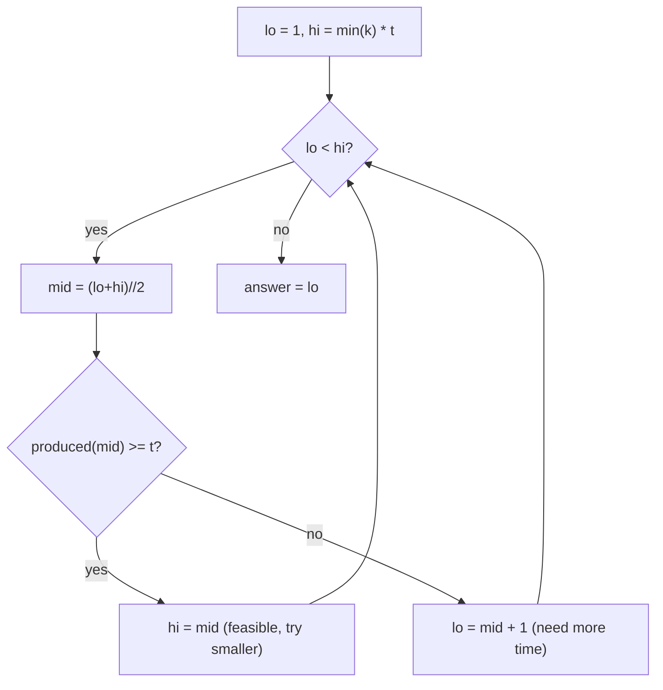

# Factory Machines (CSES — Binary Search on the Answer)

| Meta | Value |
|------|-------|
| Source | CSES Problem Set — Sorting and Searching |
| Difficulty | Medium |
| Topics | Binary Search on Answer, Greedy |
| Link | https://cses.fi/problemset/task/1620 |

---

## Problem Statement
There are `n` machines. Machine `i` produces **one product every `k[i]` seconds**. Find the
**minimum time** to produce a total of at least `t` products (all machines work in parallel).

**Example**
```
n = 3, t = 7, k = [3, 2, 5]
Output: 8
```
In 8 seconds: machine1 makes ⌊8/3⌋=2, machine2 makes ⌊8/2⌋=4, machine3 makes ⌊8/5⌋=1 → total 7 ≥ 7. ✓
In 7 seconds: 2 + 3 + 1 = 6 < 7. ✗  So 8 is the minimum.

---

## Binary Search on the Answer (Time)

The key observation is **monotonicity**: if `T` seconds suffice to make `t` products, then any
time `> T` also suffices. So "can we finish in `T` seconds?" is a **monotone predicate** —
`False, False, ..., False, True, True, ...` — perfect for binary search on `T`.

**Products in time `T`:**
$$
\text{produced}(T) = \sum_{i=1}^{n} \left\lfloor \frac{T}{k_i} \right\rfloor
$$

We binary-search the smallest `T` with `produced(T) >= t`.



```python
def factory_machines(t, k):
    def produced(T):
        total = 0
        for ki in k:
            total += T // ki
            if total >= t:              # early exit avoids overflow-ish big sums
                return total
        return total

    lo, hi = 1, min(k) * t              # fastest machine alone needs min(k)*t seconds
    while lo < hi:
        mid = (lo + hi) // 2
        if produced(mid) >= t:
            hi = mid                    # feasible -> shrink upper bound
        else:
            lo = mid + 1                # infeasible -> raise lower bound
    return lo
```

```cpp
long long factory_machines(long long t, const vector<long long>& k) {
    auto produced = [&](long long T) {
        long long total = 0;
        for (long long ki : k) {
            total += T / ki;
            if (total >= t)             // early exit avoids overflow-ish big sums
                return total;
        }
        return total;
    };

    long long lo = 1;
    long long hi = *min_element(k.begin(), k.end()) * t;  // fastest machine alone needs min(k)*t seconds
    while (lo < hi) {
        long long mid = (lo + hi) / 2;
        if (produced(mid) >= t)
            hi = mid;                   // feasible -> shrink upper bound
        else
            lo = mid + 1;               // infeasible -> raise lower bound
    }
    return lo;
}
```

**Upper bound `hi = min(k) * t`:** the single fastest machine alone makes `t` products in
`min(k) * t` seconds, so the answer never exceeds that.

---

## Trace — `t = 7`, `k = [3, 2, 5]`

`lo = 1`, `hi = 2 * 7 = 14`.

| lo | hi | mid | produced(mid) = ⌊m/3⌋+⌊m/2⌋+⌊m/5⌋ | ≥ 7? | action |
|----|----|-----|-----------------------------------|------|--------|
| 1 | 14 | 7 | 2 + 3 + 1 = 6 | no | lo = 8 |
| 8 | 14 | 11 | 3 + 5 + 2 = 10 | yes | hi = 11 |
| 8 | 11 | 9 | 3 + 4 + 1 = 8 | yes | hi = 9 |
| 8 | 9 | 8 | 2 + 4 + 1 = 7 | yes | hi = 8 |
| 8 | 8 | — | — | — | stop |

Answer = **8**. The search converges in `O(log(min(k)·t))` iterations, each costing `O(n)`.

---

## Why "Search on Answer" Applies

Many optimization problems aren't directly searchable, but become so when you **invert** them:
instead of "what is the minimum time?", ask "is time `T` enough?" — a yes/no **feasibility check**.
If feasibility is monotone in `T`, binary-search the boundary. This pattern powers Koko Eating
Bananas, Aggressive Cows, Array Division, capacity/ship-packages problems, and more.

---

## Complexity

| Metric | Value |
|--------|-------|
| Time | O(n · log(min(k) · t)) |
| Space | O(1) |

Watch for **overflow** in languages with fixed ints: `min(k) * t` can be ~10¹⁸ — use 64-bit
(Python is arbitrary precision, so safe here). The early-exit in `produced` also caps the sum.

---

## Takeaway
**Binary search on the answer** converts a hard minimization into a series of easy
**feasibility checks**, exploiting the monotonic "if T works, T+1 works" property. Identify the
predicate, bound the search range carefully, and use the lower-bound (`hi = mid`) template to land
on the smallest feasible value.
