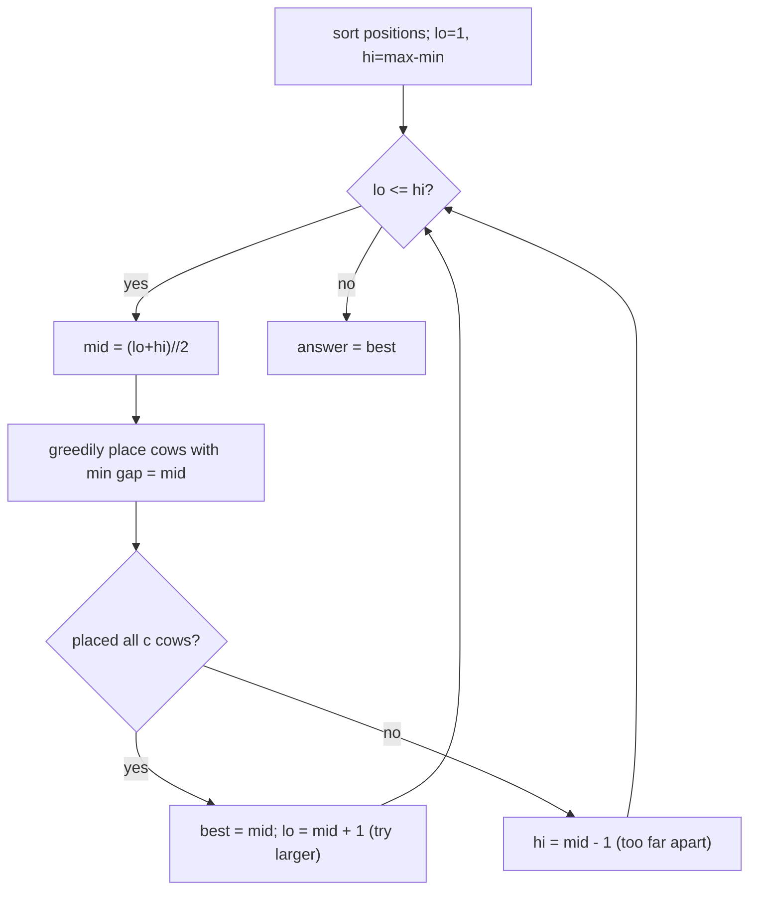

# Aggressive Cows (SPOJ — Maximize the Minimum Distance)

| Meta | Value |
|------|-------|
| Source | SPOJ AGGRCOW (classic) |
| Difficulty | Medium |
| Topics | Binary Search on Answer, Greedy |
| Link | https://www.spoj.com/problems/AGGRCOW/ |

---

## Problem Statement
There are `n` stalls at given positions on a line, and `c` aggressive cows. Place the cows in
stalls so that the **minimum distance** between any two cows is **as large as possible**. Output
that largest possible minimum distance.

**Example**
```
positions = [1, 2, 4, 8, 9], c = 3
Output: 3
```
Place cows at stalls `1, 4, 8` → gaps `3, 4` → min gap = 3. No arrangement of 3 cows beats 3.

---

## Binary Search on the Distance

This is the **"maximize the minimum"** twin of Array Division. We binary-search the answer
`d` = the candidate minimum spacing, with a greedy feasibility check:

> Sort the stalls. Place the first cow at the leftmost stall. Greedily place each next cow at the
> first stall **at least `d` away** from the previously placed cow. If we manage to place all `c`
> cows, distance `d` is **feasible**.

Monotonicity: a smaller required spacing `d` is **easier** to satisfy. So feasibility is
`True, True, ..., True, False, False` — we want the **largest feasible `d`**.



```python
def aggressive_cows(positions, c):
    positions.sort()

    def can_place(d):
        count = 1                       # first cow at positions[0]
        last = positions[0]
        for p in positions[1:]:
            if p - last >= d:           # far enough -> place a cow here
                count += 1
                last = p
                if count == c:
                    return True
        return count >= c

    lo, hi = 1, positions[-1] - positions[0]
    best = 0
    while lo <= hi:
        mid = (lo + hi) // 2
        if can_place(mid):
            best = mid                  # feasible -> push for a bigger gap
            lo = mid + 1
        else:
            hi = mid - 1                # infeasible -> shrink the gap
    return best
```

```cpp
int aggressive_cows(vector<int> positions, int c) {
    sort(positions.begin(), positions.end());

    auto can_place = [&](int d) {
        int count = 1;                  // first cow at positions[0]
        int last = positions[0];
        for (size_t i = 1; i < positions.size(); ++i) {
            int p = positions[i];
            if (p - last >= d) {        // far enough -> place a cow here
                count += 1;
                last = p;
                if (count == c)
                    return true;
            }
        }
        return count >= c;
    };

    int lo = 1, hi = positions.back() - positions.front();
    int best = 0;
    while (lo <= hi) {
        int mid = (lo + hi) / 2;
        if (can_place(mid)) {
            best = mid;                 // feasible -> push for a bigger gap
            lo = mid + 1;
        } else {
            hi = mid - 1;               // infeasible -> shrink the gap
        }
    }
    return best;
}
```

This uses the **"largest feasible"** template (max-the-min): on success, record and move `lo` up.

---

## Trace — `positions = [1, 2, 4, 8, 9]`, `c = 3`

`lo = 1`, `hi = 9 - 1 = 8`.

| lo | hi | mid (d) | greedy placement | placed | ≥3? | action |
|----|----|---------|------------------|--------|-----|--------|
| 1 | 8 | 4 | 1, (gap≥4)→8 | cow at 1, 8 → 2 | no | hi=3 |
| 1 | 3 | 2 | 1, 4, 8 (gaps 3,4) | 3 | yes | best=2, lo=3 |
| 3 | 3 | 3 | 1, 4, 8 (gaps 3,4) | 3 | yes | best=3, lo=4 |
| 4 | 3 | — | — | — | — | stop |

Answer = **3**. At `d=4` only 2 cows fit (infeasible); at `d=3` all 3 fit, and it's the largest such
spacing.

---

## Greedy Correctness

For a fixed minimum gap `d`, placing each cow as **early (leftmost) as possible** leaves the most
room for the remaining cows. Any later placement could only reduce how many cows fit — never
increase it. Hence the greedy maximizes the count, making `can_place(d)` an exact predicate, and
the count is **monotone decreasing** in `d`.

---

## Complexity

| Metric | Value |
|--------|-------|
| Sort | O(n log n) |
| Binary search | O(n · log(range)) |
| Total | O(n log n + n log(max−min)) |
| Space | O(1) extra |

---

## "Max-the-Min" vs "Min-the-Max" Templates
| Goal | On success | On failure | Answer is |
|------|-----------|-----------|-----------|
| **Maximize the minimum** (cows) | record, `lo = mid+1` | `hi = mid-1` | largest feasible |
| **Minimize the maximum** (array division) | `hi = mid` | `lo = mid+1` | smallest feasible |

## Takeaway
"**Maximize the minimum gap**" is binary search on the answer with a **leftmost-greedy** placement
check. It mirrors "minimize the maximum" but searches for the **largest** feasible value. Recognize
the max-min / min-max phrasing and the correct template — and direction of the predicate — follows
immediately.
