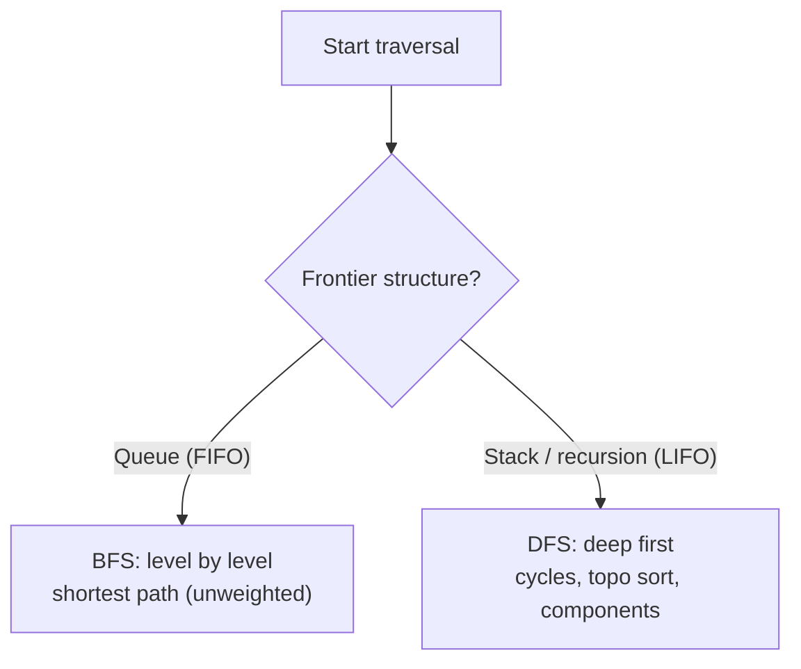
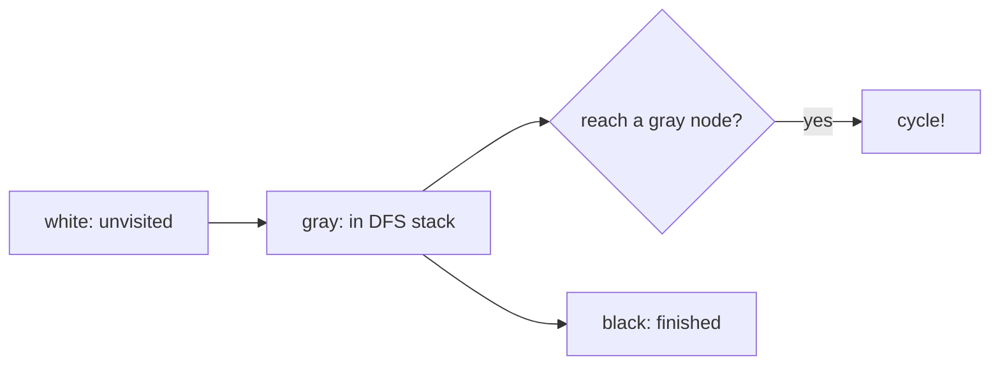

# Graphs — Complete Guide (Beginner → Advanced)

> Graphs model **relationships**: networks, maps, dependencies, social connections. Nearly every
> hard real-world problem is a graph problem in disguise. Master traversal (BFS/DFS) and you
> unlock shortest paths, cycles, connectivity, scheduling, and more.

---

## Table of Contents
1. [What is a Graph?](#1-what-is-a-graph)
2. [Representations](#2-representations)
3. [Traversals: BFS & DFS](#3-traversals-bfs--dfs)
4. [Connectivity & Cycles](#4-connectivity--cycles)
5. [Topological Sort (DAGs)](#5-topological-sort-dags)
6. [Shortest Paths](#6-shortest-paths)
7. [Minimum Spanning Trees](#7-minimum-spanning-trees)
8. [Union-Find (DSU)](#8-union-find-dsu)
9. [Cheat Sheet](#9-cheat-sheet)

---

## 1. What is a Graph?

A graph `G = (V, E)` is a set of **vertices** `V` and **edges** `E` connecting them.

```
   (A)---(B)
    |   / |
    |  /  |
   (C)---(D)
```

Classifications:
- **Directed** (edges have direction, `A → B`) vs **Undirected** (`A — B`).
- **Weighted** (edges carry a cost) vs **Unweighted**.
- **Cyclic** vs **Acyclic** (a directed acyclic graph = **DAG**).
- **Connected** vs **Disconnected**; **dense** (E ≈ V²) vs **sparse** (E ≈ V).

Trees are a special case: a **connected acyclic undirected graph** with exactly `V − 1` edges.

---

## 2. Representations

### Adjacency List — preferred for sparse graphs
Each vertex stores a list of its neighbors. Space `O(V + E)`.

```python
graph = {
    'A': ['B', 'C'],
    'B': ['A', 'C', 'D'],
    'C': ['A', 'B', 'D'],
    'D': ['B', 'C'],
}
```

```cpp
#include <map>
#include <vector>
#include <string>
using namespace std;

map<string, vector<string>> graph = {
    {"A", {"B", "C"}},
    {"B", {"A", "C", "D"}},
    {"C", {"A", "B", "D"}},
    {"D", {"B", "C"}},
};
```

### Adjacency Matrix — good for dense graphs / O(1) edge checks
A `V × V` matrix where `M[i][j] = 1` (or weight) if an edge exists. Space `O(V²)`.

```
    A B C D
A [ 0 1 1 0 ]
B [ 1 0 1 1 ]
C [ 1 1 0 1 ]
D [ 0 1 1 0 ]
```

| Operation | Adjacency List | Adjacency Matrix |
|-----------|----------------|------------------|
| Space | O(V + E) | O(V²) |
| Edge exists? | O(degree) | **O(1)** |
| Iterate neighbors | O(degree) | O(V) |
| Best for | sparse graphs | dense graphs |

---

## 3. Traversals: BFS & DFS

Both visit every reachable vertex once; the difference is **order** and the **frontier
structure**.

### BFS — Breadth-First (Queue, FIFO)
Explores level by level. On an **unweighted** graph it finds **shortest paths** (fewest edges).

```python
from collections import deque
def bfs(graph, start):
    visited = {start}
    q = deque([start])
    order = []
    while q:
        node = q.popleft()
        order.append(node)
        for nb in graph[node]:
            if nb not in visited:
                visited.add(nb)      # mark on enqueue to avoid duplicates
                q.append(nb)
    return order
```

```cpp
#include <vector>
#include <queue>
#include <unordered_set>
#include <unordered_map>
using namespace std;

vector<int> bfs(unordered_map<int, vector<int>>& graph, int start) {
    unordered_set<int> visited{start};
    queue<int> q;
    q.push(start);
    vector<int> order;
    while (!q.empty()) {
        int node = q.front(); q.pop();
        order.push_back(node);
        for (int nb : graph[node]) {
            if (!visited.count(nb)) {
                visited.insert(nb);      // mark on enqueue to avoid duplicates
                q.push(nb);
            }
        }
    }
    return order;
}
```

### DFS — Depth-First (Stack / recursion, LIFO)
Goes as deep as possible before backtracking. Natural for cycle detection, topological sort,
connected components, path finding.

```python
def dfs(graph, node, visited):
    visited.add(node)
    for nb in graph[node]:
        if nb not in visited:
            dfs(graph, nb, visited)
```

```cpp
#include <vector>
#include <unordered_set>
#include <unordered_map>
using namespace std;

void dfs(unordered_map<int, vector<int>>& graph, int node, unordered_set<int>& visited) {
    visited.insert(node);
    for (int nb : graph[node]) {
        if (!visited.count(nb)) {
            dfs(graph, nb, visited);
        }
    }
}
```



Both run in **O(V + E)** with an adjacency list — each vertex and edge examined once.

---

## 4. Connectivity & Cycles

- **Connected components (undirected):** run BFS/DFS from each unvisited vertex; each launch is
  a new component.
- **Cycle detection (undirected):** during DFS, if you reach a visited vertex that **isn't your
  parent**, there's a cycle.
- **Cycle detection (directed):** track three states — *unvisited*, *in-progress (on the
  recursion stack)*, *done*. Reaching an *in-progress* node means a **back edge** → cycle.



---

## 5. Topological Sort (DAGs)

A linear ordering of a **DAG**'s vertices such that every edge `u → v` has `u` before `v`. Used
for **build systems, course scheduling, dependency resolution**.

### Kahn's Algorithm (BFS-based)
1. Compute **in-degree** of every node.
2. Queue all nodes with in-degree 0.
3. Repeatedly pop a node, append to order, and decrement neighbors' in-degrees; enqueue any that
   hit 0.
4. If you ordered fewer than `V` nodes, the graph has a **cycle** (no valid ordering).

$$
\text{valid topo order exists} \iff \text{graph is a DAG (acyclic)}
$$

DFS-based alternative: push nodes onto a stack in **post-order**, then reverse.

---

## 6. Shortest Paths

| Algorithm | Graph type | Time | Idea |
|-----------|-----------|------|------|
| **BFS** | unweighted | O(V + E) | level order = fewest edges |
| **Dijkstra** | non-negative weights | O(E log V) | greedily pop closest via min-heap |
| **0-1 BFS** | weights 0/1 | O(V + E) | deque: push 0-edges front, 1-edges back |
| **Bellman-Ford** | negative weights ok | O(V·E) | relax all edges V−1 times; detects neg cycles |
| **Floyd-Warshall** | all pairs | O(V³) | DP over intermediate vertices |

### Dijkstra core
Maintain tentative distances; repeatedly extract the **closest unfinalized** vertex from a
min-heap and **relax** its edges:

$$
\text{if } dist[u] + w(u,v) < dist[v]: \quad dist[v] = dist[u] + w(u,v)
$$

Dijkstra fails with negative edges because once a node is "finalized" it's never revisited — a
later negative edge could have improved it. Use Bellman-Ford then.

---

## 7. Minimum Spanning Trees

A **MST** connects all vertices with minimum total edge weight (no cycles), using `V − 1` edges.

| Algorithm | Idea | Time |
|-----------|------|------|
| **Kruskal** | sort edges, add the cheapest that doesn't form a cycle (Union-Find) | O(E log E) |
| **Prim** | grow the tree from a start vertex, always adding the cheapest frontier edge (heap) | O(E log V) |

Both rely on the **cut property:** the minimum-weight edge crossing any partition of vertices is
safe to include in some MST.

---

## 8. Union-Find (DSU)

A **Disjoint Set Union** tracks connected components with near-O(1) `find` and `union`. Two
optimizations make it almost constant:
- **Path compression:** flatten the tree during `find`.
- **Union by rank/size:** attach the smaller tree under the larger.

With both, `m` operations run in `O(m · α(n))` where `α` is the inverse Ackermann function
(≤ 4 for any practical `n`).

```python
parent = list(range(n))
def find(x):
    while parent[x] != x:
        parent[x] = parent[parent[x]]   # path compression
        x = parent[x]
    return x
def union(a, b):
    parent[find(a)] = find(b)
```

```cpp
#include <vector>
#include <numeric>
using namespace std;

vector<int> parent(n);
// parent = [0, 1, ..., n-1]
// (call once after sizing: iota(parent.begin(), parent.end(), 0);)

int find(int x) {
    while (parent[x] != x) {
        parent[x] = parent[parent[x]];   // path compression
        x = parent[x];
    }
    return x;
}
// `union` is a C++ keyword, so name the function `unite`
void unite(int a, int b) {
    parent[find(a)] = find(b);
}
```

Used in Kruskal's MST, cycle detection, connectivity queries, and "number of islands" variants.

---

## 9. Cheat Sheet

```
Represent:   adjacency list (sparse, O(V+E))  |  matrix (dense, O(1) edge check)
Traverse:    BFS (queue, shortest unweighted)  |  DFS (stack, cycles/topo/components)
             both O(V+E)

Topo sort:   Kahn (in-degrees + queue)  -> only for DAGs
Shortest:    BFS (unweighted) | Dijkstra (non-neg, heap) |
             Bellman-Ford (neg ok) | Floyd-Warshall (all pairs)
MST:         Kruskal (sort + DSU) | Prim (heap)
DSU:         path compression + union by rank ~ O(alpha(n)) ~ O(1)

Directed cycle: white/gray/black DFS  |  Undirected cycle: visited != parent
```

> **Mental model:** Almost every graph problem = "explore reachable nodes (BFS/DFS) + track some
> extra state." Identify whether you need *fewest edges* (BFS), *cheapest path* (Dijkstra),
> *ordering* (topo sort), or *connectivity* (DSU), and the right tool follows.
