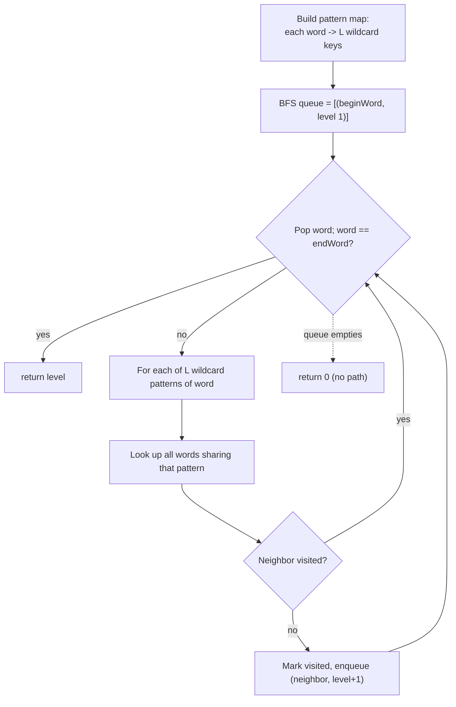
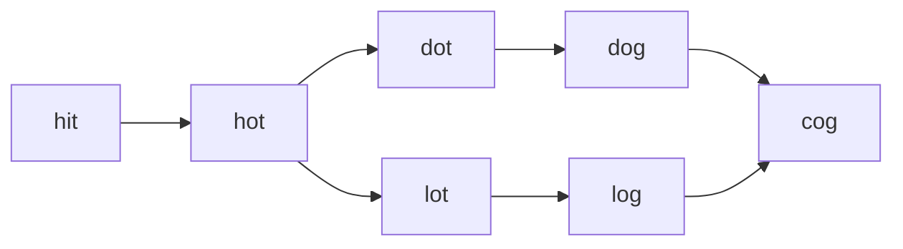

# Word Ladder

| Meta | Value |
|------|-------|
| Source | LeetCode #127 |
| Difficulty | Hard |
| Topics | Graph, BFS, Shortest Path, Hashing, Implicit Graph |
| Link | https://leetcode.com/problems/word-ladder/ |

---

## Problem Statement
Given two words `beginWord` and `endWord`, and a dictionary `wordList`, return the length of the
**shortest transformation sequence** from `beginWord` to `endWord` such that:

- Only **one letter** changes between consecutive words.
- Every intermediate word must be in `wordList`.

The length counts the **number of words** in the sequence (including both endpoints). Return `0` if no
such sequence exists. `beginWord` does **not** need to be in `wordList`, but `endWord` **must** be.

**Example**
```
beginWord = "hit"
endWord   = "cog"
wordList  = ["hot", "dot", "dog", "lot", "log", "cog"]

Shortest path:  hit -> hot -> dot -> dog -> cog

Answer = 5   (there are 5 words in the sequence)
```

---

## Why BFS Over an Implicit Word Graph

Model each word as a **node**. Two nodes share an **edge** if the words differ by exactly one letter.
Finding the fewest transformations = finding the **shortest path** in this unweighted graph = **BFS**.
BFS explores level by level, so the first time we dequeue `endWord`, the level number is the minimum
sequence length.

**The efficiency trick — wildcard patterns.** Checking every pair of words for a one-letter difference
costs $O(N^2 \cdot L)$. Instead, for a word of length `L`, generate `L` **generic/wildcard** patterns
by replacing each position with `*`. For example `hit` → `*it`, `h*t`, `hi*`. Two words are neighbors
**iff they share a wildcard pattern**. We precompute a map:

$$\text{pattern} \;\mapsto\; \{\text{words matching that pattern}\}$$

During BFS, a word's neighbors are all words sharing any of its `L` patterns — an $O(L)$ lookup
instead of scanning the whole dictionary. With alphabet size 26 and `C = 26 \cdot L` candidate
generations, total work is $O(N \cdot L^2)$ (each pattern is an $O(L)$ string built `L` times).



---

## Solution — BFS with Wildcard Adjacency

### Python
```python
from collections import deque, defaultdict

def ladder_length(beginWord, endWord, wordList):
    word_set = set(wordList)
    if endWord not in word_set:        # endWord must be reachable target
        return 0

    L = len(beginWord)

    # Precompute pattern -> list of words sharing that wildcard pattern
    patterns = defaultdict(list)
    for word in word_set:
        for i in range(L):
            key = word[:i] + "*" + word[i + 1:]   # e.g. "hot" -> "*ot","h*t","ho*"
            patterns[key].append(word)

    visited = {beginWord}              # avoid revisiting words
    q = deque([(beginWord, 1)])        # (word, sequence length so far)

    while q:
        word, level = q.popleft()
        if word == endWord:            # first dequeue of endWord = shortest
            return level
        for i in range(L):
            key = word[:i] + "*" + word[i + 1:]
            for neighbor in patterns[key]:         # one-letter-different words
                if neighbor not in visited:
                    visited.add(neighbor)
                    q.append((neighbor, level + 1))
            patterns[key] = []         # optional: clear to avoid rescanning

    return 0                           # endWord never reached
```

### C++
```cpp
#include <vector>
#include <string>
#include <queue>
#include <unordered_set>
#include <unordered_map>
using namespace std;

int ladderLength(string beginWord, string endWord, vector<string>& wordList) {
    unordered_set<string> wordSet(wordList.begin(), wordList.end());
    if (!wordSet.count(endWord)) return 0;   // endWord must be reachable target

    int L = beginWord.size();

    // Precompute pattern -> list of words sharing that wildcard pattern
    unordered_map<string, vector<string>> patterns;
    for (const string& word : wordSet) {
        for (int i = 0; i < L; ++i) {
            string key = word.substr(0, i) + "*" + word.substr(i + 1); // "hot"->"*ot","h*t","ho*"
            patterns[key].push_back(word);
        }
    }

    unordered_set<string> visited{beginWord};    // avoid revisiting words
    queue<pair<string,int>> q;
    q.push({beginWord, 1});                       // (word, sequence length so far)

    while (!q.empty()) {
        auto [word, level] = q.front(); q.pop();
        if (word == endWord) return level;        // first dequeue of endWord = shortest
        for (int i = 0; i < L; ++i) {
            string key = word.substr(0, i) + "*" + word.substr(i + 1);
            for (const string& neighbor : patterns[key]) {   // one-letter-different words
                if (!visited.count(neighbor)) {
                    visited.insert(neighbor);
                    q.push({neighbor, level + 1});
                }
            }
            patterns[key].clear();                // optional: clear to avoid rescanning
        }
    }

    return 0;                                     // endWord never reached
}
```

---

## Iteration Trace — BFS Frontier by Level

Input `beginWord = "hit"`, `endWord = "cog"`,
`wordList = ["hot","dot","dog","lot","log","cog"]`.

| Level | Frontier dequeued | Wildcard expansions | New neighbors enqueued | `visited` set |
|:-----:|-------------------|---------------------|------------------------|---------------|
| 1 | `hit` | `*it`,`h*t`,`hi*` | `hot` (via `h*t`) | `{hit, hot}` |
| 2 | `hot` | `*ot`,`h*t`,`ho*` | `dot`,`lot` (via `*ot`) | `{hit, hot, dot, lot}` |
| 3 | `dot`, `lot` | `*ot`,`d*t`,`do*` / `l*t`,`lo*` | `dog`,`log` (via `do*`,`lo*`) | `{..., dog, log}` |
| 4 | `dog`, `log` | `*og`,`d*g`,`do*` / `l*g`,`lo*` | `cog` (via `*og`) | `{..., cog}` |
| 5 | `cog` | — | `cog == endWord` → **return 5** | — |

The chain `hit → hot → dot → dog → cog` has 5 words, so the answer is **5**. BFS guarantees this is the
shortest because `cog` is dequeued at the earliest possible level.

---

## Diagram — The Implicit Word Graph



Each edge connects words differing by exactly one letter; BFS finds the shortest hop count from `hit`
to `cog`.

---

## Complexity

Let `N` be the number of words and `L` the word length.

| Approach | Time | Space |
|----------|------|-------|
| BFS + wildcard pattern map | $O(N \cdot L^2)$ — `N` words × `L` patterns × $O(L)$ to build each key | $O(N \cdot L^2)$ for the pattern map + $O(N)$ queue/visited |
| BFS comparing all word pairs | $O(N^2 \cdot L)$ | $O(N)$ |

For each word we build `L` wildcard keys, and constructing each key copies up to `L` characters →
$O(L^2)$ per word, $O(N \cdot L^2)$ overall. The wildcard map turns neighbor discovery from a full
dictionary scan into $O(L)$ pattern lookups.

---

## Takeaway
- **Model transformations as an implicit graph** and run BFS — the first time `endWord` is dequeued,
  its level is the shortest sequence length. BFS is the right tool for unweighted shortest paths.
- **Wildcard patterns make adjacency cheap.** Precompute `pattern → words` so a word's neighbors are
  found in $O(L)$ lookups instead of an $O(N \cdot L)$ scan of every dictionary word.
- **Mark words visited when enqueued, not when dequeued**, to prevent the same word being added
  multiple times and to keep each node processed once.
- **Count words, not edges** — the answer includes both endpoints, so start the level counter at `1`.
- Return `0` early if `endWord` is absent from the dictionary; it can never be the final node otherwise.
