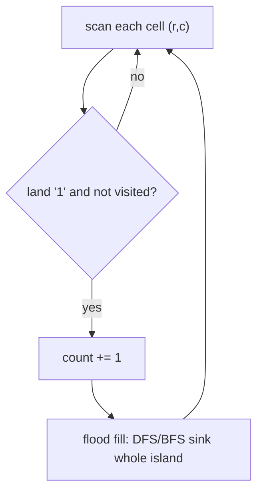

# Number of Islands

| Meta | Value |
|------|-------|
| Source | LeetCode #200 |
| Difficulty | Medium |
| Topics | Graph, DFS, BFS, Union-Find, Matrix |
| Link | https://leetcode.com/problems/number-of-islands/ |

---

## Problem Statement
Given a 2-D grid of `'1'` (land) and `'0'` (water), count the number of **islands**. An island
is land connected **4-directionally** (up/down/left/right).

**Example**
```
Grid:               Islands = 3
1 1 0 0 0
1 1 0 0 0
0 0 1 0 0
0 0 0 1 1
```

---

## Reframe as a Graph

The grid **is** a graph: each land cell is a vertex; edges connect horizontally/vertically
adjacent land cells. Counting islands = counting **connected components** of land.

The algorithm: scan every cell. When you hit an unvisited `'1'`, that's a **new island** — run a
flood fill (DFS or BFS) to mark its *entire* connected region as visited so it's counted once.



---

## DFS Solution

```python
def num_islands(grid):
    if not grid:
        return 0
    rows, cols = len(grid), len(grid[0])
    count = 0

    def dfs(r, c):
        if r < 0 or r >= rows or c < 0 or c >= cols or grid[r][c] != '1':
            return                       # out of bounds or water/visited
        grid[r][c] = '0'                 # sink: mark visited
        dfs(r + 1, c)                    # down
        dfs(r - 1, c)                    # up
        dfs(r, c + 1)                    # right
        dfs(r, c - 1)                    # left

    for r in range(rows):
        for c in range(cols):
            if grid[r][c] == '1':
                count += 1               # found a new island
                dfs(r, c)                # sink all of it
    return count
```

```cpp
#include <vector>
#include <functional>
using namespace std;

int num_islands(vector<vector<char>>& grid) {
    if (grid.empty())
        return 0;
    int rows = grid.size(), cols = grid[0].size();
    int count = 0;

    function<void(int, int)> dfs = [&](int r, int c) {
        if (r < 0 || r >= rows || c < 0 || c >= cols || grid[r][c] != '1')
            return;                          // out of bounds or water/visited
        grid[r][c] = '0';                    // sink: mark visited
        dfs(r + 1, c);                       // down
        dfs(r - 1, c);                       // up
        dfs(r, c + 1);                       // right
        dfs(r, c - 1);                       // left
    };

    for (int r = 0; r < rows; ++r) {
        for (int c = 0; c < cols; ++c) {
            if (grid[r][c] == '1') {
                count += 1;                  // found a new island
                dfs(r, c);                   // sink all of it
            }
        }
    }
    return count;
}
```

We "sink" visited land to `'0'` to avoid revisiting — saving a separate `visited` set.

---

## Trace — small grid

```
1 1 0
0 1 0
0 0 1
```

| scan (r,c) | grid[r][c] | action | count | grid after sinking |
|-----------|-----------|--------|-------|--------------------|
| (0,0) | '1' | new island → DFS sinks (0,0),(0,1),(1,1) | 1 | top-left blob gone |
| (0,1) | '0' (sunk) | skip | 1 | |
| (1,1) | '0' (sunk) | skip | 1 | |
| (2,2) | '1' | new island → DFS sinks (2,2) | 2 | |

Result: **2 islands**. The first DFS from (0,0) consumes the whole connected blob, so its other
cells are already `'0'` when the scan reaches them.

---

## BFS Alternative (avoids deep recursion)

For very large grids, DFS recursion can overflow the stack. BFS with a queue is iterative:

```python
from collections import deque

def num_islands_bfs(grid):
    if not grid:
        return 0
    rows, cols = len(grid), len(grid[0])
    count = 0
    for r in range(rows):
        for c in range(cols):
            if grid[r][c] == '1':
                count += 1
                grid[r][c] = '0'
                q = deque([(r, c)])
                while q:
                    x, y = q.popleft()
                    for dx, dy in ((1,0),(-1,0),(0,1),(0,-1)):
                        nx, ny = x + dx, y + dy
                        if 0 <= nx < rows and 0 <= ny < cols and grid[nx][ny] == '1':
                            grid[nx][ny] = '0'   # mark on enqueue
                            q.append((nx, ny))
    return count
```

```cpp
#include <vector>
#include <queue>
#include <utility>
using namespace std;

int num_islands_bfs(vector<vector<char>>& grid) {
    if (grid.empty())
        return 0;
    int rows = grid.size(), cols = grid[0].size();
    int count = 0;
    int dirs[4][2] = {{1,0},{-1,0},{0,1},{0,-1}};
    for (int r = 0; r < rows; ++r) {
        for (int c = 0; c < cols; ++c) {
            if (grid[r][c] == '1') {
                count += 1;
                grid[r][c] = '0';
                queue<pair<int,int>> q;
                q.push({r, c});
                while (!q.empty()) {
                    auto [x, y] = q.front(); q.pop();
                    for (auto& d : dirs) {
                        int nx = x + d[0], ny = y + d[1];
                        if (0 <= nx && nx < rows && 0 <= ny && ny < cols && grid[nx][ny] == '1') {
                            grid[nx][ny] = '0';   // mark on enqueue
                            q.push({nx, ny});
                        }
                    }
                }
            }
        }
    }
    return count;
}
```

---

## Complexity

| Metric | Value |
|--------|-------|
| Time   | O(rows × cols) — each cell visited a constant number of times |
| Space  | O(rows × cols) worst case (recursion/queue when grid is all land) |

Every cell is examined by the outer scan once and by a flood fill at most once.

---

## Union-Find Alternative
Treat each land cell as an element; union adjacent land cells. The number of islands = number of
distinct roots. Useful when islands **merge dynamically** (e.g. LeetCode 305 "Number of Islands
II", where land is added over time). Time `O(rows·cols·α)`.

## Takeaway
"Count connected regions in a grid" = **count connected components**, solved by scanning + flood
fill (DFS/BFS) or Union-Find. The flood-fill "sink as you go" trick generalizes to *max area of
island*, *surrounded regions*, and *flood fill* itself.
