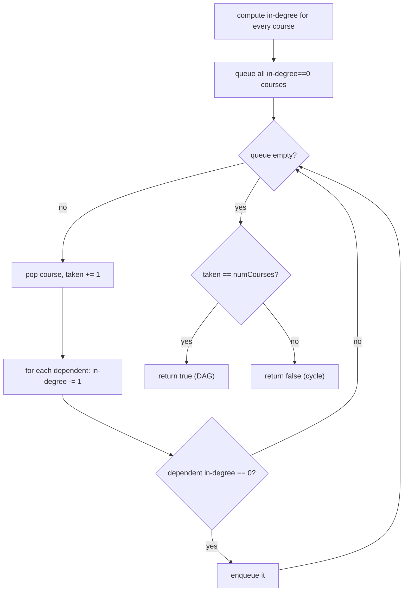

# Course Schedule (Topological Sort / Cycle Detection)

| Meta | Value |
|------|-------|
| Source | LeetCode #207 |
| Difficulty | Medium |
| Topics | Graph, Topological Sort, BFS (Kahn), DFS, Cycle Detection |
| Link | https://leetcode.com/problems/course-schedule/ |

---

## Problem Statement
There are `numCourses` courses labeled `0..numCourses-1`. `prerequisites[i] = [a, b]` means you
must take course `b` **before** course `a`. Return `true` if you can finish all courses.

**Example**
```
numCourses = 2, prerequisites = [[1, 0]]        -> true   (take 0, then 1)
numCourses = 2, prerequisites = [[1, 0], [0, 1]] -> false  (0 needs 1, 1 needs 0: cycle!)
```

---

## Reframe as a Graph

Model courses as a **directed graph**: an edge `b → a` means "b unlocks a" (b before a). You can
finish all courses **iff** the graph is a **DAG** — i.e., it has **no cycle**. A cycle means a
circular dependency that can never be satisfied.

$$
\text{Can finish all courses} \iff \text{the dependency graph is acyclic}
$$

---

## Approach 1: Kahn's Algorithm (BFS Topological Sort)

Repeatedly take courses with **no remaining prerequisites** (in-degree 0). Taking one "unlocks"
its dependents by reducing their in-degree. If we manage to take **all** courses, no cycle
exists; if we get stuck (some courses still have prerequisites), there's a cycle.



```python
from collections import deque

def can_finish(num_courses, prerequisites):
    graph = [[] for _ in range(num_courses)]
    indegree = [0] * num_courses
    for a, b in prerequisites:        # b -> a (b before a)
        graph[b].append(a)
        indegree[a] += 1

    queue = deque(i for i in range(num_courses) if indegree[i] == 0)
    taken = 0
    while queue:
        course = queue.popleft()
        taken += 1
        for nxt in graph[course]:
            indegree[nxt] -= 1
            if indegree[nxt] == 0:
                queue.append(nxt)
    return taken == num_courses
```

```cpp
#include <vector>
#include <queue>
using namespace std;

bool can_finish(int num_courses, vector<vector<int>>& prerequisites) {
    vector<vector<int>> graph(num_courses);
    vector<int> indegree(num_courses, 0);
    for (auto& p : prerequisites) {       // b -> a (b before a)
        int a = p[0], b = p[1];
        graph[b].push_back(a);
        indegree[a] += 1;
    }

    queue<int> queue_;
    for (int i = 0; i < num_courses; ++i)
        if (indegree[i] == 0)
            queue_.push(i);
    int taken = 0;
    while (!queue_.empty()) {
        int course = queue_.front(); queue_.pop();
        taken += 1;
        for (int nxt : graph[course]) {
            indegree[nxt] -= 1;
            if (indegree[nxt] == 0)
                queue_.push(nxt);
        }
    }
    return taken == num_courses;
}
```

### Trace — `numCourses=2, prereqs=[[1,0]]`

Edge `0 → 1`. `indegree = [0, 1]`.

| step | queue | pop | taken | indegree after | enqueue |
|------|-------|-----|-------|----------------|---------|
| init | [0] | — | 0 | [0,1] | — |
| 1 | [] | 0 | 1 | [0,0] (1 decremented) | 1 → queue=[1] |
| 2 | [] | 1 | 2 | [0,0] | — |

`taken = 2 == numCourses` → **true** ✓.

### Trace of a cycle — `prereqs=[[1,0],[0,1]]`
Edges `0→1` and `1→0`. `indegree = [1, 1]`. **No course has in-degree 0**, so the queue starts
empty, `taken = 0 ≠ 2` → **false** ✓. The cycle blocks everything from ever starting.

---

## Approach 2: DFS with Three-Color Cycle Detection

Color each node:
- **white (0):** unvisited.
- **gray (1):** in the current DFS path (recursion stack).
- **black (2):** fully explored, safe.

If DFS reaches a **gray** node, we've found a **back edge** → cycle.

```python
def can_finish_dfs(num_courses, prerequisites):
    graph = [[] for _ in range(num_courses)]
    for a, b in prerequisites:
        graph[b].append(a)
    color = [0] * num_courses        # 0=white 1=gray 2=black

    def has_cycle(node):
        color[node] = 1              # entering: mark gray
        for nxt in graph[node]:
            if color[nxt] == 1:      # back edge to an ancestor
                return True
            if color[nxt] == 0 and has_cycle(nxt):
                return True
        color[node] = 2              # leaving: mark black
        return False

    return not any(color[i] == 0 and has_cycle(i) for i in range(num_courses))
```

```cpp
#include <vector>
#include <functional>
using namespace std;

bool can_finish_dfs(int num_courses, vector<vector<int>>& prerequisites) {
    vector<vector<int>> graph(num_courses);
    for (auto& p : prerequisites) {
        int a = p[0], b = p[1];
        graph[b].push_back(a);
    }
    vector<int> color(num_courses, 0);   // 0=white 1=gray 2=black

    function<bool(int)> has_cycle = [&](int node) {
        color[node] = 1;                 // entering: mark gray
        for (int nxt : graph[node]) {
            if (color[nxt] == 1)         // back edge to an ancestor
                return true;
            if (color[nxt] == 0 && has_cycle(nxt))
                return true;
        }
        color[node] = 2;                 // leaving: mark black
        return false;
    };

    for (int i = 0; i < num_courses; ++i)
        if (color[i] == 0 && has_cycle(i))
            return false;
    return true;
}
```

The **gray** state is essential: hitting a *black* node is fine (already proven acyclic), but
hitting a *gray* node means we looped back onto our own active path.

---

## Complexity

| Approach | Time | Space |
|----------|------|-------|
| Kahn (BFS) | O(V + E) | O(V + E) |
| DFS coloring | O(V + E) | O(V + E) |

Both build the graph in O(E) and visit each vertex/edge once.

---

## Follow-up: Course Schedule II (LeetCode 210)
Return an actual valid ordering — just output the order in which Kahn's algorithm pops courses
(or the reverse of DFS post-order). If a cycle exists, return an empty list.

## Takeaway
"Can these tasks be ordered given dependencies?" = **detect a cycle in a directed graph** =
**topological sort feasibility**. Kahn's in-degree BFS and three-color DFS are the two canonical
tools — pick BFS when you also want the ordering, DFS when you want clean recursive cycle logic.
