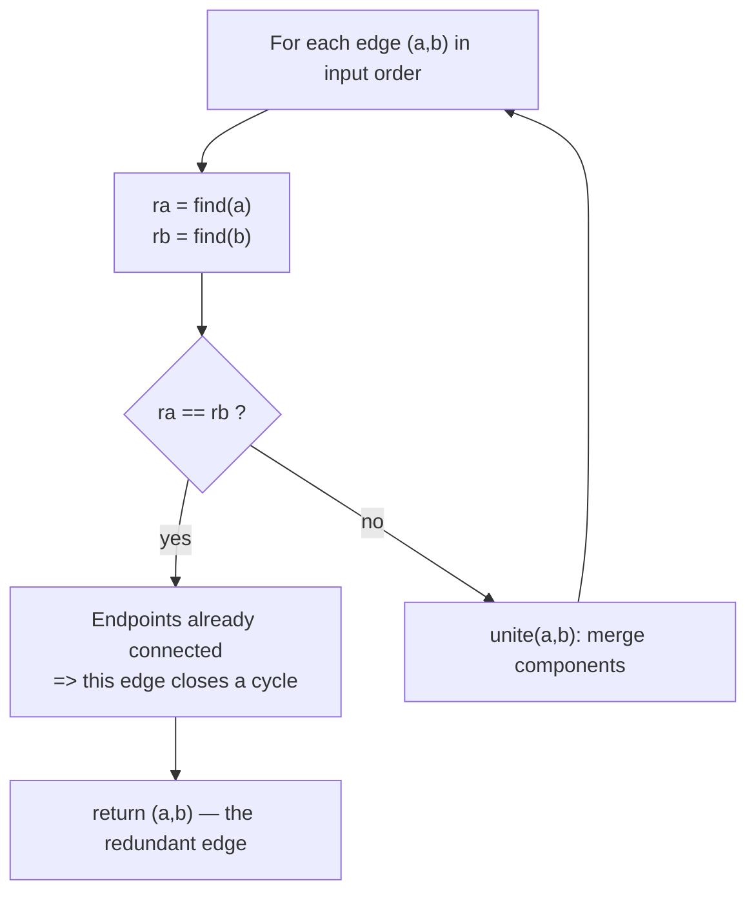
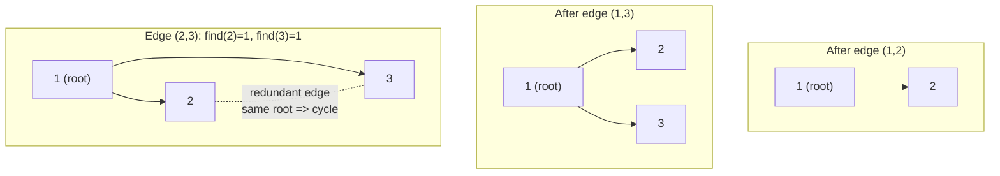

# Redundant Connection

| Meta | Value |
|------|-------|
| Source | LeetCode #684 |
| Difficulty | Medium |
| Topics | Graph, Union-Find (DSU), Cycle Detection, Disjoint Set |
| Link | https://leetcode.com/problems/redundant-connection/ |

---

## Problem Statement
You start with a tree of `n` nodes labeled `1..n` (a connected, acyclic graph). Exactly **one extra
edge** has been added, so the input is a graph with `n` nodes and `n` edges that contains **exactly
one cycle**. Given the edge list `edges`, return the edge that can be removed so the result is again a
tree. If multiple answers exist, return the edge that appears **last** in the input.

**Example**
```
edges = [[1,2], [1,3], [2,3]]

      1
     / \
    2 - 3      The edges 1-2, 1-3, 2-3 form a cycle 1-2-3-1.

Answer = [2,3]   (the last edge that closes the cycle)
```

---

## Why Union-Find (DSU)

A tree on `n` nodes has exactly `n - 1` edges and **no cycle**. Adding one more edge creates exactly
one cycle. The redundant edge is the one that, when added, **connects two nodes already in the same
connected component** — because they were already linked by some path, this edge closes a loop.

**Disjoint Set Union (DSU)** tracks connected components incrementally:

- `find(x)` returns the **root** (representative) of `x`'s component, with **path compression** so
  repeated lookups flatten the tree.
- `unite(a, b)` merges the two components, using **union by rank/size** to keep trees shallow.

Process edges **in input order**. For each edge `(a, b)`:

- If `find(a) == find(b)`, the two endpoints **already share a root** → this edge would create a
  cycle → it is the redundant edge (and because we scan in order, it is automatically the *last* such
  edge). Return it.
- Otherwise, `unite(a, b)` and continue.

With path compression + union by rank, each operation runs in near-constant **inverse Ackermann**
time $\alpha(n)$, which is $\le 4$ for any practical `n`.



---

## Solution — Union-Find with Path Compression & Union by Rank

### Python
```python
def find_redundant_connection(edges):
    n = len(edges)
    parent = list(range(n + 1))       # parent[i] = representative of i (1-indexed)
    rank = [0] * (n + 1)              # tree height bound per root

    def find(x):
        # Path compression: point nodes directly at the root
        while parent[x] != x:
            parent[x] = parent[parent[x]]  # halve the path
            x = parent[x]
        return x

    def unite(a, b):
        ra, rb = find(a), find(b)
        if ra == rb:
            return False              # already connected -> cycle
        # Union by rank: attach shorter tree under taller
        if rank[ra] < rank[rb]:
            ra, rb = rb, ra
        parent[rb] = ra
        if rank[ra] == rank[rb]:
            rank[ra] += 1
        return True

    for a, b in edges:
        if not unite(a, b):           # first edge that fails to merge
            return [a, b]             # is the redundant one
    return []                         # problem guarantees an answer
```

### C++
```cpp
#include <vector>
using namespace std;

struct DSU {
    vector<int> parent, rank_;
    DSU(int n) : parent(n + 1), rank_(n + 1, 0) {
        for (int i = 0; i <= n; ++i) parent[i] = i;  // each node is its own root
    }

    int find(int x) {
        // Path compression: point nodes directly at the root
        while (parent[x] != x) {
            parent[x] = parent[parent[x]];  // halve the path
            x = parent[x];
        }
        return x;
    }

    bool unite(int a, int b) {         // 'union' is a C++ keyword -> use 'unite'
        int ra = find(a), rb = find(b);
        if (ra == rb) return false;    // already connected -> cycle
        // Union by rank: attach shorter tree under taller
        if (rank_[ra] < rank_[rb]) swap(ra, rb);
        parent[rb] = ra;
        if (rank_[ra] == rank_[rb]) ++rank_[ra];
        return true;
    }
};

vector<int> findRedundantConnection(vector<vector<int>>& edges) {
    int n = edges.size();
    DSU dsu(n);
    for (auto& e : edges) {
        if (!dsu.unite(e[0], e[1]))    // first edge that fails to merge
            return {e[0], e[1]};       // is the redundant one
    }
    return {};                         // problem guarantees an answer
}
```

---

## Iteration Trace — DSU Parent Array Evolution

Input `edges = [[1,2], [1,3], [2,3]]`, `n = 3`. Initial `parent = [0, 1, 2, 3]` (index 0 unused).

| Step | Edge | `find(a)` | `find(b)` | Same root? | Action | `parent` after |
|:----:|:----:|:---------:|:---------:|:----------:|--------|----------------|
| init | — | — | — | — | each node own root | `[0, 1, 2, 3]` |
| 1 | `(1,2)` | 1 | 2 | no | `unite` → `parent[2]=1` | `[0, 1, 1, 3]` |
| 2 | `(1,3)` | 1 | 3 | no | `unite` → `parent[3]=1` | `[0, 1, 1, 1]` |
| 3 | `(2,3)` | 1 | 1 | **yes** | **cycle!** return `[2,3]` | `[0, 1, 1, 1]` |

At step 3, both `2` and `3` resolve to root `1` — they were already connected, so edge `(2,3)` is the
redundant one. Answer: **`[2,3]`**.

---

## Diagram — Components Merging Then Cycle Detected



---

## Complexity

Let `n` be the number of edges (and nodes). With path compression and union by rank, each `find` /
`unite` is $O(\alpha(n))$ amortized, where $\alpha$ is the inverse Ackermann function ($\le 4$ in
practice — effectively constant).

| Approach | Time | Space |
|----------|------|-------|
| Union-Find (path compression + union by rank) | $O(n \cdot \alpha(n)) \approx O(n)$ | $O(n)$ for `parent` and `rank` arrays |
| Naive DFS cycle check per edge | $O(n^2)$ | $O(n)$ |

---

## Takeaway
- **DSU answers "are these two already connected?" in near-constant time.** The redundant edge is the
  first edge whose endpoints already share a root.
- **Scan edges in input order** so the first cycle-closing edge found is automatically the *last* one
  in the input — satisfying the tie-break for free.
- **Two optimizations matter:** *path compression* (flatten lookup chains) and *union by rank/size*
  (keep trees shallow). Together they give the $\alpha(n)$ bound.
- **`union` is a reserved keyword in C++** — name the merge operation `unite` (or `merge`) to avoid a
  compile error.
- This DSU template is reusable for connectivity, Kruskal's MST, and general cycle-detection problems.
