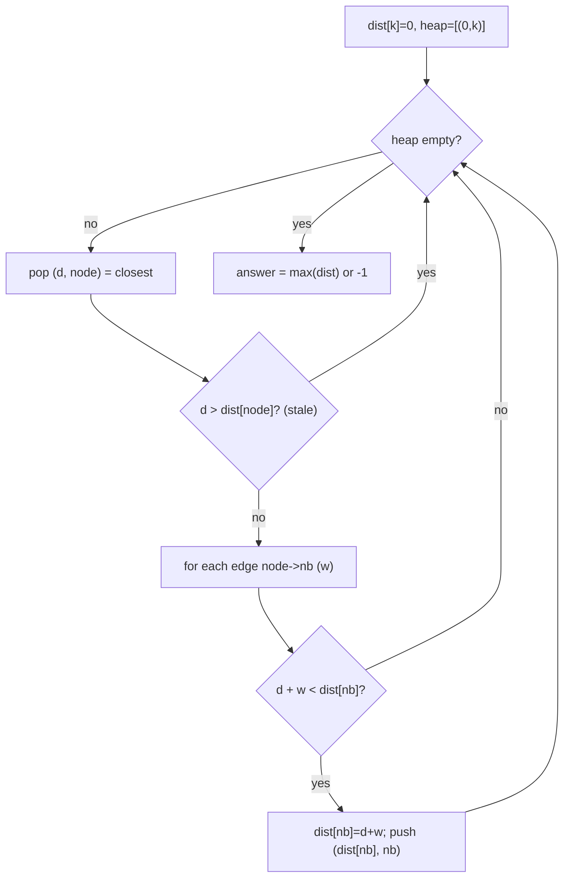

# Network Delay Time (Dijkstra's Shortest Path)

| Meta | Value |
|------|-------|
| Source | LeetCode #743 |
| Difficulty | Medium |
| Topics | Graph, Dijkstra, Shortest Path, Heap |
| Link | https://leetcode.com/problems/network-delay-time/ |

---

## Problem Statement
A network of `n` nodes. `times[i] = [u, v, w]` is a directed edge: a signal from `u` reaches `v`
after `w` time. Send a signal from node `k`. Return the time for **all** nodes to receive it, or
`−1` if some node is unreachable.

**Example**
```
n = 4, k = 2, times = [[2,1,1],[2,3,1],[3,4,1]]
Output: 2     // farthest node (4) is reached at time 2
```

---

## Reframe — Single-Source Shortest Path

The time for all nodes to receive the signal is the **maximum** over the **shortest** arrival
times from `k` to every node. Edge weights are **non-negative** (delays), so **Dijkstra's
algorithm** is the right tool.

$$
\text{answer} = \max_{v \in V} \text{dist}(k, v) \quad (\text{or } -1 \text{ if any is } \infty)
$$

---

## Dijkstra with a Min-Heap

Greedily expand the **closest unfinalized node**. A min-heap always hands us the next nearest
node. When we pop a node, its recorded distance is **final** (optimal) — because all edge
weights are non-negative, no later path can be shorter.



```python
import heapq
from collections import defaultdict

def network_delay_time(times, n, k):
    graph = defaultdict(list)
    for u, v, w in times:
        graph[u].append((v, w))

    dist = {}                          # node -> shortest known time
    heap = [(0, k)]                    # (time, node)
    while heap:
        d, node = heapq.heappop(heap)
        if node in dist:               # already finalized -> skip stale entry
            continue
        dist[node] = d
        for nb, w in graph[node]:
            if nb not in dist:
                heapq.heappush(heap, (d + w, nb))

    if len(dist) < n:                  # someone unreachable
        return -1
    return max(dist.values())
```

```cpp
#include <vector>
#include <queue>
#include <unordered_map>
using namespace std;

int network_delay_time(vector<vector<int>>& times, int n, int k) {
    unordered_map<int, vector<pair<int,int>>> graph;
    for (auto& t : times) {
        int u = t[0], v = t[1], w = t[2];
        graph[u].push_back({v, w});
    }

    unordered_map<int,int> dist;                 // node -> shortest known time
    // min-heap of (time, node)
    priority_queue<pair<int,int>, vector<pair<int,int>>, greater<pair<int,int>>> heap;
    heap.push({0, k});                           // (time, node)
    while (!heap.empty()) {
        auto [d, node] = heap.top(); heap.pop();
        if (dist.count(node))                    // already finalized -> skip stale entry
            continue;
        dist[node] = d;
        for (auto& [nb, w] : graph[node]) {
            if (!dist.count(nb))
                heap.push({d + w, nb});
        }
    }

    if ((int)dist.size() < n)                    // someone unreachable
        return -1;
    int ans = 0;
    for (auto& [node, d] : dist)
        ans = max(ans, d);
    return ans;
}
```

---

## Trace — `n=4, k=2, times=[[2,1,1],[2,3,1],[3,4,1]]`

Graph: `2→1 (1)`, `2→3 (1)`, `3→4 (1)`.

| pop (d, node) | finalize dist | push neighbors | heap after |
|---------------|---------------|----------------|------------|
| (0, 2) | dist[2]=0 | (1,1), (1,3) | [(1,1),(1,3)] |
| (1, 1) | dist[1]=1 | (1 has no out-edges) | [(1,3)] |
| (1, 3) | dist[3]=1 | (2,4) | [(2,4)] |
| (2, 4) | dist[4]=2 | (4 has no out-edges) | [] |

All 4 nodes finalized: `dist = {2:0, 1:1, 3:1, 4:2}`. Answer = `max = ` **2** ✓.

The signal reaches node 4 last, at time 2 — the bottleneck that determines the total.

---

## Why "Skip if Already Finalized"?

We may push several entries for the same node (different tentative distances). The **first** time
we pop it, that distance is the smallest (heap property) and hence final. Later popped entries
for the same node are **stale** — the `if node in dist: continue` guard discards them in O(1).

---

## Why Non-Negative Weights Matter

Dijkstra finalizes a node on pop and never revisits it. If an edge could be **negative**, a path
discovered later might be cheaper, invalidating that finalization. For negative weights, use
**Bellman-Ford** (`O(V·E)`), which relaxes all edges repeatedly and also detects negative cycles.

---

## Complexity

| Metric | Value |
|--------|-------|
| Time   | O(E log V) — each edge can trigger a heap push of cost O(log V) |
| Space  | O(V + E) — graph + heap + dist map |

---

## Edge Cases
- A node with no incoming path from `k` → stays out of `dist` → return `−1`.
- `k` itself has distance 0.
- Multiple edges between the same pair → Dijkstra naturally keeps the cheapest effective path.

## Takeaway
**Dijkstra = BFS with a priority queue**, where we always expand the cheapest frontier node. It
solves single-source shortest paths on non-negative weighted graphs in `O(E log V)`. Recognize
"minimize total/maximum travel cost" with non-negative weights → reach for Dijkstra.
