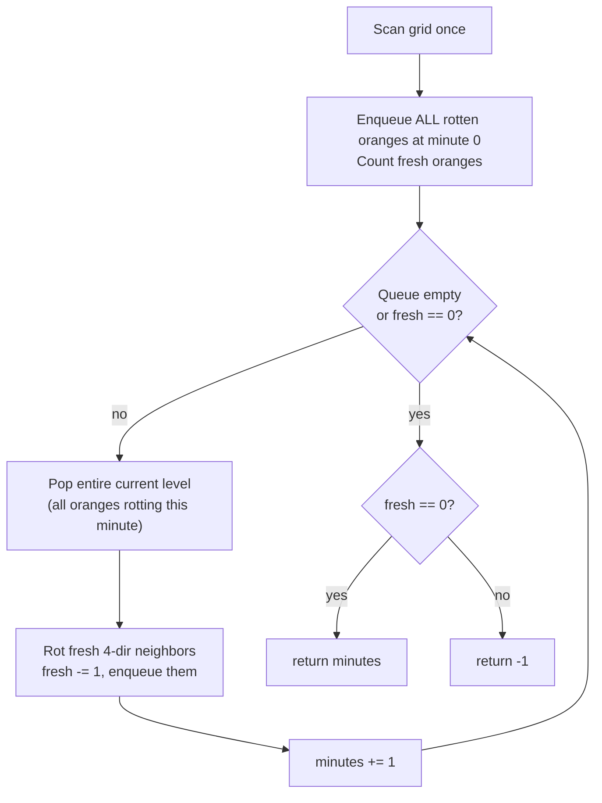
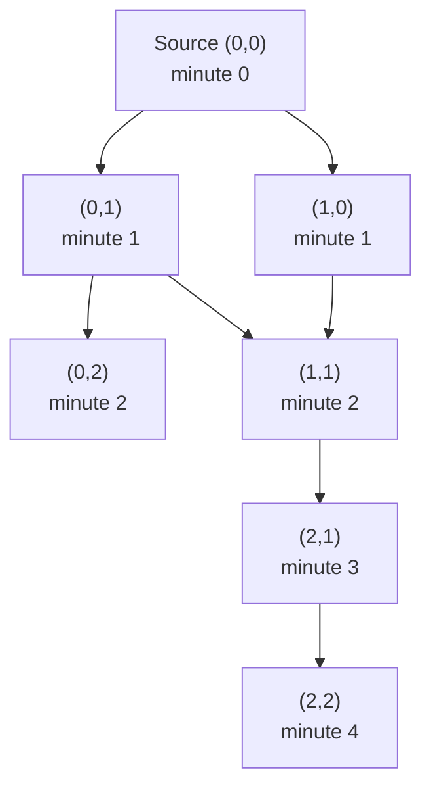

# Rotting Oranges

| Meta | Value |
|------|-------|
| Source | LeetCode #994 |
| Difficulty | Medium |
| Topics | Graph, BFS, Multi-Source BFS, Matrix, Simulation |
| Link | https://leetcode.com/problems/rotting-oranges/ |

---

## Problem Statement
You are given an `m x n` grid where each cell holds one of three values:

- `0` — an empty cell
- `1` — a **fresh** orange
- `2` — a **rotten** orange

Every minute, any fresh orange that is **4-directionally adjacent** (up/down/left/right) to a
rotten orange becomes rotten. Return the **minimum number of minutes** that must elapse until no
cell has a fresh orange. If this is impossible, return `-1`.

**Example**
```
Minute 0          Minute 1          Minute 2          Minute 3          Minute 4
2 1 1             2 2 1             2 2 2             2 2 2             2 2 2
1 1 0      ->     2 1 0      ->     2 2 0      ->     2 2 0      ->     2 2 0
0 1 1             0 1 1             0 1 1             0 2 1             0 2 2

Answer = 4  (the bottom-right fresh orange rots last, at minute 4)
```

If even one fresh orange is permanently isolated from every rotten one, the answer is `-1`.

---

## Why Multi-Source BFS

Rot spreads **simultaneously** from **all** currently-rotten oranges, one ring outward per minute.
That is exactly **breadth-first search** — but instead of starting from a single source, we seed the
BFS queue with **every** rotten orange at time `0`. This is **multi-source BFS**.

Key insight: if you process the queue **level by level**, each level is precisely "all oranges that
rot during minute $t$". The number of levels we expand (minus the initial seed level) equals the
elapsed minutes. Because BFS visits every cell at its shortest distance from the *nearest* source,
the minute a fresh orange rots equals its grid distance to the closest initial rotten orange:

$$\text{minutes} = \max_{\text{fresh cell } v}\ \min_{\text{rotten source } s}\ \text{dist}(s, v)$$

We also track a `fresh` counter. After BFS completes, if `fresh > 0`, some orange was unreachable, so
we return `-1`. Otherwise we return the number of minutes elapsed.



---

## Solution — Multi-Source BFS

### Python
```python
from collections import deque

def oranges_rotting(grid):
    rows, cols = len(grid), len(grid[0])
    q = deque()                       # holds (r, c) of rotten oranges
    fresh = 0

    # Seed: enqueue every rotten orange, count every fresh one
    for r in range(rows):
        for c in range(cols):
            if grid[r][c] == 2:
                q.append((r, c))      # initial sources at minute 0
            elif grid[r][c] == 1:
                fresh += 1

    if fresh == 0:                    # nothing to rot -> 0 minutes
        return 0

    minutes = 0
    directions = [(1, 0), (-1, 0), (0, 1), (0, -1)]

    # Process the queue one LEVEL (one minute) at a time
    while q and fresh > 0:
        minutes += 1                  # this whole level rots during this minute
        for _ in range(len(q)):       # snapshot current level size
            r, c = q.popleft()
            for dr, dc in directions:
                nr, nc = r + dr, c + dc
                if 0 <= nr < rows and 0 <= nc < cols and grid[nr][nc] == 1:
                    grid[nr][nc] = 2  # rot it so it is never revisited
                    fresh -= 1
                    q.append((nr, nc))

    return minutes if fresh == 0 else -1
```

### C++
```cpp
#include <vector>
#include <queue>
using namespace std;

int orangesRotting(vector<vector<int>>& grid) {
    int rows = grid.size(), cols = grid[0].size();
    queue<pair<int,int>> q;           // holds (r, c) of rotten oranges
    int fresh = 0;

    // Seed: enqueue every rotten orange, count every fresh one
    for (int r = 0; r < rows; ++r)
        for (int c = 0; c < cols; ++c) {
            if (grid[r][c] == 2) q.push({r, c});   // initial sources at minute 0
            else if (grid[r][c] == 1) ++fresh;
        }

    if (fresh == 0) return 0;          // nothing to rot -> 0 minutes

    int minutes = 0;
    int dr[4] = {1, -1, 0, 0};
    int dc[4] = {0, 0, 1, -1};

    // Process the queue one LEVEL (one minute) at a time
    while (!q.empty() && fresh > 0) {
        ++minutes;                     // this whole level rots during this minute
        int levelSize = q.size();      // snapshot current level size
        for (int i = 0; i < levelSize; ++i) {
            auto [r, c] = q.front(); q.pop();
            for (int d = 0; d < 4; ++d) {
                int nr = r + dr[d], nc = c + dc[d];
                if (nr >= 0 && nr < rows && nc >= 0 && nc < cols && grid[nr][nc] == 1) {
                    grid[nr][nc] = 2;  // rot it so it is never revisited
                    --fresh;
                    q.push({nr, nc});
                }
            }
        }
    }

    return fresh == 0 ? minutes : -1;
}
```

---

## Iteration Trace

Using the example grid:
```
2 1 1
1 1 0
0 1 1
```
Seed: rotten source `(0,0)`, `fresh = 5`. Columns below show the BFS frontier popped each minute and
the cells newly rotted.

| Minute | Frontier popped (level) | Newly rotted neighbors | `fresh` after | Grid snapshot |
|:------:|-------------------------|------------------------|:-------------:|---------------|
| 0 (seed) | — | — | 5 | `2 1 1 / 1 1 0 / 0 1 1` |
| 1 | `(0,0)` | `(0,1)`, `(1,0)` | 3 | `2 2 1 / 2 1 0 / 0 1 1` |
| 2 | `(0,1)`, `(1,0)` | `(0,2)`, `(1,1)` | 1 | `2 2 2 / 2 2 0 / 0 1 1` |
| 3 | `(0,2)`, `(1,1)` | `(2,1)` | 0... wait | `2 2 2 / 2 2 0 / 0 2 1` |
| 3 | (same level) | `(2,1)` rotted | 1 | `2 2 2 / 2 2 0 / 0 2 1` |
| 4 | `(2,1)` | `(2,2)` | 0 | `2 2 2 / 2 2 0 / 0 2 2` |

After minute 4, `fresh == 0`, so the answer is **4**. (The frontier at minute 3 only reaches `(2,1)`;
`(2,2)` is one ring further and rots at minute 4 — matching $\min$-distance to the nearest source.)

---

## Diagram — Spread as Distance Rings



Each edge is one minute of spread; a cell's minute is its BFS depth from the nearest source.

---

## Complexity

| Approach | Time | Space |
|----------|------|-------|
| Multi-source BFS | $O(m \cdot n)$ — each cell enqueued/visited at most once | $O(m \cdot n)$ — queue can hold all cells in the worst case |

The initial scan is $O(m \cdot n)$ and the BFS touches each cell a constant number of times, so the
total work is linear in the number of grid cells.

---

## Takeaway
- **Seed the queue with all sources at once.** Multi-source BFS is identical to single-source BFS
  except the queue starts non-empty; the level number naturally becomes the elapsed time.
- **Process level by level** (snapshot `len(q)` before draining) so each ring corresponds to exactly
  one minute. Incrementing a counter per ring gives the answer directly.
- **Track the fresh count** to distinguish "all rotted" from "some unreachable." If anything is fresh
  after BFS, those oranges were disconnected from every rotten source — return `-1`.
- **Mutate the grid in place** (set rotted cells to `2`) as your visited-set; this avoids a separate
  structure and guarantees each cell is processed once.
