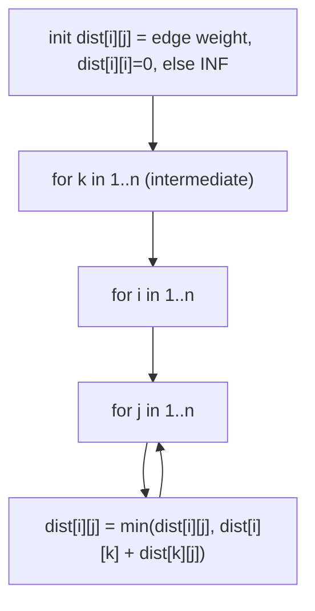

# Shortest Routes II (CSES — All-Pairs Shortest Paths via Floyd-Warshall)

| Meta | Value |
|------|-------|
| Source | CSES Problem Set — Graph Algorithms |
| Difficulty | Medium |
| Topics | Floyd-Warshall, All-Pairs Shortest Path, DP |
| Link | https://cses.fi/problemset/task/1672 |

---

## Problem Statement
An undirected weighted graph of `n` nodes and `m` edges. Answer `q` queries: the **shortest
distance** between nodes `a` and `b` (or `-1` if unreachable).

**Example**
```
n = 4, edges: (1,2,5) (1,3,9) (2,3,3) (3,4,1)
query (1,4) -> 1->2->3->4 = 5+3+1 = 9
query (2,4) -> 2->3->4 = 3+1 = 4
```

---

## Floyd-Warshall — DP over "Allowed Intermediate Nodes"

Let `dist[i][j]` be the shortest path from `i` to `j` using only nodes `1..k` as intermediates.
Adding node `k` as a permitted waypoint gives the recurrence:

$$
dist_k[i][j] = \min\bigl(dist_{k-1}[i][j],\; dist_{k-1}[i][k] + dist_{k-1}[k][j]\bigr)
$$

We iterate `k` over all nodes, updating the matrix **in place**. After all `k`, `dist[i][j]` is the
true all-pairs shortest distance.



```python
INF = float('inf')

def floyd_warshall(n, edges):
    dist = [[INF] * (n + 1) for _ in range(n + 1)]
    for i in range(1, n + 1):
        dist[i][i] = 0
    for a, b, w in edges:
        dist[a][b] = min(dist[a][b], w)      # keep the cheapest parallel edge
        dist[b][a] = min(dist[b][a], w)      # undirected

    for k in range(1, n + 1):                # intermediate node
        dk = dist[k]
        for i in range(1, n + 1):
            dik = dist[i][k]
            if dik == INF:
                continue                      # no path i->k, skip row
            di = dist[i]
            for j in range(1, n + 1):
                via = dik + dk[j]
                if via < di[j]:
                    di[j] = via               # relax through k
    return dist
```

```cpp
#include <vector>
using namespace std;

const long long INF = 1e18;

vector<vector<long long>> floyd_warshall(int n, vector<vector<long long>>& edges) {
    vector<vector<long long>> dist(n + 1, vector<long long>(n + 1, INF));
    for (int i = 1; i <= n; ++i)
        dist[i][i] = 0;
    for (auto& e : edges) {
        long long a = e[0], b = e[1], w = e[2];
        dist[a][b] = min(dist[a][b], w);     // keep the cheapest parallel edge
        dist[b][a] = min(dist[b][a], w);     // undirected
    }

    for (int k = 1; k <= n; ++k) {           // intermediate node
        vector<long long>& dk = dist[k];
        for (int i = 1; i <= n; ++i) {
            long long dik = dist[i][k];
            if (dik == INF)
                continue;                     // no path i->k, skip row
            vector<long long>& di = dist[i];
            for (int j = 1; j <= n; ++j) {
                long long via = dik + dk[j];
                if (via < di[j])
                    di[j] = via;              // relax through k
            }
        }
    }
    return dist;
}
```

**Key ordering rule:** the `k` loop must be **outermost**. That's what makes the DP correct — by
the time we consider routing `i→j` through `k`, the sub-distances `i→k` and `k→j` already account
for all intermediates `< k`.

---

## Trace — example (relevant relaxations)

Init direct edges (undirected): `1-2=5, 1-3=9, 2-3=3, 3-4=1`, diagonal 0, rest ∞.

| k | improvement found | resulting dist |
|---|-------------------|----------------|
| k=2 | 1→3 via 2: 5+3=8 < 9 | dist[1][3] = 8 |
| k=3 | 1→4 via 3: 8+1=9 | dist[1][4] = 9 |
| k=3 | 2→4 via 3: 3+1=4 | dist[2][4] = 4 |
| k=3 | 1→4 also from 1→3(=8)+3→4(1) | confirms 9 |

Query (1,4) → **9**, query (2,4) → **4**. ✓ Node 2 unlocks a cheaper `1→3`, then node 3 propagates
it to reach node 4.

---

## Complexity

| Metric | Value |
|--------|-------|
| Time | O(n³) — three nested loops |
| Space | O(n²) — the distance matrix |
| Query | O(1) after preprocessing |

Floyd-Warshall is ideal when `n` is small (CSES caps `n ≤ 500`, so `n³ = 1.25·10⁸`, fine) and you
need **many** pairwise queries.

---

## When to Use Which Shortest-Path Algorithm
| Need | Algorithm | Time |
|------|-----------|------|
| **All pairs**, small n | **Floyd-Warshall** | O(n³) |
| Single source, non-negative | Dijkstra | O(m log n) |
| Single source, negative edges | Bellman-Ford | O(nm) |
| All pairs, sparse, non-negative | Dijkstra ×n | O(n·m log n) |

**Negative cycle check:** after running, if any `dist[i][i] < 0`, node `i` lies on a negative cycle.

## Takeaway
**Floyd-Warshall** computes all-pairs shortest paths in O(n³) with a clean DP: progressively allow
each node `k` as an intermediate and relax every pair through it. The **`k`-outermost** loop order
is essential. Use it for dense, small-`n` graphs with many distance queries.
