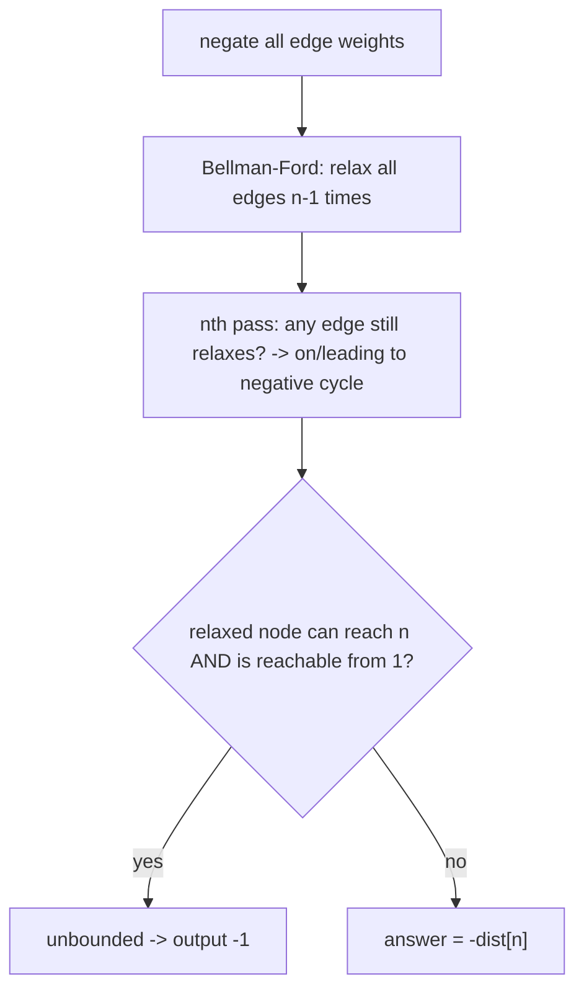

# High Score (CSES — Bellman-Ford with Positive Cycle Detection)

| Meta | Value |
|------|-------|
| Source | CSES Problem Set — Graph Algorithms |
| Difficulty | Hard |
| Topics | Bellman-Ford, Negative/Positive Cycles, Shortest Path |
| Link | https://cses.fi/problemset/task/1673 |

---

## Problem Statement
A directed graph of `n` rooms and `m` edges; traversing an edge gives (possibly negative) score.
Find the **maximum score** to go from room 1 to room `n`. If the score can be made **arbitrarily
large** (a reachable positive cycle on a 1→n path), output `-1`.

**Example**
```
n = 4, edges (a, b, score):
(1,2,3) (2,4,5) (1,3,2) (3,4,3)
Max score 1->4 = 8  (path 1->2->4: 3 + 5)
```

---

## Reduce "Maximize" to "Shortest Path" by Negating

Maximizing a sum = minimizing the **negated** sum. Negate every edge weight and run **Bellman-Ford**
for shortest paths. A reachable **negative cycle** in the negated graph corresponds to a reachable
**positive cycle** in the original → unbounded score → answer `-1`.



```python
INF = float('inf')

def high_score(n, edges):
    # maximize -> negate weights and minimize
    dist = [INF] * (n + 1)
    dist[1] = 0

    # standard Bellman-Ford: n-1 relaxation rounds
    for _ in range(n - 1):
        for a, b, w in edges:
            if dist[a] != INF and dist[a] - w < dist[b]:   # -w because we negate
                dist[b] = dist[a] - w

    # nth round: nodes that still relax are affected by a negative cycle
    affected = set()
    for a, b, w in edges:
        if dist[a] != INF and dist[a] - w < dist[b]:
            dist[b] = dist[a] - w
            affected.add(b)

    # propagate "infinitely good" reachability from affected nodes
    # if node n is reachable from any affected node -> unbounded
    from collections import deque, defaultdict
    adj = defaultdict(list)
    for a, b, w in edges:
        adj[a].append(b)
    q = deque(affected)
    bad = set(affected)
    while q:
        x = q.popleft()
        for y in adj[x]:
            if y not in bad:
                bad.add(y)
                q.append(y)

    if n in bad:
        return -1
    return -dist[n]                       # un-negate the answer
```

```cpp
#include <vector>
#include <queue>
#include <set>
using namespace std;

const long long INF = 1e18;

long long high_score(int n, vector<vector<long long>>& edges) {
    // maximize -> negate weights and minimize
    vector<long long> dist(n + 1, INF);
    dist[1] = 0;

    // standard Bellman-Ford: n-1 relaxation rounds
    for (int r = 0; r < n - 1; ++r) {
        for (auto& e : edges) {
            long long a = e[0], b = e[1], w = e[2];
            if (dist[a] != INF && dist[a] - w < dist[b])   // -w because we negate
                dist[b] = dist[a] - w;
        }
    }

    // nth round: nodes that still relax are affected by a negative cycle
    set<int> affected;
    for (auto& e : edges) {
        long long a = e[0], b = e[1], w = e[2];
        if (dist[a] != INF && dist[a] - w < dist[b]) {
            dist[b] = dist[a] - w;
            affected.insert((int)b);
        }
    }

    // propagate "infinitely good" reachability from affected nodes
    // if node n is reachable from any affected node -> unbounded
    vector<vector<int>> adj(n + 1);
    for (auto& e : edges) {
        int a = e[0], b = e[1];
        adj[a].push_back(b);
    }
    queue<int> q;
    set<int> bad;
    for (int x : affected) { q.push(x); bad.insert(x); }
    while (!q.empty()) {
        int x = q.front(); q.pop();
        for (int y : adj[x]) {
            if (!bad.count(y)) {
                bad.insert(y);
                q.push(y);
            }
        }
    }

    if (bad.count(n))
        return -1;
    return -dist[n];                       // un-negate the answer
}
```

---

## How Bellman-Ford Works

Bellman-Ford relaxes **every edge** `n-1` times. After `k` rounds, `dist[v]` is correct for the
shortest path using **at most `k` edges**. Since any shortest simple path has ≤ `n-1` edges,
`n-1` rounds suffice.

$$
\text{after round } k:\quad dist[v] = \min_{\text{paths } 1\to v \text{ with} \le k \text{ edges}} \text{weight}
$$

If an **`n`-th** round can still relax some edge, that path used `n` edges — impossible for a
simple path — so it must repeat a vertex, i.e. it rides a **negative cycle**. That cycle (and
everything reachable from it that can also reach `n`) makes the score unbounded.

---

## Trace — example (negated weights)

Negated edges: `(1,2,-3), (2,4,-5), (1,3,-2), (3,4,-3)`. Start `dist[1]=0`.

| round | relaxations | dist after |
|-------|-------------|------------|
| init | — | [_,0,∞,∞,∞] |
| 1 | 1→2: −3; 1→3: −2; 2→4: −3−5=−8; 3→4: −2−3=−5 | [_,0,−3,−2,−8] |
| 2 | no improvement | [_,0,−3,−2,−8] |
| 3 | no improvement | [_,0,−3,−2,−8] |
| nth | no edge relaxes → no negative cycle | — |

`dist[4] = −8` → answer `−(−8) = 8`. Path `1→2→4` scores `3 + 5 = 8`. ✓ No positive cycle, so the
result is bounded.

---

## Complexity

| Metric | Value |
|--------|-------|
| Time | O(n · m) — `n` rounds over `m` edges |
| Space | O(n + m) |

Slower than Dijkstra, but Bellman-Ford is the tool when weights can be **negative** (Dijkstra
breaks there).

---

## Algorithm Selection
| Situation | Use |
|-----------|-----|
| Non-negative weights, single source | Dijkstra O(m log n) |
| **Negative weights**, single source | **Bellman-Ford** O(nm) |
| Detect negative/positive cycle | Bellman-Ford nth-round test |
| All-pairs, small `n` | Floyd-Warshall O(n³) |
| Edge weights ∈ {0,1} | 0-1 BFS O(n+m) |

## Takeaway
**Bellman-Ford** handles negative weights in O(nm) and detects cycles via one extra relaxation
round. To **maximize** a path score, negate weights and minimize; a reachable **negative cycle**
(in negated terms) that can still reach the target means the answer is **unbounded** (`-1`).
