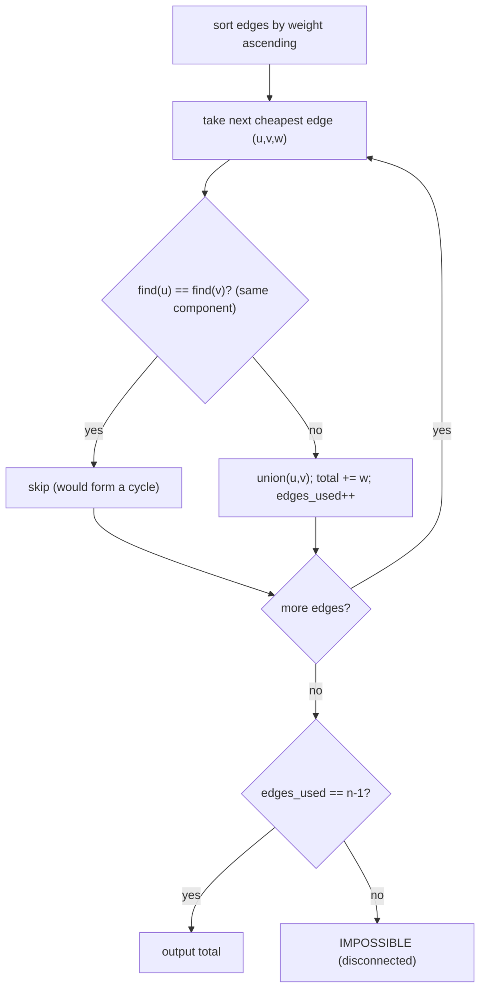

# Road Reparation (CSES — Minimum Spanning Tree via Kruskal + DSU)

| Meta | Value |
|------|-------|
| Source | CSES Problem Set — Graph Algorithms |
| Difficulty | Medium |
| Topics | MST, Kruskal, Disjoint Set Union (DSU) |
| Link | https://cses.fi/problemset/task/1675 |

---

## Problem Statement
There are `n` cities and `m` roads, each with a repair cost. Find the **minimum total cost** to
repair roads so that **all cities are connected**. If it's impossible (graph can't be connected),
output `IMPOSSIBLE`.

This is exactly the **Minimum Spanning Tree (MST)** problem.

**Example**
```
n = 5 cities, edges (u, v, w):
(1,2,3) (2,3,5) (2,4,2) (3,4,8) (5,1,7)
MST cost = 3 + 2 + 5 + 7 = 17  (connects all 5 cities with minimum total weight)
```

---

## Kruskal's Algorithm — Greedy by Edge Weight

Sort all edges ascending by weight. Add each edge **if it connects two currently separate
components** (no cycle). A **Disjoint Set Union (DSU / Union-Find)** detects whether the endpoints
are already connected in near-O(1).



```python
class DSU:
    def __init__(self, n):
        self.parent = list(range(n + 1))
        self.rank = [0] * (n + 1)

    def find(self, x):
        while self.parent[x] != x:
            self.parent[x] = self.parent[self.parent[x]]   # path compression
            x = self.parent[x]
        return x

    def union(self, a, b):
        ra, rb = self.find(a), self.find(b)
        if ra == rb:
            return False                    # already connected -> cycle
        if self.rank[ra] < self.rank[rb]:   # union by rank
            ra, rb = rb, ra
        self.parent[rb] = ra
        if self.rank[ra] == self.rank[rb]:
            self.rank[ra] += 1
        return True

def road_reparation(n, edges):
    edges.sort(key=lambda e: e[2])          # ascending by weight
    dsu = DSU(n)
    total = 0
    used = 0
    for u, v, w in edges:
        if dsu.union(u, v):                 # connects two components
            total += w
            used += 1
            if used == n - 1:               # spanning tree complete
                break
    return total if used == n - 1 else "IMPOSSIBLE"
```

```cpp
#include <vector>
#include <algorithm>
#include <numeric>
#include <string>
using namespace std;

struct DSU {
    vector<int> parent, rank_;
    DSU(int n) : parent(n + 1), rank_(n + 1, 0) {
        iota(parent.begin(), parent.end(), 0);
    }

    int find(int x) {
        while (parent[x] != x) {
            parent[x] = parent[parent[x]];   // path compression
            x = parent[x];
        }
        return x;
    }

    // `union` is a C++ keyword, so name the method `unite`
    bool unite(int a, int b) {
        int ra = find(a), rb = find(b);
        if (ra == rb)
            return false;                    // already connected -> cycle
        if (rank_[ra] < rank_[rb])           // union by rank
            swap(ra, rb);
        parent[rb] = ra;
        if (rank_[ra] == rank_[rb])
            rank_[ra] += 1;
        return true;
    }
};

string road_reparation(int n, vector<vector<long long>>& edges) {
    sort(edges.begin(), edges.end(),
         [](const vector<long long>& a, const vector<long long>& b) {
             return a[2] < b[2];             // ascending by weight
         });
    DSU dsu(n);
    long long total = 0;
    int used = 0;
    for (auto& e : edges) {
        int u = e[0], v = e[1];
        long long w = e[2];
        if (dsu.unite(u, v)) {               // connects two components
            total += w;
            used += 1;
            if (used == n - 1)               // spanning tree complete
                break;
        }
    }
    return used == n - 1 ? to_string(total) : "IMPOSSIBLE";
}
```

---

## Trace — the example graph

Sorted edges: `(2,4,2), (1,2,3), (2,3,5), (5,1,7), (3,4,8)`.

| edge | weight | find(u),find(v) | same? | action | total | components |
|------|--------|------------------|-------|--------|-------|------------|
| (2,4) | 2 | 2, 4 | no | union | 2 | {2,4} |
| (1,2) | 3 | 1, 2 | no | union | 5 | {1,2,4} |
| (2,3) | 5 | 2, 3 | no | union | 10 | {1,2,3,4} |
| (5,1) | 7 | 5, 1 | no | union | 17 | {1,2,3,4,5} |
| (3,4) | 8 | 3, 4 | **yes** | skip (cycle) | 17 | — |

Used 4 edges = `n−1 = 4` → connected. MST cost = **17**. The skipped edge `(3,4,8)` would close a
cycle, so the greedy correctly rejects it.

---

## Why the Greedy Is Correct (Cut Property)

**Cut property:** for any partition of the vertices into two sets, the **minimum-weight edge
crossing** the cut belongs to some MST. Kruskal always adds the globally cheapest edge that joins
two different components — i.e. the cheapest edge across the cut separating those components — so
every edge it picks is MST-safe.

---

## DSU Complexity — Near-Constant

With **path compression** + **union by rank**, each operation runs in $O(\alpha(n))$ where
$\alpha$ is the inverse Ackermann function ($< 5$ for any practical `n`). So DSU operations are
effectively constant time.

| Step | Time |
|------|------|
| Sort edges | O(m log m) |
| m DSU operations | O(m · α(n)) ≈ O(m) |
| **Total** | **O(m log m)** |
| Space | O(n + m) |

---

## Kruskal vs Prim
| | Kruskal | Prim |
|--|---------|------|
| Engine | sort edges + DSU | grow tree + min-heap |
| Best for | **sparse** graphs | **dense** graphs |
| Complexity | O(m log m) | O(m log n) / O(n²) |

CSES **Road Construction** (1676) uses the same DSU to track components/sizes dynamically.

## Takeaway
**Kruskal + DSU** builds an MST greedily: sort edges, add the cheapest that joins two components
(cycle check via union-find), stop at `n−1` edges. The **cut property** guarantees optimality, and
path-compressed union-by-rank DSU makes connectivity checks effectively O(1).
