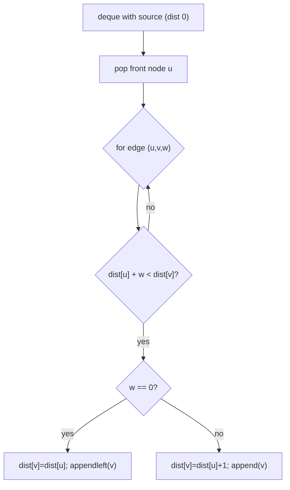

# 0-1 BFS (Shortest Path with Edge Weights 0 or 1 — Deque)

| Meta | Value |
|------|-------|
| Source | Classic CP (Codeforces / AtCoder), e.g. CF "Labyrinth", AtCoder grid problems |
| Difficulty | Medium |
| Topics | 0-1 BFS, Deque, Shortest Path |
| Link | https://codeforces.com/problemset (recurring pattern) |

---

## Problem Statement
In a graph where every edge has weight **0 or 1**, find the shortest distance from a source to all
nodes. Typical setting: a grid where moving forward costs `0` but turning / breaking a wall costs
`1`.

**Example**
```
Grid (0 = free, 1 = wall you may break):
0 1 0
0 1 0
0 0 0
Min walls to break from top-left to top-right = 1.
```

---

## Why Not Plain Dijkstra?

Dijkstra works but costs O(m log n) due to the heap. With weights restricted to **{0, 1}**, a
**double-ended queue** replaces the priority queue and achieves **O(n + m)** — the heap's log
factor disappears.

**Rule:**
- A **0-weight** edge → `appendleft` (same "layer", process before others).
- A **1-weight** edge → `append` (next layer).

This keeps the deque **monotonic** in distance, mimicking Dijkstra's "process closest first"
without sorting.



```python
from collections import deque

def zero_one_bfs(n, adj, source):
    # adj[u] = list of (v, w) with w in {0, 1}
    INF = float('inf')
    dist = [INF] * n
    dist[source] = 0
    dq = deque([source])
    while dq:
        u = dq.popleft()
        for v, w in adj[u]:
            if dist[u] + w < dist[v]:
                dist[v] = dist[u] + w
                if w == 0:
                    dq.appendleft(v)     # 0-edge: stay at front (same distance band)
                else:
                    dq.append(v)         # 1-edge: go to back (next distance band)
    return dist
```

```cpp
#include <vector>
#include <deque>
#include <climits>
using namespace std;

vector<int> zero_one_bfs(int n, vector<vector<pair<int,int>>>& adj, int source) {
    // adj[u] = list of (v, w) with w in {0, 1}
    const int INF = INT_MAX;
    vector<int> dist(n, INF);
    dist[source] = 0;
    deque<int> dq{source};
    while (!dq.empty()) {
        int u = dq.front(); dq.pop_front();
        for (auto& [v, w] : adj[u]) {
            if (dist[u] + w < dist[v]) {
                dist[v] = dist[u] + w;
                if (w == 0)
                    dq.push_front(v);    // 0-edge: stay at front (same distance band)
                else
                    dq.push_back(v);     // 1-edge: go to back (next distance band)
            }
        }
    }
    return dist;
}
```

> Because a node may be inserted more than once, **re-check `dist` on pop** (or guard with the
> relaxation condition as above) so stale entries are ignored.

---

## Trace — line graph `0 →(0)→ 1 →(1)→ 2 →(0)→ 3`, source 0

| step | deque (front→back) | pop u | relax | dist updates |
|------|--------------------|-------|-------|--------------|
| init | [0] | — | — | dist=[0,∞,∞,∞] |
| 1 | [0] | 0 | 0→1 w0: appendleft | dist[1]=0, deque=[1] |
| 2 | [1] | 1 | 1→2 w1: append | dist[2]=1, deque=[2] |
| 3 | [2] | 2 | 2→3 w0: appendleft | dist[3]=1, deque=[3] |
| 4 | [3] | 3 | — | done |

Final `dist = [0, 0, 1, 1]`. The 0-edges keep nodes in the same band (front), the single 1-edge
pushes to the next band — exactly the Dijkstra ordering, but with O(1) deque ops.

---

## Why It's Correct

At all times the deque holds nodes from at most **two consecutive distance values** `d` and `d+1`,
with all `d` nodes ahead of all `d+1` nodes. `appendleft` for 0-edges preserves "still distance
`d`"; `append` for 1-edges preserves "distance `d+1` goes after". So we always pop the
minimum-distance node first — the Dijkstra invariant — without a heap.

---

## Complexity

| Approach | Time | Space |
|----------|------|-------|
| Dijkstra (heap) | O(m log n) | O(n) |
| **0-1 BFS (deque)** | **O(n + m)** | O(n) |

---

## When 0-1 BFS Applies
- Grid pathfinding where some moves are free and others cost 1 (break a wall, change direction).
- Edges with only two distinct weights (generalize by scaling, or use **0-k BFS** / Dial's
  algorithm for small bounded weights).
- Any "minimum number of expensive operations" shortest-path framing.

## Takeaway
When edge weights are only **0 or 1**, swap Dijkstra's heap for a **deque**: push 0-edges to the
front, 1-edges to the back. This preserves the closest-first order in **O(n + m)** — a clean,
heap-free shortest path for binary-weight graphs.
