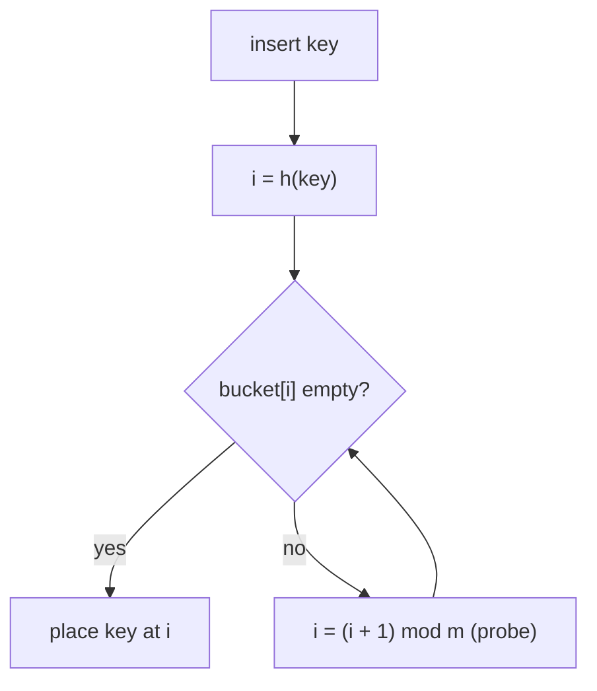

# Hashing & Hash Tables — Complete Guide (Beginner → Advanced)

> Hash tables give **average O(1)** insert, delete, and lookup. They are the single most
> useful tool for turning O(n²) brute-force solutions into O(n) ones.

---

## Table of Contents
1. [The Problem Hashing Solves](#1-the-problem-hashing-solves)
2. [Hash Functions](#2-hash-functions)
3. [Collisions & Resolution Strategies](#3-collisions--resolution-strategies)
4. [Load Factor & Resizing](#4-load-factor--resizing)
5. [Complexity Summary](#5-complexity-summary)
6. [Sets vs Maps](#6-sets-vs-maps)
7. [Common Patterns](#7-common-patterns)
8. [Advanced: Custom Hashing & Anti-Hash Attacks](#8-advanced-custom-hashing--anti-hash-attacks)
9. [Cheat Sheet](#9-cheat-sheet)

---

## 1. The Problem Hashing Solves

An array gives O(1) access **by integer index**. But what if your "key" is a string, a large
number, or an arbitrary object? A hash table lets you use **any key** by converting it into an
array index via a **hash function**.

```
key  --hash-->  index  -->  bucket in an array
"cat" -> h("cat") = 17 -> buckets[17]
```

---

## 2. Hash Functions

A hash function `h(key)` maps a key to an integer in `[0, m)` where `m` is the table size. A
good hash function is:
- **Deterministic** — same key → same hash.
- **Uniform** — spreads keys evenly to minimize collisions.
- **Fast** — O(key length).

### Example: polynomial string hash
$$
h(s) = \left(\sum_{i=0}^{L-1} s_i \cdot b^{\,i}\right) \bmod m
$$
where `b` is a base (e.g. 31) and `m` a large prime. The final index is `h(s) % table_size`.

---

## 3. Collisions & Resolution Strategies

By the **pigeonhole principle**, mapping infinitely many keys into `m` buckets *must* cause
collisions (two keys → same index). Two main strategies:

### 3.1 Separate Chaining
Each bucket holds a linked list (or tree) of all entries that hashed there.

```
buckets
[0] -> ("cat", 1)
[1] -> None
[2] -> ("dog", 2) -> ("cow", 9)   # collision: two keys in one bucket
```

Lookup: hash to the bucket, then scan its short list.

### 3.2 Open Addressing
Store everything in the array itself. On collision, **probe** for the next free slot:
- **Linear probing:** try `h, h+1, h+2, …`
- **Quadratic probing:** try `h, h+1², h+2², …`
- **Double hashing:** step size from a second hash function.



---

## 4. Load Factor & Resizing

The **load factor** measures fullness:

$$
\alpha = \frac{\text{number of entries}}{\text{number of buckets}}
$$

As `α` rises, collisions and probe chains grow. When `α` exceeds a threshold (≈ 0.7), the
table **resizes** (usually doubles) and **rehashes** all entries. Like dynamic arrays, this is
amortized O(1) per insertion.

For chaining, expected operations cost `O(1 + α)`; keeping `α` bounded keeps it O(1).

---

## 5. Complexity Summary

| Operation | Average | Worst (all collide) |
|-----------|---------|---------------------|
| Insert | O(1) | O(n) |
| Lookup | O(1) | O(n) |
| Delete | O(1) | O(n) |
| Space | O(n) | O(n) |

Worst case is rare with a good hash function; with **balanced-tree buckets** (Java 8+),
worst case improves to O(log n).

---

## 6. Sets vs Maps

| Structure | Stores | Use when |
|-----------|--------|----------|
| **Hash Set** | keys only | membership / dedup / "have I seen X?" |
| **Hash Map** | key → value | counting, indexing, caching, grouping |

---

## 7. Common Patterns

### 7.1 Seen-Set (dedup / cycle / membership)
"Have I encountered this before?" → O(1) check.

### 7.2 Frequency Map (counting)
Count occurrences of each element; foundation of anagrams, top-K, majority element.

### 7.3 Complement Lookup
Store needed-complements (Two Sum) to find pairs in one pass.

### 7.4 Grouping
Map a **canonical key** → list of items (group anagrams by sorted string).

### 7.5 Prefix-Sum + Hash
Count subarrays with a target sum: store prefix-sum frequencies (Subarray Sum Equals K).

---

## 8. Advanced: Custom Hashing & Anti-Hash Attacks

- **Hashing tuples / pairs:** combine field hashes, e.g. `h = h1 * P + h2`.
- **Anti-hash tests (competitive programming):** adversaries craft inputs that collide in
  predictable hashes (e.g. Java/C++ `unordered_map` with default hash), forcing O(n²). Defend
  with a **randomized seed** or a custom hash (`splitmix64`).
- **Consistent hashing:** distributes keys across servers so adding/removing a server only
  remaps a small fraction — backbone of distributed caches.

---

## 9. Cheat Sheet

```
Avg insert/lookup/delete .... O(1)
Worst case .................. O(n)  (O(log n) with tree buckets)
Load factor alpha ........... entries / buckets ; resize ~0.7
Collisions .................. chaining or open addressing

Patterns:
  seen-set ........ membership, dedup, cycle detection
  freq map ........ counting, top-K, majority
  complement ...... pair-sum problems
  group-by-key .... anagrams, categorization
  prefix + hash ... subarray sum = k
```

> **Mental model:** A hash table is an array indexed by *arbitrary keys instead of integers*.
> Whenever a brute force does repeated "search for X," a hash table usually collapses it to O(1).
