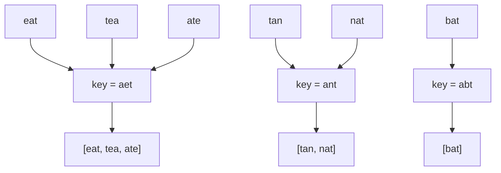

# Group Anagrams

| Meta | Value |
|------|-------|
| Source | LeetCode #49 |
| Difficulty | Medium |
| Topics | Hash Table, String, Sorting |
| Link | https://leetcode.com/problems/group-anagrams/ |

---

## Problem Statement
Given an array of strings, group the anagrams together. Anagrams are words made of the same
letters in different orders.

**Example**
```
Input:  ["eat","tea","tan","ate","nat","bat"]
Output: [["eat","tea","ate"], ["tan","nat"], ["bat"]]
```

---

## Key Insight — Canonical Key

All anagrams of a word share a **canonical form**. If we map each word to that canonical form
and use it as a **hash-map key**, anagrams automatically collide into the same bucket.

Two valid canonical forms:
1. **Sorted string:** `"eat" → "aet"`, `"tea" → "aet"`, `"ate" → "aet"` — all equal.
2. **Character-count signature:** a 26-length tuple of letter counts.



---

## Solution 1: Sorted Key — O(n · k log k)

```python
from collections import defaultdict

def group_anagrams(strs):
    groups = defaultdict(list)
    for word in strs:
        key = "".join(sorted(word))   # canonical form
        groups[key].append(word)
    return list(groups.values())
```

```cpp
vector<vector<string>> group_anagrams(vector<string>& strs) {
    unordered_map<string, vector<string>> groups;
    for (string word : strs) {
        string key = word;
        sort(key.begin(), key.end());   // canonical form
        groups[key].push_back(word);
    }
    vector<vector<string>> result;
    for (auto& [key, group] : groups) result.push_back(group);
    return result;
}
```

`n` = number of words, `k` = max word length. Sorting each word costs `O(k log k)`.

### Iteration Trace
| word | sorted key | groups state |
|------|-----------|--------------|
| eat  | aet | `{aet:[eat]}` |
| tea  | aet | `{aet:[eat,tea]}` |
| tan  | ant | `{aet:[eat,tea], ant:[tan]}` |
| ate  | aet | `{aet:[eat,tea,ate], ant:[tan]}` |
| nat  | ant | `{aet:[eat,tea,ate], ant:[tan,nat]}` |
| bat  | abt | `{..., abt:[bat]}` |

---

## Solution 2: Count Signature — O(n · k)

Avoid sorting by using a 26-length count tuple as the key (counts are immutable & hashable).

```python
from collections import defaultdict

def group_anagrams_count(strs):
    groups = defaultdict(list)
    for word in strs:
        count = [0] * 26
        for c in word:
            count[ord(c) - ord('a')] += 1
        groups[tuple(count)].append(word)   # tuple is hashable
    return list(groups.values())
```

```cpp
vector<vector<string>> group_anagrams_count(vector<string>& strs) {
    unordered_map<string, vector<string>> groups;
    for (string word : strs) {
        vector<int> count(26, 0);
        for (char c : word)
            count[c - 'a']++;
        // build a hashable key from the count signature
        string key;
        for (int x : count) key += to_string(x) + ",";
        groups[key].push_back(word);   // signature string is hashable
    }
    vector<vector<string>> result;
    for (auto& [key, group] : groups) result.push_back(group);
    return result;
}
```

Building the count is `O(k)` per word → total `O(n·k)`, beating the sort approach when words
are long.

### Why the count tuple works as a key
Two words are anagrams **iff** their letter-count vectors are identical. The tuple `(1,0,0,...)`
is hashable and compares by value, so identical signatures land in the same bucket.

---

## Complexity

| Approach | Time | Space |
|----------|------|-------|
| Sorted key | O(n · k log k) | O(n · k) |
| **Count key** | **O(n · k)** | O(n · k) |

---

## Edge Cases
- Empty string `""` → its own key (empty), grouped with other empty strings.
- Single word → a group of one.
- Case sensitivity — assume lowercase here; normalize otherwise.

## Takeaway
The **canonical-key pattern** ("normalize each item to a representative, then group by it in a
hash map") solves a huge class of grouping problems — group by sorted form, by signature, by
rounded value, etc.
