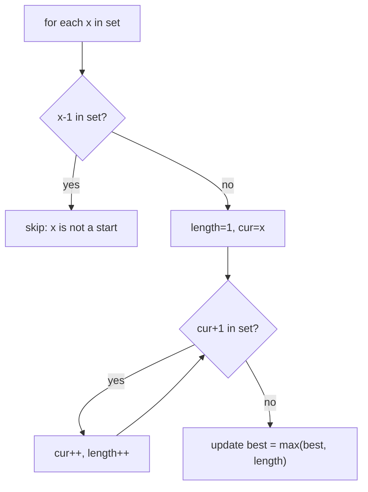

# Longest Consecutive Sequence

| Meta | Value |
|------|-------|
| Source | LeetCode #128 |
| Difficulty | Medium |
| Topics | Hash Set, Array |
| Link | https://leetcode.com/problems/longest-consecutive-sequence/ |

---

## Problem Statement
Given an unsorted array `nums`, return the length of the longest run of **consecutive integers**
(e.g. 1,2,3,4). You must run in **O(n)** time.

**Example**
```
Input:  nums = [100, 4, 200, 1, 3, 2]
Output: 4        // the sequence 1, 2, 3, 4
```

---

## Why Not Just Sort?
Sorting then scanning is `O(n log n)` — simple, but the problem demands `O(n)`. A **hash set**
plus a clever "only start counting from sequence beginnings" trick achieves linear time.

---

## Key Insight — Start Only at Sequence Heads

Put all numbers in a hash set for O(1) membership. A number `x` is the **start** of a
consecutive sequence **iff `x − 1` is NOT in the set**. From each such start, walk upward
(`x, x+1, x+2, …`) counting the run.

Because we only expand from starts, **each number is visited at most twice** total (once in the
outer loop, once during a walk) → overall O(n), not O(n²).



---

## Code

```python
def longest_consecutive(nums):
    num_set = set(nums)
    best = 0
    for x in num_set:
        if x - 1 not in num_set:        # x is the start of a run
            length = 1
            cur = x
            while cur + 1 in num_set:   # extend upward
                cur += 1
                length += 1
            best = max(best, length)
    return best
```

```cpp
int longest_consecutive(vector<int>& nums) {
    unordered_set<int> num_set(nums.begin(), nums.end());
    int best = 0;
    for (int x : num_set) {
        if (num_set.find(x - 1) == num_set.end()) {   // x is the start of a run
            int length = 1;
            int cur = x;
            while (num_set.find(cur + 1) != num_set.end()) {   // extend upward
                cur += 1;
                length += 1;
            }
            best = max(best, length);
        }
    }
    return best;
}
```

---

## Iteration Trace — `nums = [100, 4, 200, 1, 3, 2]`

`num_set = {1, 2, 3, 4, 100, 200}`

| x | x−1 in set? | is start? | walk | length | best |
|---|-------------|-----------|------|--------|------|
| 1 | 0? no | **yes** | 1→2→3→4 | 4 | 4 |
| 2 | 1? yes | no (skip) | — | — | 4 |
| 3 | 2? yes | no | — | — | 4 |
| 4 | 3? yes | no | — | — | 4 |
| 100 | 99? no | yes | 100 only | 1 | 4 |
| 200 | 199? no | yes | 200 only | 1 | 4 |

Only `1`, `100`, `200` trigger walks. The walk from `1` is the longest → **4**.

---

## Why It's O(n), Not O(n²)

The inner `while` loop only runs for numbers that are sequence **starts**. The walk from a start
visits each subsequent member exactly once across the *entire* algorithm — those members are
skipped instantly by the `x-1 in set` guard in the outer loop. So total inner-loop work is
bounded by `n`. Outer loop is `n`. Total: **O(n)**.

$$
\text{total work} = \underbrace{O(n)}_{\text{outer scan}} + \underbrace{O(n)}_{\text{all walks combined}} = O(n)
$$

---

## Complexity

| Approach | Time | Space |
|----------|------|-------|
| Sort + scan | O(n log n) | O(1) |
| **Hash set** | **O(n)** | O(n) |

---

## Edge Cases
- Empty array → 0.
- Duplicates (`[1,1,2]`) → the set dedups them automatically; answer 2.
- Negative numbers → arithmetic works unchanged.

## Takeaway
The guard *"only begin work at the boundary of a structure"* (here, sequence starts) is a
powerful way to keep a nested-looking algorithm linear. The same idea appears in flood-fill
region counting and interval merging.
