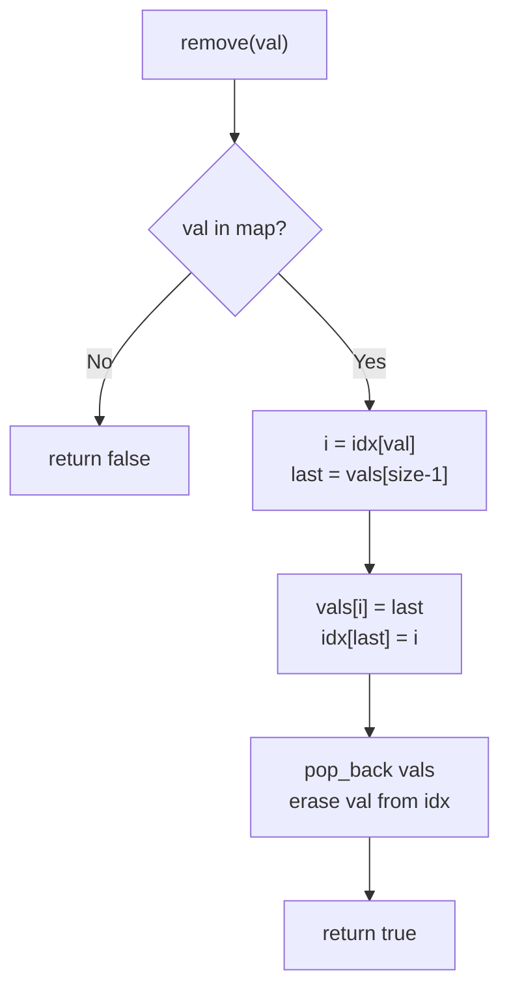
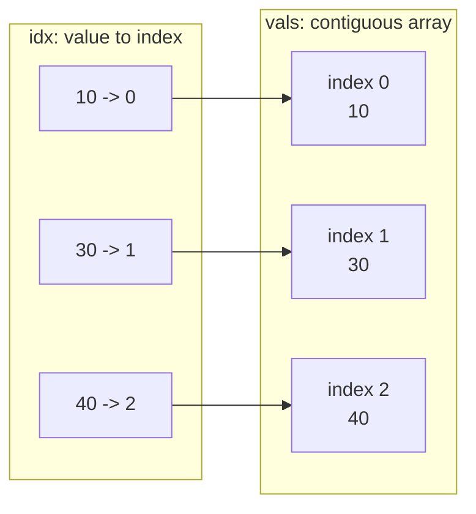

# Insert Delete GetRandom O(1)

| Meta | Value |
|------|-------|
| Source | LeetCode #380 |
| Difficulty | Medium |
| Topics | Hash Table, Array, Math, Design, Randomization |
| Link | https://leetcode.com/problems/insert-delete-getrandom-o1/ |

---

## Problem Statement

Design a data structure `RandomizedSet` that supports **all three** of the following
operations in **average O(1)** time:

- `insert(val)` — insert `val` into the set. Returns `true` if `val` was **not** present, else `false`.
- `remove(val)` — remove `val` from the set. Returns `true` if `val` **was** present, else `false`.
- `getRandom()` — return a random element from the current set. Each element must have the
  **same probability** of being returned.

**Example**
```
RandomizedSet set = new RandomizedSet();
set.insert(1);     // returns true  -> set = {1}
set.remove(2);     // returns false -> 2 not present, set = {1}
set.insert(2);     // returns true  -> set = {1, 2}
set.getRandom();   // returns 1 or 2, each with probability 1/2
set.remove(1);     // returns true  -> set = {2}
set.insert(2);     // returns false -> 2 already present, set = {2}
set.getRandom();   // returns 2 (the only element)
```

---

## Why a Hash Map + Dynamic Array?

No single standard container gives us all three operations in O(1):

| Container alone | insert | remove | getRandom |
|-----------------|--------|--------|-----------|
| Hash set        | O(1)   | O(1)   | **O(n)** (no index access) |
| Dynamic array   | O(1) amortized | **O(n)** (search + shift) | O(1) |

The trick is to **combine** them so each covers the other's weakness:

- A **dynamic array** `vals` stores the actual elements contiguously. Because it is indexable,
  `getRandom()` is just `vals[random_index]` — true O(1) with uniform probability.
- A **hash map** `idx` maps `value -> index in vals`. This gives O(1) membership tests and,
  crucially, lets `remove` locate an element's array position instantly without scanning.

### The swap-with-last deletion trick

Removing from the **middle** of an array normally costs O(n) because every element after the
hole must shift left. We avoid this entirely:

1. Look up the index `i` of the value to delete via the map.
2. Take the **last** element of the array and copy it into slot `i` (overwriting the victim).
3. Update the map so the moved element now points to index `i`.
4. `pop_back()` — remove the now-duplicated last slot in O(1).
5. Erase the deleted value from the map.

Because order does not matter in a set, overwriting the hole with the last element and shrinking
the array keeps everything contiguous **without shifting**. Every step is O(1).



### Why getRandom is uniform

At any moment the array holds exactly the `n` set elements, each in one slot. Picking an index
uniformly at random in $[0, n-1]$ selects each element with probability

$$
P(\text{element}) = \frac{1}{n}
$$

which satisfies the uniform requirement.

---

## Python

```python
import random

class RandomizedSet:
    def __init__(self):
        self.vals = []          # dynamic array of elements (contiguous)
        self.idx = {}           # value -> index in self.vals

    def insert(self, val: int) -> bool:
        if val in self.idx:     # already present -> no-op
            return False
        self.idx[val] = len(self.vals)   # new element goes to the end
        self.vals.append(val)
        return True

    def remove(self, val: int) -> bool:
        if val not in self.idx:          # not present -> nothing to remove
            return False
        i = self.idx[val]                # index of the victim
        last = self.vals[-1]             # last element
        self.vals[i] = last              # overwrite the hole with the last element
        self.idx[last] = i               # last element now lives at index i
        self.vals.pop()                  # drop the duplicated tail in O(1)
        del self.idx[val]                # forget the removed value
        return True

    def getRandom(self) -> int:
        # uniform index in [0, n-1] -> each element has probability 1/n
        return self.vals[random.randrange(len(self.vals))]
```

## C++

```cpp
#include <unordered_map>
#include <vector>
#include <cstdlib>   // rand
using namespace std;

class RandomizedSet {
    vector<int> vals;                 // dynamic array of elements (contiguous)
    unordered_map<int, int> idx;      // value -> index in vals

public:
    RandomizedSet() {}

    bool insert(int val) {
        if (idx.count(val)) return false;     // already present -> no-op
        idx[val] = (int)vals.size();          // new element goes to the end
        vals.push_back(val);
        return true;
    }

    bool remove(int val) {
        auto it = idx.find(val);
        if (it == idx.end()) return false;    // not present -> nothing to remove
        int i = it->second;                   // index of the victim
        int last = vals.back();               // last element
        vals[i] = last;                       // overwrite the hole with the last element
        idx[last] = i;                        // last element now lives at index i
        vals.pop_back();                      // drop the duplicated tail in O(1)
        idx.erase(it);                        // forget the removed value
        return true;
    }

    int getRandom() {
        // uniform index in [0, n-1] -> each element has probability 1/n
        return vals[rand() % vals.size()];
    }
};
```

---

## Iteration Trace

Operations: `insert(10)`, `insert(20)`, `insert(30)`, `remove(20)`, `insert(40)`, `getRandom()`.

The key moment is `remove(20)`: index of `20` is `1`, the last element `30` is moved into slot `1`,
its map entry is updated to `1`, then the tail is popped.

| Step | Operation    | `vals` (array)      | `idx` (map)                 | Returns |
|------|--------------|---------------------|-----------------------------|---------|
| 1    | insert(10)   | `[10]`              | `{10:0}`                    | true    |
| 2    | insert(20)   | `[10, 20]`          | `{10:0, 20:1}`              | true    |
| 3    | insert(30)   | `[10, 20, 30]`      | `{10:0, 20:1, 30:2}`        | true    |
| 4    | remove(20)   | `[10, 30]`          | `{10:0, 30:1}`              | true    |
| 5    | insert(40)   | `[10, 30, 40]`      | `{10:0, 30:1, 40:2}`        | true    |
| 6    | getRandom()  | `[10, 30, 40]`      | `{10:0, 30:1, 40:2}`        | 10/30/40 (p = 1/3 each) |

Notice in step 4 that no shifting occurred — `30` simply hopped from index `2` to index `1`,
and the array shrank from the tail.

---

## State Overview



The map and array are kept perfectly in sync: every value points to the exact slot where it
lives, which is what makes O(1) removal possible.

---

## Complexity

| Operation   | Time (average) | Space |
|-------------|----------------|-------|
| `insert`    | O(1)           | O(n)  |
| `remove`    | O(1)           | O(n)  |
| `getRandom` | O(1)           | O(1)  |
| Overall     | O(1) per op    | O(n)  |

Time bounds are **average** O(1) because hash map operations are amortized O(1); worst-case
hash collisions can degrade them, but this is rare in practice. The array's `push_back`/`pop_back`
are amortized O(1).

---

## Takeaway

- **Pair a hash map with a dynamic array** when you need O(1) membership *and* O(1) random
  access — each container cancels the other's weakness.
- The **swap-with-last deletion** trick is the heart of the problem: because set order is
  irrelevant, you overwrite the deleted slot with the last element and `pop_back`, turning an
  O(n) middle-removal into O(1).
- Always keep the map (`value -> index`) and the array in lockstep; the single easy-to-miss step
  is updating the moved element's index in the map **before** popping.
- `getRandom` is uniform precisely because the array stays contiguous, so a random index in
  $[0, n-1]$ hits each element with probability $1/n$.
