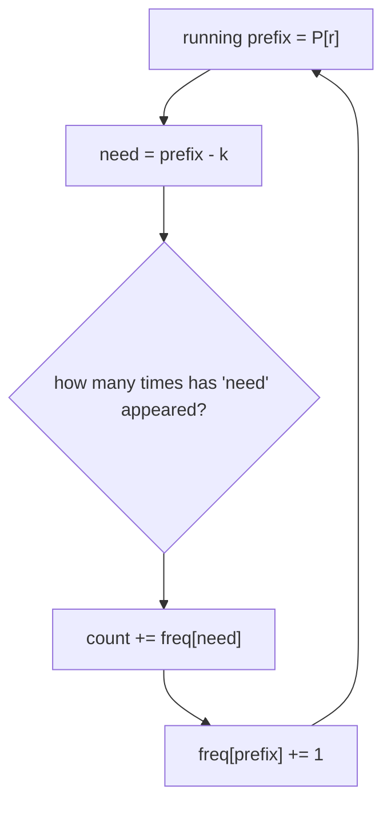

# Subarray Sum Equals K

| Meta | Value |
|------|-------|
| Source | LeetCode #560 |
| Difficulty | Medium |
| Topics | Hash Table, Prefix Sum |
| Link | https://leetcode.com/problems/subarray-sum-equals-k/ |

---

## Problem Statement
Given an integer array `nums` and an integer `k`, return the **number of contiguous subarrays**
whose elements sum to `k`.

**Example**
```
Input:  nums = [1, 1, 1], k = 2
Output: 2        // [1,1] (indices 0-1) and [1,1] (indices 1-2)
```

---

## From Brute Force to Prefix Sums

Brute force checks all `O(n²)` subarrays and sums each — `O(n³)`, or `O(n²)` with running sums.
We want `O(n)`.

### Prefix-sum reformulation
Let `P[i]` = sum of the first `i` elements (`P[0] = 0`). The sum of subarray `(l, r]` is:

$$
\text{sum}(l, r) = P[r] - P[l]
$$

We want subarrays summing to `k`:

$$
P[r] - P[l] = k \quad\Longleftrightarrow\quad P[l] = P[r] - k
$$

So for each right endpoint `r`, the number of valid left endpoints is **how many earlier prefix
sums equal `P[r] − k`**. A hash map of prefix-sum **frequencies** answers this in O(1).



---

## Code

```python
from collections import defaultdict

def subarray_sum(nums, k):
    count = 0
    prefix = 0
    freq = defaultdict(int)
    freq[0] = 1                  # empty prefix: enables subarrays starting at index 0
    for x in nums:
        prefix += x
        count += freq[prefix - k]   # add all earlier prefixes equal to prefix-k
        freq[prefix] += 1
    return count
```

```cpp
int subarray_sum(vector<int>& nums, int k) {
    int count = 0;
    long long prefix = 0;
    unordered_map<long long, int> freq;
    freq[0] = 1;                  // empty prefix: enables subarrays starting at index 0
    for (int x : nums) {
        prefix += x;
        count += freq[prefix - k];   // add all earlier prefixes equal to prefix-k
        freq[prefix] += 1;
    }
    return count;
}
```

### Why `freq[0] = 1`?
If a prefix `P[r]` itself equals `k`, then `need = P[r] - k = 0`. The "empty prefix" `P[0]=0`
must be counted so that the subarray `[0..r]` is included. Seeding `freq[0] = 1` handles this.

---

## Iteration Trace — `nums = [1, 2, 3]`, `k = 3`

| x | prefix | need = prefix−k | freq[need] | count | freq after |
|---|--------|-----------------|------------|-------|-----------|
| start | 0 | — | — | 0 | `{0:1}` |
| 1 | 1 | 1−3=−2 | 0 | 0 | `{0:1, 1:1}` |
| 2 | 3 | 3−3=0  | **1** | 1 | `{0:1, 1:1, 3:1}` |
| 3 | 6 | 6−3=3  | **1** | 2 | `{0:1, 1:1, 3:1, 6:1}` |

Result = **2**: subarrays `[1,2]` (sum 3) and `[3]` (sum 3). Notice we found `[3]` because at
prefix 6 we'd matched prefix 3; and `[1,2]` because at prefix 3 we matched the seeded 0.

---

## Complexity

| Approach | Time | Space |
|----------|------|-------|
| Brute force | O(n²) | O(1) |
| **Prefix sum + hash** | **O(n)** | O(n) |

---

## Common Pitfalls
- **Sliding window does NOT work here** because `nums` can contain negatives and zeros — sums
  aren't monotonic, so shrinking a window is invalid. The prefix-sum + hash approach is required.
- Forgetting `freq[0] = 1` → undercounts subarrays that start at index 0.
- Counting **distinct** vs **all** subarrays — this problem counts all (frequency, not presence).

## Takeaway
**Prefix sum + hash-map frequency** is the canonical way to count subarrays with a target sum.
The identity `P[l] = P[r] − k` converts a 2-D subarray search into a 1-D "have I seen this
value?" lookup. The same pattern counts subarrays divisible by `k` (store `prefix % k`).
