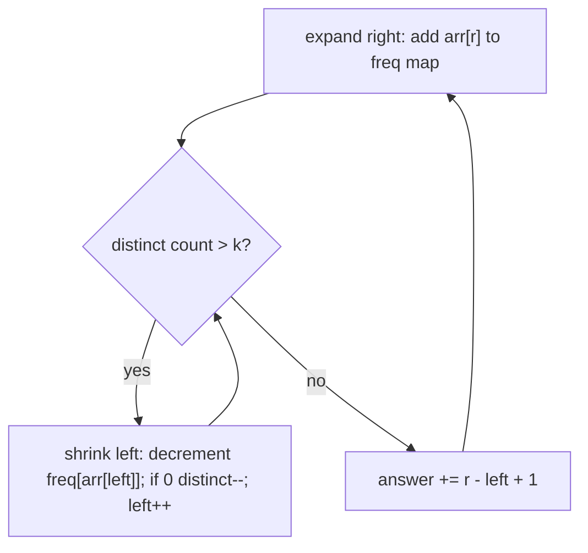

# Distinct Numbers & Distinct Values Subarrays (CSES)

| Meta | Value |
|------|-------|
| Source | CSES Problem Set — Sorting and Searching |
| Difficulty | Easy (counting) / Medium (subarray variant) |
| Topics | Hash Set, Coordinate Compression, Sliding Window |
| Link | https://cses.fi/problemset/task/1621 |

---

## Part A — Distinct Numbers
Given `n` integers, report how many **distinct** values appear.

```
Input:  [2, 3, 2, 2, 3]
Output: 2        // distinct values are {2, 3}
```

### Solution 1: Hash Set — O(n)
Insert everything into a set; its size is the answer.

```python
def distinct_numbers(arr):
    return len(set(arr))
```

```cpp
int distinct_numbers(vector<int>& arr) {
    unordered_set<int> s(arr.begin(), arr.end());
    return (int)s.size();
}
```

### Solution 2: Sort + Scan — O(n log n)
Sort, then count positions where the value differs from the previous one. Useful when a hash set
is unavailable or you also need the values in order.

```python
def distinct_numbers_sort(arr):
    arr.sort()
    count = 1 if arr else 0
    for i in range(1, len(arr)):
        if arr[i] != arr[i - 1]:
            count += 1
    return count
```

```cpp
int distinct_numbers_sort(vector<int> arr) {
    sort(arr.begin(), arr.end());
    int count = arr.empty() ? 0 : 1;
    for (int i = 1; i < (int)arr.size(); i++) {
        if (arr[i] != arr[i - 1])
            count += 1;
    }
    return count;
}
```

| Approach | Time | Space |
|----------|------|-------|
| Hash set | O(n) | O(n) |
| Sort + scan | O(n log n) | O(1) |

---

## Part B — Subarray Distinct Values (Harder Variant, CSES 2428)

> Count the number of subarrays that contain at most `k` distinct values.

This combines a **hash map frequency** with a **sliding window** — a frequent competitive
pattern.

### Key Insight — "At Most K" Windows Count Subarrays
For each right endpoint `r`, find the smallest `left` such that the window `[left, r]` has ≤ `k`
distinct values. Then **every** subarray ending at `r` with start in `[left, r]` is valid —
that's `r − left + 1` subarrays. Sum over all `r`.



```python
def subarrays_at_most_k_distinct(arr, k):
    from collections import defaultdict
    freq = defaultdict(int)
    distinct = 0
    left = 0
    total = 0
    for r, x in enumerate(arr):
        if freq[x] == 0:
            distinct += 1
        freq[x] += 1
        while distinct > k:                 # too many distinct -> shrink
            freq[arr[left]] -= 1
            if freq[arr[left]] == 0:
                distinct -= 1
            left += 1
        total += r - left + 1               # subarrays ending at r
    return total
```

```cpp
long long subarrays_at_most_k_distinct(vector<int>& arr, int k) {
    unordered_map<int, int> freq;
    int distinct = 0;
    int left = 0;
    long long total = 0;
    for (int r = 0; r < (int)arr.size(); r++) {
        int x = arr[r];
        if (freq[x] == 0)
            distinct += 1;
        freq[x] += 1;
        while (distinct > k) {                 // too many distinct -> shrink
            freq[arr[left]] -= 1;
            if (freq[arr[left]] == 0)
                distinct -= 1;
            left += 1;
        }
        total += r - left + 1;               // subarrays ending at r
    }
    return total;
}
```

> "**Exactly k** distinct" = `atMost(k) − atMost(k−1)` — a classic counting trick that converts
> a hard exact constraint into two easy monotonic ones.

---

## Trace — `arr = [1, 2, 1, 3]`, `k = 2`

| r | x | freq / distinct | shrink? | left | window | += (r−left+1) | total |
|---|---|-----------------|---------|------|--------|---------------|-------|
| 0 | 1 | {1:1} d=1 | no | 0 | [1] | 1 | 1 |
| 1 | 2 | {1:1,2:1} d=2 | no | 0 | [1,2] | 2 | 3 |
| 2 | 1 | {1:2,2:1} d=2 | no | 0 | [1,2,1] | 3 | 6 |
| 3 | 3 | d=3 >2 → shrink: drop 1(→{1:1}),still d=3? drop 2(d=2),drop1(d=2)… | left→2 | 2 | [1,3] | 2 | 8 |

Result **8** subarrays with ≤ 2 distinct values. (Shrinking removes `arr[0]=1`, `arr[1]=2` until
distinct drops to 2, landing `left = 2`.)

---

## Why Each Element Is Processed O(1) Amortized

`left` only ever moves **forward** across the whole array. Across all `r`, the total number of
`left++` steps is at most `n`. So despite the inner `while`, total work is **O(n)** — the
hallmark of the sliding-window amortization.

---

## Complexity

| Problem | Time | Space |
|---------|------|-------|
| Distinct count | O(n) | O(n) |
| Subarrays ≤ k distinct | O(n) | O(n) |

## Takeaway
A **hash map** answers "how many distinct in this window?" in O(1) amortized, and pairing it with
a **sliding window** counts subarrays under distinctness constraints. The `atMost(k) −
atMost(k−1)` identity is the go-to for "exactly k" counting problems.
