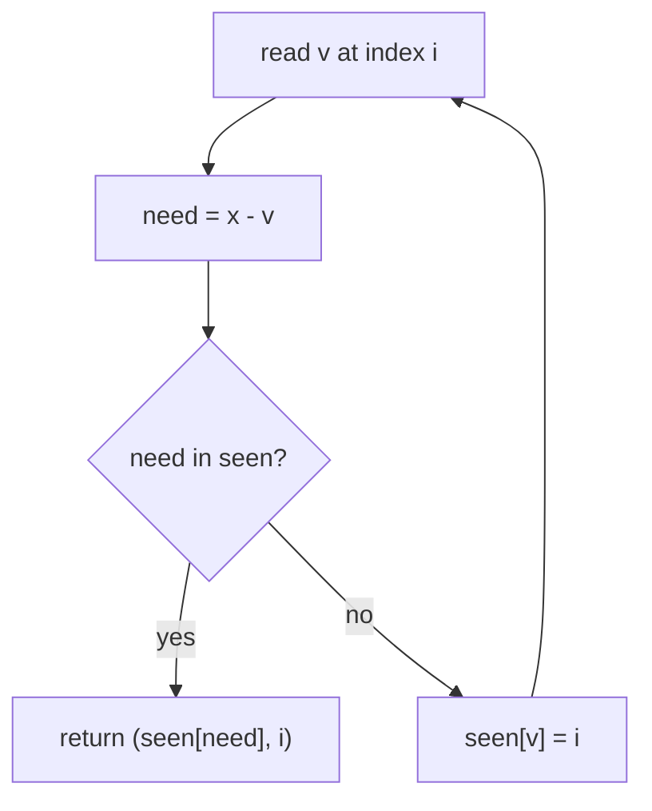

# Sum of Two / Three / Four Values (CSES)

| Meta | Value |
|------|-------|
| Source | CSES Problem Set — Sorting and Searching |
| Difficulty | Easy → Medium |
| Topics | Hash Map, Two Pointers, Index Bookkeeping |
| Link | https://cses.fi/problemset/task/1640 |

---

## Sum of Two Values
Given `n` numbers and a target `x`, find **two distinct positions** whose values sum to `x`, or
report `IMPOSSIBLE`. Output the **original 1-based indices**.

```
Input:  arr = [2, 7, 5, 1], x = 9
Output: 2 1        // arr[2]=7 + arr[1]=2 = 9  (any valid pair)
```

---

## Hash Map — One Pass O(n)

This is CSES's version of "Two Sum." The twist: we must return **original indices**, so the hash
map stores `value → original index`. For each element, look up its complement `x − value`.

```python
def sum_of_two(arr, x):
    seen = {}                          # value -> 1-based index
    for i, v in enumerate(arr, start=1):
        need = x - v
        if need in seen:
            return (seen[need], i)     # found a valid pair
        seen[v] = i
    return None                        # IMPOSSIBLE
```

```cpp
// returns a pair of 1-based indices, or {-1, -1} if IMPOSSIBLE
pair<int, int> sum_of_two(vector<int>& arr, long long x) {
    unordered_map<long long, int> seen;    // value -> 1-based index
    for (int i = 1; i <= (int)arr.size(); i++) {
        long long v = arr[i - 1];
        long long need = x - v;
        if (seen.count(need))
            return {seen[need], i};        // found a valid pair
        seen[v] = i;
    }
    return {-1, -1};                       // IMPOSSIBLE
}
```

Storing the index **after** the lookup guarantees the two indices are distinct (we never pair an
element with itself).



### Trace — `arr = [2, 7, 5, 1]`, `x = 9`
| i | v | need | seen before | found? |
|---|---|------|-------------|--------|
| 1 | 2 | 7 | {} | no → store 2→1 |
| 2 | 7 | 2 | {2:1} | **yes → (1, 2)** |

---

## Sum of Three Values (CSES 1641) — O(n²)

Fix one element `arr[i]`, then solve **Sum of Two Values** for target `x − arr[i]` on the rest.
Sort by value (carrying original indices) and use **two pointers** for the inner search.

```python
def sum_of_three(arr, x):
    idx = sorted(range(len(arr)), key=lambda i: arr[i])   # indices by value
    a = [arr[i] for i in idx]
    n = len(arr)
    for i in range(n):
        l, r = i + 1, n - 1
        target = x - a[i]
        while l < r:
            s = a[l] + a[r]
            if s == target:
                return (idx[i] + 1, idx[l] + 1, idx[r] + 1)   # 1-based
            elif s < target:
                l += 1
            else:
                r -= 1
    return None
```

```cpp
// returns a tuple of 1-based indices, or {-1,-1,-1} if none
array<int, 3> sum_of_three(vector<int>& arr, long long x) {
    int n = (int)arr.size();
    vector<int> idx(n);
    iota(idx.begin(), idx.end(), 0);
    sort(idx.begin(), idx.end(), [&](int i, int j){ return arr[i] < arr[j]; });   // indices by value
    vector<long long> a(n);
    for (int i = 0; i < n; i++) a[i] = arr[idx[i]];
    for (int i = 0; i < n; i++) {
        int l = i + 1, r = n - 1;
        long long target = x - a[i];
        while (l < r) {
            long long s = a[l] + a[r];
            if (s == target)
                return {idx[i] + 1, idx[l] + 1, idx[r] + 1};   // 1-based
            else if (s < target)
                l += 1;
            else
                r -= 1;
        }
    }
    return {-1, -1, -1};
}
```

The outer loop is `O(n)`; each inner two-pointer scan is `O(n)` → total **O(n²)**, far better
than the `O(n³)` brute force.

---

## Sum of Four Values (CSES 1642) — O(n²) with Hashing

For four values summing to `x`, hash **all pairwise sums** and look for two pairs that complete
the target. Carefully avoid index reuse.

```python
def sum_of_four(arr, x):
    from collections import defaultdict
    pair_sum = defaultdict(list)       # sum -> list of (i, j)
    n = len(arr)
    for i in range(n):
        # before adding pairs involving i, search for a complementary earlier pair
        for j in range(i):
            need = x - arr[i] - arr[j]
            if need in pair_sum:
                for (a, b) in pair_sum[need]:
                    if a != i and a != j and b != i and b != j:
                        return (a + 1, b + 1, j + 1, i + 1)
        for j in range(i):
            pair_sum[arr[i] + arr[j]].append((i, j))
    return None
```

```cpp
// returns a tuple of 1-based indices, or {-1,-1,-1,-1} if none
array<int, 4> sum_of_four(vector<int>& arr, long long x) {
    unordered_map<long long, vector<pair<int,int>>> pair_sum;   // sum -> list of (i, j)
    int n = (int)arr.size();
    for (int i = 0; i < n; i++) {
        // before adding pairs involving i, search for a complementary earlier pair
        for (int j = 0; j < i; j++) {
            long long need = x - arr[i] - arr[j];
            if (pair_sum.count(need)) {
                for (auto& [a, b] : pair_sum[need]) {
                    if (a != i && a != j && b != i && b != j)
                        return {a + 1, b + 1, j + 1, i + 1};
                }
            }
        }
        for (int j = 0; j < i; j++)
            pair_sum[(long long)arr[i] + arr[j]].push_back({i, j});
    }
    return {-1, -1, -1, -1};
}
```

The ordering (search complementary pairs that use **only earlier** indices, then register the
new pairs) guarantees all four indices are distinct. Time **O(n²)** on average.

---

## Complexity Summary

| Problem | Technique | Time |
|---------|-----------|------|
| Two values | hash map | O(n) |
| Three values | sort + fix one + two pointers | O(n²) |
| Four values | hash all pairwise sums | O(n²) |

The general pattern: **k-Sum reduces to (k−1)-Sum** by fixing one element, and the base case
(2-Sum) is solved by either a hash map (unsorted) or two pointers (sorted).

---

## Index Bookkeeping — The Common Pitfall
Competitive versions demand **original indices** and **distinct** elements. Two safeguards:
1. Store indices *after* checking complements (no self-pairing).
2. When sorting, sort an **index array** by value so you can recover original positions.

## Takeaway
The k-Sum family is the canonical demonstration of **trading time for space with a hash map** and
**recursive reduction**. Master the 2-Sum hash-map core and the rest are layered fixings on top.
