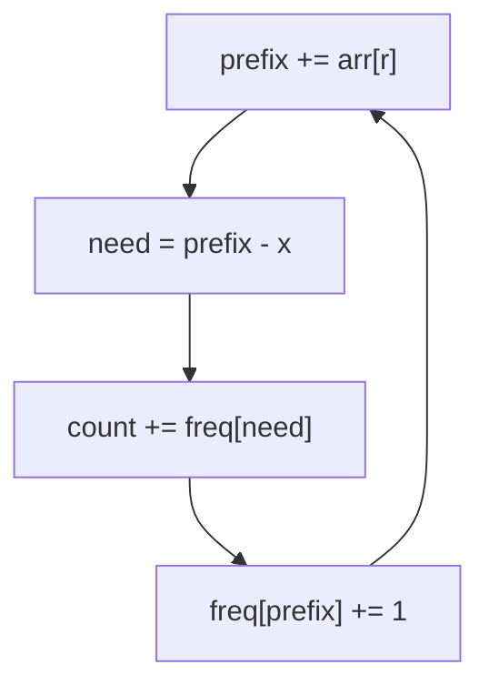

# Subarray Sums II / Sum Divisible by N (CSES — Prefix Sum + Hash Map)

| Meta | Value |
|------|-------|
| Source | CSES Problem Set — Sorting and Searching |
| Difficulty | Medium |
| Topics | Prefix Sum, Hash Map, Modular Arithmetic |
| Links | https://cses.fi/problemset/task/1661 , https://cses.fi/problemset/task/1662 |

---

## Problem A — Subarray Sums II (target sum, negatives allowed)
Count subarrays whose sum equals exactly `x`. Unlike "Subarray Sums I," values may be
**negative**, so a sliding window does **not** work — we need **prefix sums + hash map**.

```
arr = [2, -1, 3, 5, -2, 3], x = 5
Output: count of subarrays summing to 5
```

### Why Sliding Window Fails Here
With negatives, growing the window can *decrease* the sum, so the sum isn't monotonic in window
size. There's no valid "shrink when too big" rule. The prefix-sum hash technique handles
negatives naturally.

### Technique
Let `P[r]` be the prefix sum up to index `r`. A subarray `(l, r]` sums to `x` iff:

$$
P[r] - P[l] = x \;\Longleftrightarrow\; P[l] = P[r] - x
$$

Walk left to right keeping a frequency map of prefix sums seen so far. For each `P[r]`, add the
number of earlier prefixes equal to `P[r] − x`.

```python
from collections import defaultdict

def subarray_sums_equal_x(arr, x):
    freq = defaultdict(int)
    freq[0] = 1                        # empty prefix
    prefix = 0
    count = 0
    for v in arr:
        prefix += v
        count += freq[prefix - x]      # earlier prefixes that complete x
        freq[prefix] += 1
    return count
```

```cpp
long long subarray_sums_equal_x(vector<long long>& arr, long long x) {
    unordered_map<long long, int> freq;
    freq[0] = 1;                       // empty prefix
    long long prefix = 0;
    long long count = 0;
    for (long long v : arr) {
        prefix += v;
        count += freq[prefix - x];     // earlier prefixes that complete x
        freq[prefix] += 1;
    }
    return count;
}
```



---

## Problem B — Subarray Divisible by N (CSES 1662)
Count subarrays whose sum is **divisible by `n`**. Same prefix-sum idea, but key on the
**residue** `prefix mod n` instead of the raw sum.

### Modular Insight
A subarray `(l, r]` has sum divisible by `n` iff:

$$
P[r] \equiv P[l] \pmod{n}
$$

because `(P[r] − P[l]) \bmod n = 0`. So count pairs of prefixes sharing the same residue. If a
residue appears `c` times, it contributes `\binom{c}{2} = c(c-1)/2` subarrays — but the streaming
version below adds them incrementally.

```python
from collections import defaultdict

def subarrays_divisible_by_n(arr, n):
    freq = defaultdict(int)
    freq[0] = 1                        # empty prefix has residue 0
    prefix = 0
    count = 0
    for v in arr:
        prefix += v
        r = prefix % n                 # in some languages, fix negative mod: (prefix % n + n) % n
        count += freq[r]               # earlier prefixes with same residue
        freq[r] += 1
    return count
```

```cpp
long long subarrays_divisible_by_n(vector<long long>& arr, long long n) {
    unordered_map<long long, int> freq;
    freq[0] = 1;                       // empty prefix has residue 0
    long long prefix = 0;
    long long count = 0;
    for (long long v : arr) {
        prefix += v;
        long long r = ((prefix % n) + n) % n;   // fix negative mod so residue is in [0, n)
        count += freq[r];              // earlier prefixes with same residue
        freq[r] += 1;
    }
    return count;
}
```

> **Negative-mod caution:** in C/C++/Java, `prefix % n` can be negative. Normalize with
> `((prefix % n) + n) % n` so residues land in `[0, n)`. Python's `%` already returns
> non-negative for positive `n`.

---

## Trace — Divisible by `n = 5`: `arr = [1, 2, 3, 4, 5]`

Prefix sums: `1, 3, 6, 10, 15`; residues mod 5: `1, 3, 1, 0, 0` (plus seeded residue 0).

| v | prefix | r = prefix%5 | freq[r] before | count += | freq after |
|---|--------|--------------|----------------|----------|-----------|
| init | 0 | — | — | 0 | {0:1} |
| 1 | 1 | 1 | 0 | 0 | {0:1,1:1} |
| 2 | 3 | 3 | 0 | 0 | {...,3:1} |
| 3 | 6 | 1 | 1 | **1** | {1:2,...} |
| 4 | 10 | 0 | 1 | **1** | {0:2,...} |
| 5 | 15 | 0 | 2 | **2** | {0:3,...} |

Total = `1 + 1 + 2 = 4` subarrays divisible by 5: `[2,3]`, `[1,2,3,4]`, `[5]`, `[1,2,3,4,5]`.

The residue 0 appearing 3 times (indices for prefixes 10, 15, plus the seed) creates the
multiple matches.

---

## Complexity

| Problem | Time | Space |
|---------|------|-------|
| Sum = x (with negatives) | O(n) | O(n) |
| Sum divisible by n | O(n) | O(n) |

---

## Pattern Family — "Prefix + Hash"
| Constraint on subarray sum | Key to store |
|----------------------------|--------------|
| equals `x` | `prefix` (look up `prefix − x`) |
| divisible by `n` | `prefix mod n` |
| equals `x` with at most ... | augment with extra state |

## Takeaway
**Prefix sum + hash map** is the universal answer to "count subarrays with a sum property,"
especially when negatives rule out sliding windows. For divisibility, switch the key to the
**residue** — congruent prefixes bracket a divisible subarray.
