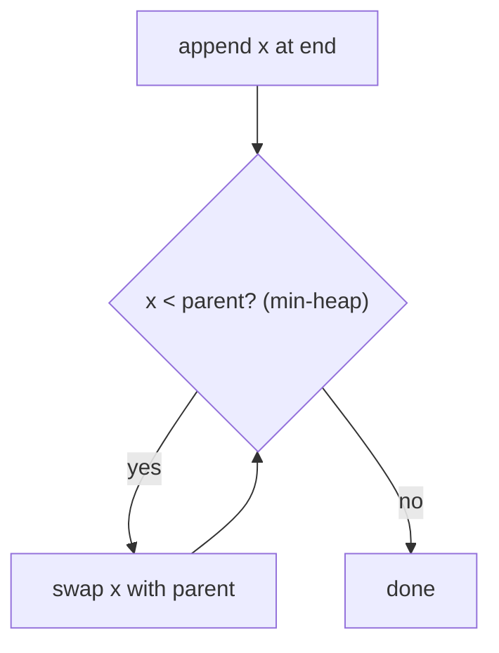

# Heaps & Priority Queues — Complete Guide (Beginner → Advanced)

> A heap is a clever array-based tree that gives you the **min or max element in O(1)** and
> insert/remove in **O(log n)**. It's the engine behind priority queues, Dijkstra, heapsort, and
> "top-K" problems.

---

## Table of Contents
1. [What is a Heap?](#1-what-is-a-heap)
2. [Array Representation (No Pointers!)](#2-array-representation-no-pointers)
3. [Core Operations](#3-core-operations)
4. [Building a Heap in O(n)](#4-building-a-heap-in-on)
5. [Heapsort](#5-heapsort)
6. [Priority Queue Applications](#6-priority-queue-applications)
7. [Advanced Variants](#7-advanced-variants)
8. [Cheat Sheet](#8-cheat-sheet)

---

## 1. What is a Heap?

A **binary heap** is a **complete binary tree** (every level full except possibly the last,
filled left-to-right) satisfying the **heap property**:

- **Min-heap:** every parent ≤ its children → the **minimum** is at the root.
- **Max-heap:** every parent ≥ its children → the **maximum** is at the root.

```
Min-heap:            Max-heap:
      1                    9
     / \                  / \
    3   2                7   8
   / \                  / \
  5   4                4   6
```

Note: a heap is only **partially ordered** — siblings have no required relationship. This
weaker invariant is exactly why heaps are cheaper to maintain than a fully sorted BST.

---

## 2. Array Representation (No Pointers!)

Because a heap is a *complete* tree, we can store it in a plain array with **no child/parent
pointers**. Using 0-based indexing, for node at index `i`:

$$
\text{parent}(i) = \left\lfloor \frac{i-1}{2} \right\rfloor, \quad
\text{left}(i) = 2i + 1, \quad
\text{right}(i) = 2i + 2
$$

```
Tree:          1
              / \
             3   2
            / \
           5   4

Array:  [1, 3, 2, 5, 4]
index:   0  1  2  3  4
parent of index 3 (val 5) = (3-1)/2 = 1 (val 3)  ✓
```

This compact layout is also **cache-friendly** — a hidden performance win over pointer trees.

---

## 3. Core Operations

### Insert (push) — O(log n): "sift up"
Append at the end, then **bubble up** while it violates the heap property with its parent.



### Extract-min/max (pop) — O(log n): "sift down"
The root is the answer. Move the **last** element to the root, then **bubble down**, swapping
with the smaller (min-heap) child until the property is restored.

```python
import heapq
h = []
heapq.heappush(h, 5)      # O(log n)
heapq.heappush(h, 1)
heapq.heappush(h, 3)
smallest = heapq.heappop(h)   # 1, O(log n)
peek = h[0]                   # O(1)
```

```cpp
#include <queue>
#include <vector>
using namespace std;

priority_queue<int, vector<int>, greater<int>> h;  // min-heap
h.push(5);                  // O(log n)
h.push(1);
h.push(3);
int smallest = h.top();     // 1, O(1)
h.pop();                    // O(log n)
int peek = h.top();         // O(1)
```

> Python's `heapq` is a **min-heap**. For a max-heap, push **negated** values (`-x`) or use
> tuples with a negated key.

| Operation | Time |
|-----------|------|
| peek min/max | O(1) |
| push | O(log n) |
| pop | O(log n) |
| build from n items | **O(n)** |
| search arbitrary | O(n) |

---

## 4. Building a Heap in O(n)

Surprisingly, building a heap from `n` items is **O(n)**, not O(n log n). Insert all elements,
then **sift down** from the last internal node up to the root.

### Why O(n)? (the math)
Nodes near the bottom (the majority) sift down only a little. Summing the work by level:

$$
\sum_{h=0}^{\log n} \frac{n}{2^{h+1}} \cdot h = n \sum_{h=0}^{\infty} \frac{h}{2^{h+1}} = n \cdot 1 = O(n)
$$

The series `Σ h / 2^(h+1)` converges to a constant, so the total is linear.

```python
import heapq
arr = [5, 3, 8, 1, 9, 2]
heapq.heapify(arr)      # O(n), in place
```

```cpp
#include <algorithm>
#include <vector>
using namespace std;

vector<int> arr = {5, 3, 8, 1, 9, 2};
make_heap(arr.begin(), arr.end(), greater<int>());  // O(n), in place (min-heap)
```

---

## 5. Heapsort

1. Build a max-heap in O(n).
2. Repeatedly swap the root (max) to the end and sift down the reduced heap.

Result: sorted array in **O(n log n)**, **in place**, **O(1) extra space**. Not stable, but
worst-case guaranteed (unlike quicksort).

---

## 6. Priority Queue Applications

| Problem | How the heap helps |
|---------|--------------------|
| **Dijkstra / Prim** | pop the closest/cheapest frontier node |
| **Top-K largest/smallest** | maintain a heap of size K |
| **K-way merge** | min-heap of list heads |
| **Median of a stream** | two heaps (max-heap low half, min-heap high half) |
| **Task scheduling** | pop the highest-priority task |
| **Huffman coding** | repeatedly merge two smallest frequencies |

### Top-K trick
To find the K **largest** elements, keep a **min-heap of size K**. If a new element exceeds the
heap's minimum (root), replace it. Cost: `O(n log K)`, space `O(K)` — far better than sorting
when K ≪ n.

---

## 7. Advanced Variants

- **d-ary heap:** each node has `d` children; shallower tree, faster decrease-key.
- **Binary indexed / pairing / Fibonacci heap:** Fibonacci heaps give amortized O(1)
  decrease-key, improving Dijkstra to `O(E + V log V)` (mostly theoretical).
- **Indexed priority queue:** supports `decrease-key` by tracking element positions — needed for
  efficient Dijkstra/Prim with updates.
- **Two-heap median:** balance a max-heap (lower half) and min-heap (upper half).

---

## 8. Cheat Sheet

```
peek ............ O(1)
push / pop ...... O(log n)
heapify (build).. O(n)
heapsort ........ O(n log n), in place

Indices (0-based): parent=(i-1)/2  left=2i+1  right=2i+2
Min-heap: parent <= children ; Max-heap: parent >= children
Python heapq = MIN-heap (negate for max)

Patterns: top-K (size-K heap), k-way merge, streaming median (2 heaps),
          Dijkstra/Prim (priority queue)
```

> **Mental model:** A heap is a "tournament bracket" stored in an array — the champion (min or
> max) is always at the top, but the rest are only loosely ranked, which keeps updates cheap.
