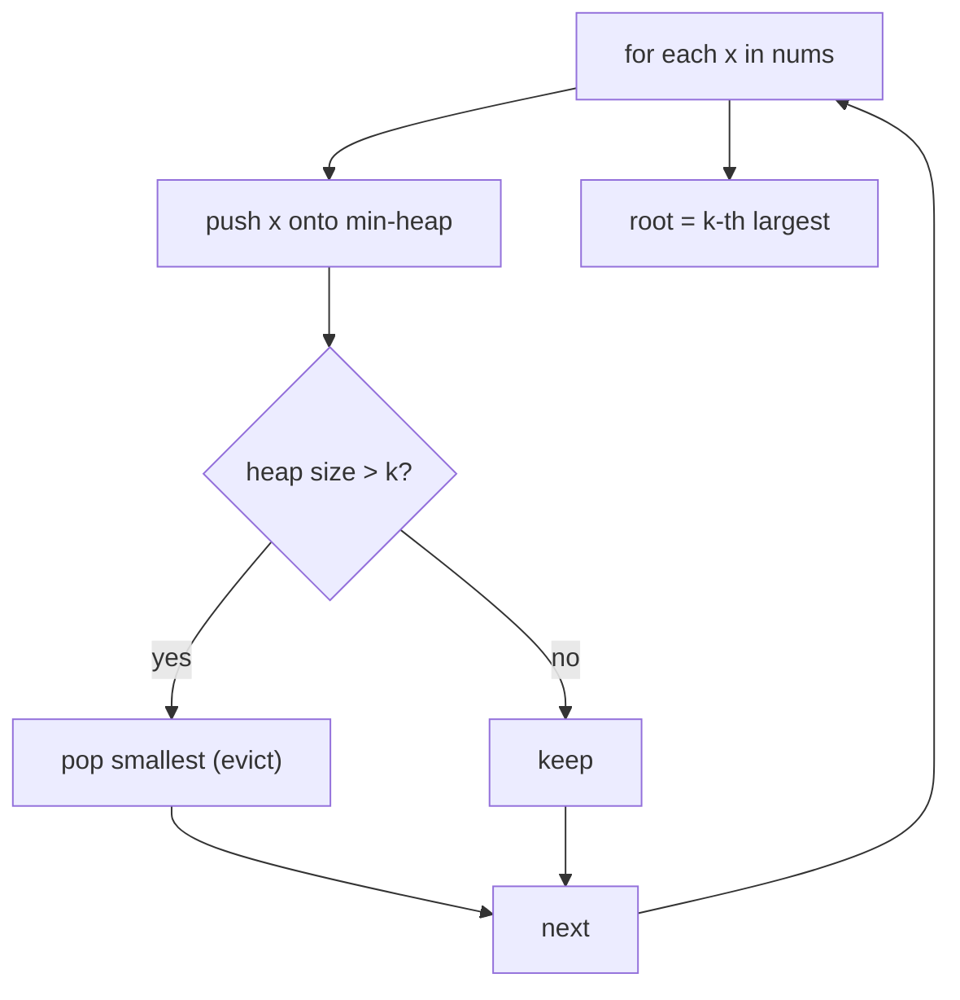

# Kth Largest Element in an Array

| Meta | Value |
|------|-------|
| Source | LeetCode #215 |
| Difficulty | Medium |
| Topics | Heap, Quickselect, Sorting |
| Link | https://leetcode.com/problems/kth-largest-element-in-an-array/ |

---

## Problem Statement
Return the **k-th largest** element in an unsorted array (in sorted order, not the k-th
distinct).

**Example**
```
Input:  nums = [3, 2, 1, 5, 6, 4], k = 2
Output: 5        // sorted desc: [6,5,4,3,2,1], 2nd is 5
```

---

## Approach 1: Min-Heap of Size K — O(n log k)

Keep a **min-heap holding the K largest elements seen so far**. The heap's root (its minimum) is
the smallest of those K — which, once we've processed everything, is exactly the **K-th
largest** overall.

For each number:
- Push it.
- If the heap exceeds size K, pop the smallest (it can't be in the top K).



```python
import heapq

def find_kth_largest(nums, k):
    heap = []
    for x in nums:
        heapq.heappush(heap, x)
        if len(heap) > k:
            heapq.heappop(heap)      # remove smallest of the k+1
    return heap[0]                   # smallest of the k largest
```

```cpp
#include <queue>
#include <vector>
using namespace std;

int find_kth_largest(vector<int>& nums, int k) {
    priority_queue<int, vector<int>, greater<int>> heap;  // min-heap
    for (int x : nums) {
        heap.push(x);
        if ((int)heap.size() > k)
            heap.pop();          // remove smallest of the k+1
    }
    return heap.top();           // smallest of the k largest
}
```

### Iteration Trace — `nums = [3,2,1,5,6,4]`, `k = 2`

| x | push → heap | size > 2? pop | heap (min at front) |
|---|-------------|---------------|---------------------|
| 3 | [3] | no | [3] |
| 2 | [2,3] | no | [2,3] |
| 1 | [1,2,3] | yes → pop 1 | [2,3] |
| 5 | [2,3,5] | yes → pop 2 | [3,5] |
| 6 | [3,5,6] | yes → pop 3 | [5,6] |
| 4 | [4,5,6] | yes → pop 4 | [5,6] |

Final heap `[5, 6]`, root = **5** = 2nd largest ✓.

The heap always retains the two biggest numbers seen; its minimum is the answer.

---

## Approach 2: Quickselect — O(n) Average

A partial quicksort. Partition around a pivot (Lomuto/Hoare); the pivot lands in its final
sorted position `p`. If `p` is the index we want (`n − k` in ascending order), we're done; else
recurse into **only one** side.

```python
import random

def find_kth_largest_qs(nums, k):
    target = len(nums) - k           # index in ascending sorted order
    lo, hi = 0, len(nums) - 1
    while lo <= hi:
        p = partition(nums, lo, hi)
        if p == target:
            return nums[p]
        elif p < target:
            lo = p + 1               # answer is to the right
        else:
            hi = p - 1               # answer is to the left

def partition(nums, lo, hi):
    pivot_idx = random.randint(lo, hi)        # randomize -> avoid worst case
    nums[pivot_idx], nums[hi] = nums[hi], nums[pivot_idx]
    pivot = nums[hi]
    i = lo
    for j in range(lo, hi):
        if nums[j] < pivot:
            nums[i], nums[j] = nums[j], nums[i]
            i += 1
    nums[i], nums[hi] = nums[hi], nums[i]
    return i
```

```cpp
#include <vector>
#include <cstdlib>
using namespace std;

int partition(vector<int>& nums, int lo, int hi);

int find_kth_largest_qs(vector<int>& nums, int k) {
    int target = (int)nums.size() - k;   // index in ascending sorted order
    int lo = 0, hi = (int)nums.size() - 1;
    while (lo <= hi) {
        int p = partition(nums, lo, hi);
        if (p == target)
            return nums[p];
        else if (p < target)
            lo = p + 1;                  // answer is to the right
        else
            hi = p - 1;                  // answer is to the left
    }
    return -1;
}

int partition(vector<int>& nums, int lo, int hi) {
    int pivot_idx = lo + rand() % (hi - lo + 1);   // randomize -> avoid worst case
    swap(nums[pivot_idx], nums[hi]);
    int pivot = nums[hi];
    int i = lo;
    for (int j = lo; j < hi; ++j) {
        if (nums[j] < pivot) {
            swap(nums[i], nums[j]);
            ++i;
        }
    }
    swap(nums[i], nums[hi]);
    return i;
}
```

### Why O(n) average?
Each partition step processes the current subrange, but we recurse into **one** side only. The
expected work halves each time:

$$
n + \frac{n}{2} + \frac{n}{4} + \dots = 2n = O(n)
$$

Worst case is O(n²) (bad pivots), but **random pivot selection** makes that astronomically
unlikely.

---

## Complexity Comparison

| Approach | Time (avg) | Time (worst) | Space |
|----------|-----------|--------------|-------|
| Sort + index | O(n log n) | O(n log n) | O(1)/O(n) |
| **Min-heap size K** | O(n log k) | O(n log k) | O(k) |
| **Quickselect** | **O(n)** | O(n²) | O(1) |

- Use the **heap** when k is small, data streams in, or you want a simple, predictable solution.
- Use **quickselect** when you want optimal average time and can mutate the array.

---

## Edge Cases
- `k = 1` → maximum element.
- `k = n` → minimum element.
- Duplicates → counted by position, not distinctness (heap/quickselect both handle this).

## Takeaway
"**Top-K**" problems split into two tools: a **size-K heap** (great for streams, `O(n log k)`)
and **quickselect** (optimal `O(n)` average for static arrays). Recognizing which fits the
constraints is the real skill.
