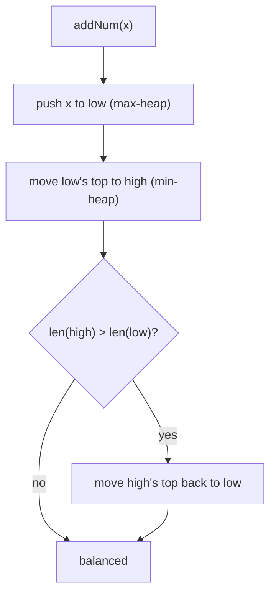

# Find Median from Data Stream (Two Heaps)

| Meta | Value |
|------|-------|
| Source | LeetCode #295 |
| Difficulty | Hard |
| Topics | Heap, Design, Two Heaps |
| Link | https://leetcode.com/problems/find-median-from-data-stream/ |

---

## Problem Statement
Design a data structure that supports:
- `addNum(x)` — add an integer from a stream.
- `findMedian()` — return the median of all elements so far.

**Example**
```
addNum(1); addNum(2); findMedian() -> 1.5
addNum(3);             findMedian() -> 2.0
```

---

## The Two-Heap Idea

The median sits in the **middle** of the sorted data. We don't need the whole thing sorted — we
only need fast access to the *middle two* elements. Split the data into two halves:

- **`low`** — a **max-heap** holding the smaller half. Its **top is the largest of the small
  half**.
- **`high`** — a **min-heap** holding the larger half. Its **top is the smallest of the large
  half**.

If we keep the halves balanced (sizes differ by ≤ 1), the median is:
- both tops averaged (even total), or
- the top of the larger heap (odd total).

```
        low (max-heap)        high (min-heap)
        [ ... , 2 ]   <-->   [ 3 , ... ]
                  ^median region^
sorted view:  ... 1 2 | 3 4 ...
```



---

## Balancing Invariant

We maintain: `len(low) == len(high)` **or** `len(low) == len(high) + 1`.
So `low` is always equal to or one larger than `high`. This makes median extraction O(1).

### The push-then-rebalance trick
1. Push the new number onto `low`.
2. Pop `low`'s max and push it onto `high` (this guarantees ordering: everything in `low ≤`
   everything in `high`).
3. If `high` got bigger than `low`, move its min back to `low`.

This three-step dance keeps both the **ordering** (low ≤ high) and the **size** invariants.

---

## Code

```python
import heapq

class MedianFinder:
    def __init__(self):
        self.low = []     # max-heap (store negatives)
        self.high = []    # min-heap

    def addNum(self, x):
        # 1. add to low (max-heap via negation)
        heapq.heappush(self.low, -x)
        # 2. ensure low's max <= high's min: shuffle top across
        heapq.heappush(self.high, -heapq.heappop(self.low))
        # 3. rebalance sizes (low may hold the extra element)
        if len(self.high) > len(self.low):
            heapq.heappush(self.low, -heapq.heappop(self.high))

    def findMedian(self):
        if len(self.low) > len(self.high):
            return -self.low[0]                    # odd count -> low's top
        return (-self.low[0] + self.high[0]) / 2   # even -> average of tops
```

```cpp
#include <queue>
#include <vector>
using namespace std;

class MedianFinder {
    priority_queue<int> low;                              // max-heap (smaller half)
    priority_queue<int, vector<int>, greater<int>> high;  // min-heap (larger half)
public:
    void addNum(int x) {
        // 1. add to low (max-heap)
        low.push(x);
        // 2. ensure low's max <= high's min: shuffle top across
        high.push(low.top());
        low.pop();
        // 3. rebalance sizes (low may hold the extra element)
        if (high.size() > low.size()) {
            low.push(high.top());
            high.pop();
        }
    }

    double findMedian() {
        if (low.size() > high.size())
            return low.top();                          // odd count -> low's top
        return (low.top() + high.top()) / 2.0;         // even -> average of tops
    }
};
```

> Python `heapq` is a min-heap, so `low` stores **negated** values to behave as a max-heap.

---

## Trace — add 1, 2, 3

| op | low (max-heap, real vals) | high (min-heap) | median |
|----|---------------------------|-----------------|--------|
| add 1 | push 1 → [1]; move to high → []; high bigger → move back → [1] | [] | — |
| | low=[1], high=[] | | |
| findMedian | | | low top = **1** |
| add 2 | push 2 → low=[2,1]; move max(2) to high → low=[1], high=[2] | sizes equal | |
| | low=[1], high=[2] | | |
| findMedian | | | (1 + 2)/2 = **1.5** |
| add 3 | push 3 → low=[3,1]; move max(3) to high → low=[1], high=[2,3]; high bigger → move min(2) back → low=[2,1], high=[3] | | |
| | low=[2,1], high=[3] | | |
| findMedian | len(low)=2 > len(high)=1 | | low top = **2** |

Outputs: `1.5`, then `2.0` ✓.

---

## Complexity

| Operation | Time | Space |
|-----------|------|-------|
| addNum | O(log n) — a few heap ops | O(n) |
| findMedian | O(1) — just read the tops | |

A naive "keep a sorted array" gives O(n) insertion (shifting); the two-heap design cuts that to
O(log n) while keeping median lookup O(1).

---

## Follow-ups
- **All numbers in [0, 100]?** Use a **counting array** (buckets) → O(1) add, O(100) median.
- **99% of numbers in a range?** Buckets for the common range + heaps/overflow lists for outliers.

## Takeaway
**Two balanced heaps straddling the median** is a classic streaming design: a max-heap for the
lower half and a min-heap for the upper half. The same pattern handles "sliding window median"
and percentile tracking.
