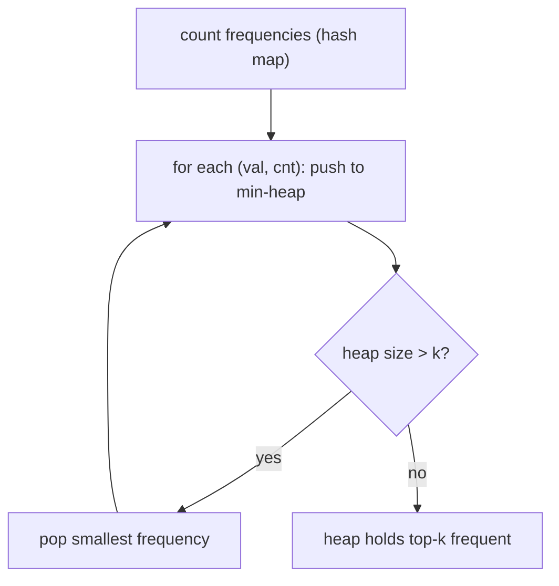

# Top K Frequent Elements

| Meta | Value |
|------|-------|
| Source | LeetCode #347 |
| Difficulty | Medium |
| Topics | Hash Map, Heap, Bucket Sort, Quickselect |
| Link | https://leetcode.com/problems/top-k-frequent-elements/ |

---

## Problem Statement
Given an integer array and an integer `k`, return the `k` **most frequent** elements (in any order).

**Example**
```
nums = [1, 1, 1, 2, 2, 3], k = 2
Output: [1, 2]      // 1 appears 3x, 2 appears 2x
```

---

## Approach Progression

### Step 0 — Count Frequencies
A hash map gives `value -> count` in O(n). The rest is "select the `k` largest counts".

### Approach A — Min-Heap of Size k (O(n log k))
Keep a heap of the `k` highest-frequency items seen so far. Push each `(count, value)`; if the
heap exceeds `k`, pop the smallest. Whatever remains is the answer.



```python
import heapq
from collections import Counter

def topKFrequent_heap(nums, k):
    freq = Counter(nums)                 # O(n)
    heap = []                            # min-heap of (count, value), size <= k
    for val, cnt in freq.items():
        heapq.heappush(heap, (cnt, val))
        if len(heap) > k:
            heapq.heappop(heap)          # drop the least frequent so far
    return [val for cnt, val in heap]
```

```cpp
#include <queue>
#include <vector>
#include <unordered_map>
using namespace std;

vector<int> topKFrequent_heap(vector<int>& nums, int k) {
    unordered_map<int, int> freq;                        // O(n)
    for (int x : nums) freq[x]++;
    // min-heap of (count, value), size <= k
    priority_queue<pair<int,int>, vector<pair<int,int>>, greater<pair<int,int>>> heap;
    for (auto& [val, cnt] : freq) {
        heap.push({cnt, val});
        if ((int)heap.size() > k)
            heap.pop();                                  // drop the least frequent so far
    }
    vector<int> result;
    for (; !heap.empty(); heap.pop())
        result.push_back(heap.top().second);
    return result;
}
```

### Approach B — Bucket Sort (O(n), optimal)
A count can be at most `n`. Create buckets indexed by frequency (`0..n`); place each value in
`bucket[count]`. Scan buckets from high frequency down, collecting until we have `k`.

```python
from collections import Counter

def topKFrequent_bucket(nums, k):
    freq = Counter(nums)
    n = len(nums)
    buckets = [[] for _ in range(n + 1)]    # buckets[f] = values with frequency f
    for val, cnt in freq.items():
        buckets[cnt].append(val)
    result = []
    for f in range(n, 0, -1):               # high frequency first
        for val in buckets[f]:
            result.append(val)
            if len(result) == k:
                return result
    return result
```

```cpp
#include <vector>
#include <unordered_map>
using namespace std;

vector<int> topKFrequent_bucket(vector<int>& nums, int k) {
    unordered_map<int, int> freq;
    for (int x : nums) freq[x]++;
    int n = (int)nums.size();
    vector<vector<int>> buckets(n + 1);          // buckets[f] = values with frequency f
    for (auto& [val, cnt] : freq)
        buckets[cnt].push_back(val);
    vector<int> result;
    for (int f = n; f > 0; --f) {                 // high frequency first
        for (int val : buckets[f]) {
            result.push_back(val);
            if ((int)result.size() == k)
                return result;
        }
    }
    return result;
}
```

---

## Trace (Heap) — `nums = [1,1,1,2,2,3]`, `k = 2`

Frequencies: `{1:3, 2:2, 3:1}`.

| process (val, cnt) | push | heap after | size > 2? pop |
|--------------------|------|------------|----------------|
| (1, 3) | (3,1) | [(3,1)] | no |
| (2, 2) | (2,2) | [(2,2),(3,1)] | no |
| (3, 1) | (1,3) | [(1,3),(3,1),(2,2)] | yes → pop (1,3) |

Heap leaves `[(2,2),(3,1)]` → values `[2, 1]` = the two most frequent. ✓ The min-heap top is always
the weakest survivor, so popping it discards low-frequency elements.

---

## Trace (Bucket) — same input

Buckets: `bucket[3]=[1]`, `bucket[2]=[2]`, `bucket[1]=[3]`. Scan `f = 6..1`:
- `f=3`: collect `1` → result `[1]`
- `f=2`: collect `2` → result `[1, 2]`, size = k → return `[1, 2]`. ✓

---

## Complexity

| Approach | Time | Space |
|----------|------|-------|
| Sort by frequency | O(n log n) | O(n) |
| **Min-heap size k** | O(n log k) | O(n + k) |
| **Bucket sort** | **O(n)** | O(n) |
| Quickselect on counts | O(n) avg, O(n²) worst | O(n) |

When `k` is small relative to the number of distinct elements, the heap is excellent; bucket sort
wins when you need strict linear time.

---

## Takeaway
"Top K frequent" = **count, then select the k largest counts**. A **size-k min-heap** gives
O(n log k); **bucket sort by frequency** gives optimal O(n) because counts are bounded by `n`.
Choosing between heap and bucket is the same trade-off as in any "k-largest" problem.
