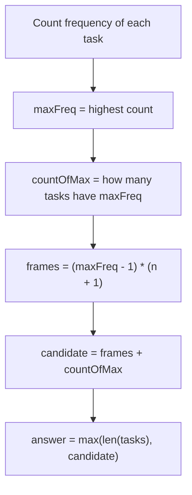
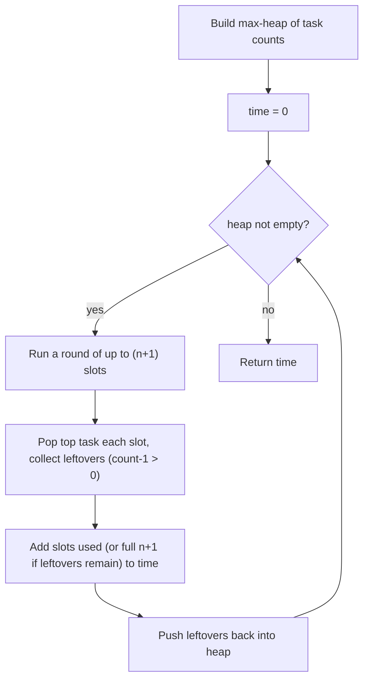

# Task Scheduler

| Meta | Value |
|------|-------|
| Source | LeetCode #621 |
| Difficulty | Medium |
| Topics | Greedy, Hash Map / Counting, Heap, Math |
| Link | https://leetcode.com/problems/task-scheduler/ |

---

## Problem Statement
You are given an array of CPU `tasks`, each represented by an uppercase letter, and a cooldown
integer `n`. Two **identical** tasks must be separated by **at least `n` intervals** of other
tasks or idle slots. Each task takes exactly one interval (unit of time). Return the **minimum
number of intervals** the CPU needs to finish all tasks.

**Example**
```
tasks = ["A","A","A","B","B","B"], n = 2
Output: 8

One valid schedule (length 8):
  A  B  idle  A  B  idle  A  B
  1  2   3    4  5   6    7  8

Each pair of identical tasks (A..A, B..B) is separated by >= 2 slots.
```

---

## Approach — The WHY

The bottleneck is always the **most frequent task**. Suppose the maximum frequency is
`maxFreq`. That task must appear `maxFreq` times, and between consecutive copies we are forced
to wait `n` intervals. So the most frequent task alone lays down a skeleton of
`(maxFreq - 1)` full "frames" of width `(n + 1)`, followed by one final copy:

$$
\text{frames} = (\text{maxFreq} - 1) \times (n + 1)
$$

Every frame has 1 slot used by the hot task and `n` slots to fill with *other* tasks (or idle).
If several tasks share the same maximum frequency `countOfMax`, each of them needs its own
trailing slot after the last frame, so we add `countOfMax`:

$$
\text{answer} = \max\Big(\;\lvert \text{tasks} \rvert,\;\; (\text{maxFreq} - 1)\times(n + 1) + \text{countOfMax}\;\Big)
$$

The `max(...)` with `len(tasks)` handles the case where `n` is small and there are **enough
distinct tasks** to fill every gap — then no idling is needed and the answer is simply the total
number of tasks. The idle count itself is
$\text{idle} = \text{answer} - \lvert \text{tasks} \rvert$, which can be computed as
$(\text{maxFreq}-1)\times n - (\text{otherTaskCount})$ clamped at 0, but the formula above folds
that reasoning into a single clean expression.

We present **two** correct approaches:
- **Approach A — Math / Greedy formula:** O(N) time, O(1) space (26 letters).
- **Approach B — Max-heap simulation:** O(N log 26) time, models the schedule round by round and
  generalizes naturally if the rules get more complex.

---

### Approach A — Math / Greedy Formula



```python
from collections import Counter

def leastInterval_formula(tasks, n):
    freq = Counter(tasks)                  # task -> count, O(N)
    maxFreq = max(freq.values())           # the bottleneck frequency
    countOfMax = sum(1 for c in freq.values() if c == maxFreq)  # ties at the top
    # (maxFreq - 1) full frames of width (n + 1), plus one slot per max task at the tail
    candidate = (maxFreq - 1) * (n + 1) + countOfMax
    # If there are enough distinct tasks to fill the gaps, no idling is needed
    return max(len(tasks), candidate)
```

```cpp
#include <vector>
#include <unordered_map>
#include <algorithm>
using namespace std;

int leastInterval_formula(vector<char>& tasks, int n) {
    unordered_map<char,int> freq;          // task -> count, O(N)
    for (char t : tasks) freq[t]++;
    int maxFreq = 0;
    for (auto& [task, c] : freq) maxFreq = max(maxFreq, c);  // bottleneck frequency
    int countOfMax = 0;
    for (auto& [task, c] : freq) if (c == maxFreq) countOfMax++;  // ties at the top
    // (maxFreq - 1) full frames of width (n + 1), plus one slot per max task at the tail
    int candidate = (maxFreq - 1) * (n + 1) + countOfMax;
    // If there are enough distinct tasks to fill the gaps, no idling is needed
    return max((int)tasks.size(), candidate);
}
```

#### Iteration Trace — Approach A on the Example
`tasks = ["A","A","A","B","B","B"], n = 2`

| Step | Quantity | Value | Reason |
|------|----------|-------|--------|
| 1 | freq | `{A:3, B:3}` | count each task |
| 2 | maxFreq | `3` | both A and B appear 3 times |
| 3 | countOfMax | `2` | A and B both hit maxFreq |
| 4 | frames = (3-1)*(2+1) | `6` | skeleton from the hottest task |
| 5 | candidate = 6 + 2 | `8` | add a tail slot per max task |
| 6 | answer = max(6, 8) | **`8`** | len(tasks)=6 < 8, so 8 wins |

Schedule realized by the formula:

```
| A B idle | A B idle | A B |
   frame 1     frame 2   tail
```

---

### Approach B — Max-Heap Simulation

Instead of trusting the formula, we simulate time in **rounds** of size `n + 1`. In each round we
greedily run the `n + 1` currently most frequent tasks (a max-heap by remaining count). Anything
still pending after the round is decremented and pushed back. If the heap empties mid-round before
the end, those leftover slots are **idle** — but only count idling if more tasks still remain.

Python's `heapq` is a **min-heap**, so we store **negated counts** to emulate a max-heap. In C++,
`priority_queue<int>` is already a **max-heap**, so no negation is needed.



```python
import heapq
from collections import Counter

def leastInterval_heap(tasks, n):
    freq = Counter(tasks)
    # Python heapq is a MIN-heap; negate counts to simulate a MAX-heap
    heap = [-c for c in freq.values()]
    heapq.heapify(heap)

    time = 0
    while heap:
        leftovers = []                    # tasks that still have copies after this round
        slots = n + 1                     # one full cooldown window
        used = 0                          # how many real tasks we ran this round
        while slots > 0 and heap:
            count = -heapq.heappop(heap)  # most frequent remaining task
            if count - 1 > 0:
                leftovers.append(-(count - 1))  # one copy consumed, re-negate
            used += 1
            slots -= 1
        for item in leftovers:
            heapq.heappush(heap, item)    # return unfinished tasks to the heap
        # If tasks remain, the round was a full (n+1) window (idles fill the gap);
        # otherwise we only paid for the tasks actually run.
        time += (n + 1) if heap else used
    return time
```

```cpp
#include <vector>
#include <unordered_map>
#include <queue>
using namespace std;

int leastInterval_heap(vector<char>& tasks, int n) {
    unordered_map<char,int> freq;
    for (char t : tasks) freq[t]++;
    // priority_queue<int> is already a MAX-heap; no negation needed
    priority_queue<int> heap;
    for (auto& [task, c] : freq) heap.push(c);

    int time = 0;
    while (!heap.empty()) {
        vector<int> leftovers;            // tasks that still have copies after this round
        int slots = n + 1;                // one full cooldown window
        int used = 0;                     // how many real tasks we ran this round
        while (slots > 0 && !heap.empty()) {
            int count = heap.top();       // most frequent remaining task
            heap.pop();
            if (count - 1 > 0)
                leftovers.push_back(count - 1);  // one copy consumed
            used++;
            slots--;
        }
        for (int item : leftovers)
            heap.push(item);              // return unfinished tasks to the heap
        // If tasks remain, the round was a full (n+1) window (idles fill the gap);
        // otherwise we only paid for the tasks actually run.
        time += heap.empty() ? used : (n + 1);
    }
    return time;
}
```

#### Iteration Trace — Approach B on the Example
`tasks = ["A","A","A","B","B","B"], n = 2`, window size `n + 1 = 3`.

| Round | Heap before | Tasks run (slots) | Idle? | Leftovers pushed | time after |
|-------|-------------|-------------------|-------|------------------|-----------|
| 1 | `[3, 3]` (A,B) | A, B, idle (used=2) | yes | `[2, 2]` | `0 + 3 = 3` |
| 2 | `[2, 2]` (A,B) | A, B, idle (used=2) | yes | `[1, 1]` | `3 + 3 = 6` |
| 3 | `[1, 1]` (A,B) | A, B (used=2) | no (heap empty) | `[]` | `6 + 2 = 8` |

Both approaches return **8**, matching the schedule `A B idle A B idle A B`.

---

## Complexity

| Approach | Time | Space |
|----------|------|-------|
| A — Math / Greedy formula | $O(N)$ | $O(1)$ — at most 26 distinct counts |
| B — Max-heap simulation | $O(N \log 26) = O(N)$ | $O(26) = O(1)$ |

> Here $N = \lvert \text{tasks} \rvert$. The heap holds at most 26 entries (uppercase letters),
> so its log factor is a constant; both approaches are effectively linear.

---

## Takeaway
- The schedule length is governed entirely by the **most frequent task** plus the count of tasks
  tied for that maximum. Memorize the formula
  $\max\big(\lvert \text{tasks}\rvert,\ (\text{maxFreq}-1)(n+1)+\text{countOfMax}\big)$.
- The `max(..., len(tasks))` term is the easy-to-miss case: when distinct tasks are plentiful,
  **no idling** is ever required.
- The **heap simulation** is more verbose but invaluable when the rules generalize (variable
  cooldowns, task priorities) where a closed-form formula no longer exists.
- Translating a size-bounded Python `heapq` max-heap to C++ means negating in Python but using a
  plain `priority_queue<int>` (already a max-heap) in C++.
