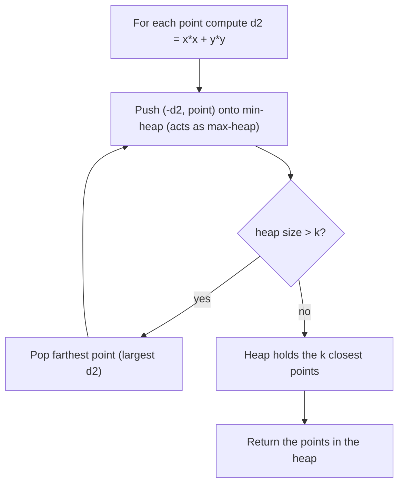

# K Closest Points to Origin

| Meta | Value |
|------|-------|
| Source | LeetCode #973 |
| Difficulty | Medium |
| Topics | Heap (Priority Queue), Quickselect, Sorting, Divide & Conquer |
| Link | https://leetcode.com/problems/k-closest-points-to-origin/ |

---

## Problem Statement
Given an array `points` where `points[i] = [xi, yi]` represents a point on the 2-D plane, and an
integer `k`, return the `k` points **closest to the origin** `(0, 0)`. The distance between two
points is the Euclidean distance; the answer may be returned in **any order** and is guaranteed to
be unique.

**Example**
```
points = [[1,3],[-2,2],[5,8],[0,1]], k = 2
Output: [[-2,2],[0,1]]

Squared distances from origin:
  [1,3]  -> 1 + 9  = 10
  [-2,2] -> 4 + 4  = 8
  [5,8]  -> 25 + 64 = 89
  [0,1]  -> 0 + 1  = 1
The two smallest are 1 ([0,1]) and 8 ([-2,2]).
```

---

## Approach — The WHY

### Use squared distance — never `sqrt`
The Euclidean distance is $\sqrt{x^2 + y^2}$, but `sqrt` is monotonic: if
$\sqrt{a} < \sqrt{b}$ then $a < b$. So comparing the **squared** distance $x^2 + y^2$ gives the
exact same ordering while staying in **integer arithmetic** — no floating-point error, no wasted
`sqrt` calls. We compare on:

$$
d^2 = x^2 + y^2
$$

For large coordinates the square can overflow 32-bit ints, so in C++ we use `long long`.

### Approach A — Max-heap of size k — $O(N \log k)$
We want the `k` **smallest** distances, so we maintain a **max-heap of size k** keyed on squared
distance. We push each point; whenever the heap exceeds `k`, we pop the **farthest** (the max).
After processing all points, the heap holds exactly the `k` closest. The heap never grows beyond
`k`, so each operation costs $O(\log k)$ → $O(N \log k)$ total, beating a full sort's
$O(N \log N)$ when $k \ll N$.

Python's `heapq` is a **min-heap**, so to emulate a max-heap we store the **negated** squared
distance. In C++, `priority_queue` is a **max-heap by default**, so we push the plain squared
distance — no negation.

### Approach B — Quickselect — $O(N)$ average
Quickselect partitions the array around a pivot (Lomuto/Hoare style) using squared distance as the
key. After partitioning so the `k` smallest land in the first `k` positions, we return that prefix.
Average time is $O(N)$ (worst case $O(N^2)$ with adversarial pivots, mitigated by random pivots).
It does **not** keep the `k` results sorted, which is fine here.



---

### Approach A — Max-Heap of Size k

```python
import heapq

def kClosest_heap(points, k):
    # Python heapq is a MIN-heap; negate d2 so the largest distance sits on top (max-heap)
    heap = []                              # entries: (-d2, x, y), size <= k
    for x, y in points:
        d2 = x * x + y * y                 # squared distance, no sqrt needed
        heapq.heappush(heap, (-d2, x, y))
        if len(heap) > k:
            heapq.heappop(heap)            # drop the farthest point so far
    return [[x, y] for _, x, y in heap]    # the k closest, any order
```

```cpp
#include <vector>
#include <queue>
using namespace std;

vector<vector<int>> kClosest_heap(vector<vector<int>>& points, int k) {
    // priority_queue is a MAX-heap by default; push plain d2 (largest on top)
    // entries: (d2, x, y), size <= k
    priority_queue<tuple<long long,int,int>> heap;
    for (auto& p : points) {
        long long x = p[0], y = p[1];
        long long d2 = x * x + y * y;      // squared distance, use long long to avoid overflow
        heap.push({d2, (int)x, (int)y});
        if ((int)heap.size() > k)
            heap.pop();                    // drop the farthest point so far
    }
    vector<vector<int>> res;
    while (!heap.empty()) {                // the k closest, any order
        auto [d2, x, y] = heap.top();
        heap.pop();
        res.push_back({x, y});
    }
    return res;
}
```

#### Iteration Trace — Approach A on the Example
`points = [[1,3],[-2,2],[5,8],[0,1]], k = 2`. Heap stores `-d2` (Python view); we list the points
it holds and the max (farthest) on top.

| Step | Point | d2 | Action | Heap after (points : d2) | Size |
|------|-------|----|--------|--------------------------|------|
| 1 | `[1,3]` | 10 | push | `{[1,3]:10}` | 1 |
| 2 | `[-2,2]` | 8 | push | `{[1,3]:10, [-2,2]:8}` | 2 |
| 3 | `[5,8]` | 89 | push, size>2 → pop farthest (89) | `{[1,3]:10, [-2,2]:8}` | 2 |
| 4 | `[0,1]` | 1 | push, size>2 → pop farthest (10) | `{[-2,2]:8, [0,1]:1}` | 2 |

Final heap → `[[-2,2], [0,1]]`, matching the expected output (any order).

---

### Approach B — Quickselect (O(N) average)

```python
import random

def kClosest_quickselect(points, k):
    def dist(p):
        return p[0] * p[0] + p[1] * p[1]   # squared distance key

    def partition(lo, hi):
        # pick a random pivot to avoid worst-case O(N^2) on sorted input
        pivot_idx = random.randint(lo, hi)
        points[pivot_idx], points[hi] = points[hi], points[pivot_idx]
        pivot = dist(points[hi])
        store = lo                         # boundary for elements < pivot
        for i in range(lo, hi):
            if dist(points[i]) < pivot:
                points[i], points[store] = points[store], points[i]
                store += 1
        points[store], points[hi] = points[hi], points[store]
        return store                       # final position of the pivot

    lo, hi = 0, len(points) - 1
    target = k - 1                         # we want the k smallest in [0..k-1]
    while lo < hi:
        p = partition(lo, hi)
        if p == target:
            break
        elif p < target:
            lo = p + 1                     # need more elements on the right
        else:
            hi = p - 1                     # the k smallest are entirely on the left
    return points[:k]                      # first k positions, any order
```

```cpp
#include <vector>
#include <cstdlib>
using namespace std;

class SolutionQS {
    long long dist(vector<int>& p) {
        long long x = p[0], y = p[1];
        return x * x + y * y;              // squared distance key (long long avoids overflow)
    }
    int partition(vector<vector<int>>& pts, int lo, int hi) {
        // pick a random pivot to avoid worst-case O(N^2) on sorted input
        int pivotIdx = lo + rand() % (hi - lo + 1);
        swap(pts[pivotIdx], pts[hi]);
        long long pivot = dist(pts[hi]);
        int store = lo;                    // boundary for elements < pivot
        for (int i = lo; i < hi; i++) {
            if (dist(pts[i]) < pivot) {
                swap(pts[i], pts[store]);
                store++;
            }
        }
        swap(pts[store], pts[hi]);
        return store;                      // final position of the pivot
    }
public:
    vector<vector<int>> kClosest(vector<vector<int>>& pts, int k) {
        int lo = 0, hi = (int)pts.size() - 1;
        int target = k - 1;                // we want the k smallest in [0..k-1]
        while (lo < hi) {
            int p = partition(pts, lo, hi);
            if (p == target) break;
            else if (p < target) lo = p + 1;   // need more elements on the right
            else hi = p - 1;                   // the k smallest are entirely on the left
        }
        return vector<vector<int>>(pts.begin(), pts.begin() + k);  // first k, any order
    }
};
```

---

## Complexity

| Approach | Time | Space |
|----------|------|-------|
| A — Max-heap of size k | $O(N \log k)$ | $O(k)$ |
| B — Quickselect | $O(N)$ average, $O(N^2)$ worst | $O(1)$ in-place (recursion/iterative) |
| (Baseline) Full sort by $d^2$ | $O(N \log N)$ | $O(N)$ or $O(\log N)$ |

> $N$ is the number of points. The heap approach wins when $k \ll N$; quickselect is the fastest
> on average but mutates the input and has a quadratic worst case unless pivots are randomized.

---

## Takeaway
- Always compare on **squared distance** $x^2 + y^2$. `sqrt` is monotonic, so it only adds cost
  and floating-point error — and squaring keeps everything in integers (use `long long` in C++ to
  avoid overflow).
- For "k closest / k smallest", a **max-heap of size k** gives $O(N \log k)$ and is the cleanest,
  most interview-friendly answer. Keep the *farthest* on top and evict it.
- Remember the heap-polarity flip: Python's `heapq` is a min-heap (negate to get a max-heap),
  while C++ `priority_queue` is a max-heap by default (no negation).
- **Quickselect** achieves $O(N)$ average when you need raw speed and don't care about ordering;
  randomize the pivot to dodge the $O(N^2)$ worst case.
