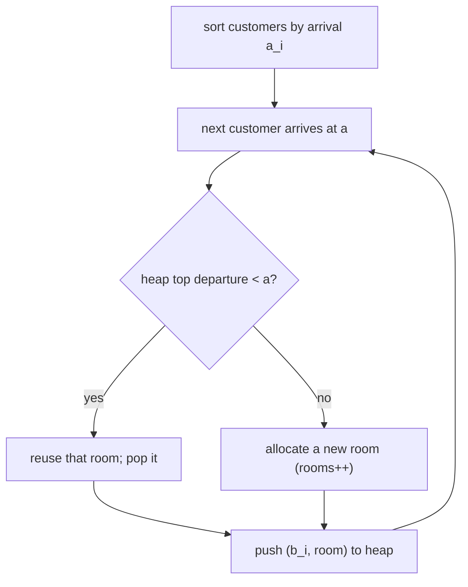

# Room Allocation (CSES — Sweep Line + Min-Heap)

| Meta | Value |
|------|-------|
| Source | CSES Problem Set — Sorting and Searching |
| Difficulty | Medium |
| Topics | Greedy, Min-Heap, Sweep Line, Interval Scheduling |
| Link | https://cses.fi/problemset/task/1164 |

---

## Problem Statement
There are `n` customers, each with an arrival and departure day `[a_i, b_i]`. A room can host a
customer during their stay; a room is free again the day **after** departure. Assign each customer
a room using the **minimum number of rooms**, and output the room number for each.

**Example**
```
n = 3, intervals = [(1,2), (2,4), (4,4)]
Minimum rooms = 2
Customer 1 (1-2): room 1
Customer 2 (2-4): room 2   (overlaps customer 1 on day 2)
Customer 3 (4-4): room 1   (room 1 free after day 2)
```

---

## Greedy: Sort by Arrival, Reuse the Earliest-Freeing Room

Process customers in **arrival order**. Maintain a **min-heap** keyed by `(departure_day, room_id)`
of currently occupied rooms. For each new customer:
- If the room that frees earliest (heap top) departs **before** this customer arrives, **reuse** it.
- Otherwise, **open a new room**.

The minimum number of rooms equals the **maximum number of overlapping intervals** — and this
greedy achieves exactly that.



```python
import heapq

def room_allocation(customers):
    # customers: list of (arrival, departure, original_index)
    indexed = sorted(range(len(customers)), key=lambda i: customers[i][0])
    answer = [0] * len(customers)
    heap = []                            # (departure_day, room_id)
    rooms = 0

    for i in indexed:
        a, b = customers[i][0], customers[i][1]
        if heap and heap[0][0] < a:      # earliest-freeing room is already vacated
            dep, room = heapq.heappop(heap)   # reuse it
        else:
            rooms += 1                    # need a brand-new room
            room = rooms
        heapq.heappush(heap, (b, room))   # occupy with this customer's departure
        answer[i] = room

    return rooms, answer
```

```cpp
#include <queue>
#include <vector>
#include <algorithm>
using namespace std;

pair<int, vector<int>> room_allocation(vector<pair<long long,long long>>& customers) {
    // customers: list of (arrival, departure)
    int n = (int)customers.size();
    vector<int> indexed(n);
    for (int i = 0; i < n; ++i) indexed[i] = i;
    sort(indexed.begin(), indexed.end(),
         [&](int i, int j) { return customers[i].first < customers[j].first; });
    vector<int> answer(n, 0);
    // min-heap of (departure_day, room_id)
    priority_queue<pair<long long,int>, vector<pair<long long,int>>, greater<pair<long long,int>>> heap;
    int rooms = 0;

    for (int i : indexed) {
        long long a = customers[i].first, b = customers[i].second;
        int room;
        if (!heap.empty() && heap.top().first < a) {   // earliest-freeing room is already vacated
            room = heap.top().second;                  // reuse it
            heap.pop();
        } else {
            rooms += 1;                                // need a brand-new room
            room = rooms;
        }
        heap.push({b, room});                          // occupy with this customer's departure
        answer[i] = room;
    }

    return {rooms, answer};
}
```

> Sorting must be by **arrival**; the heap is ordered by **departure** so the room freeing soonest
> is always the reuse candidate. Note the strict `<`: the room frees the day *after* departure, so
> a room with departure `d` is free for arrival `a` only when `d < a`.

---

## Trace — intervals `(1,2), (2,4), (4,4)` (already arrival-sorted)

| customer | arrival a | heap top (dep,room) | top.dep < a? | action | room | heap after |
|----------|-----------|---------------------|--------------|--------|------|-------------|
| 1 (1,2) | 1 | — (empty) | — | new room 1 | 1 | [(2,1)] |
| 2 (2,4) | 2 | (2,1) | 2 < 2? no | new room 2 | 2 | [(2,1),(4,2)] |
| 3 (4,4) | 4 | (2,1) | 2 < 4? yes | reuse room 1 | 1 | [(4,1),(4,2)] |

Rooms used = **2**, assignment `[1, 2, 1]`. Customer 3 reuses room 1 because it freed (departed day
2) before day 4. ✓

---

## Why It's Optimal

At any instant, all customers whose intervals overlap **must** occupy distinct rooms, so the
answer is at least the maximum overlap depth. The greedy never opens a new room unless **every**
existing room is still occupied — meaning the overlap depth genuinely increased. Hence it uses
exactly `max overlap` rooms, the proven lower bound.

This equals the classic **"minimum platforms / meeting rooms II"** result: minimum resources =
peak simultaneous demand.

---

## Complexity

| Step | Time |
|------|------|
| Sort by arrival | O(n log n) |
| Heap ops (n push + n pop) | O(n log n) |
| **Total** | **O(n log n)** |
| Space | O(n) |

---

## Sibling Problems
| Problem | Same engine |
|---------|-------------|
| **Meeting Rooms II** (LeetCode 253) | identical min-heap-by-end-time |
| **Minimum Platforms** (railways) | peak overlap of train intervals |
| **CPU Task Scheduling** | reuse earliest-free processor |

## Takeaway
**Interval room allocation** = sort by start, keep a **min-heap of end times**, reuse the
earliest-freeing room or open a new one. The minimum room count equals the **maximum interval
overlap**, and this sweep-line-plus-heap greedy attains it in O(n log n).
