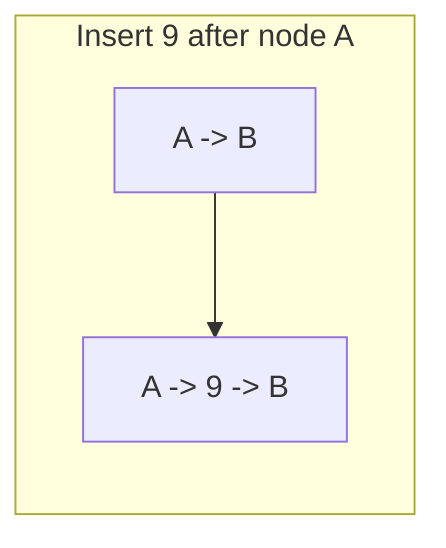
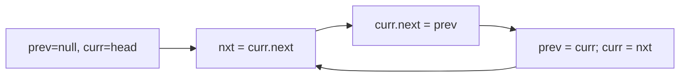

# Linked Lists — Complete Guide (Beginner → Advanced)

> A linked list trades the array's instant random access for **O(1) insertion/deletion** at a
> known position and a flexible, non-contiguous memory layout.

---

## Table of Contents
1. [What is a Linked List?](#1-what-is-a-linked-list)
2. [Node Structure & Memory Layout](#2-node-structure--memory-layout)
3. [Singly vs Doubly vs Circular](#3-singly-vs-doubly-vs-circular)
4. [Core Operations & Complexity](#4-core-operations--complexity)
5. [Array vs Linked List](#5-array-vs-linked-list)
6. [Essential Techniques](#6-essential-techniques)
7. [Advanced Patterns](#7-advanced-patterns)
8. [Pitfalls & Cheat Sheet](#8-pitfalls--cheat-sheet)

---

## 1. What is a Linked List?

A linked list is a chain of **nodes**. Each node holds a **value** and a **pointer (reference)**
to the next node. The list is accessed through a `head` pointer; the last node points to `null`.

```
head
 |
 v
[1|•]-->[2|•]-->[3|•]-->[4|/]   ('/' = null)
```

Unlike arrays, nodes are **not contiguous** in memory — each one can live anywhere, connected
only by pointers.

---

## 2. Node Structure & Memory Layout

```python
class ListNode:
    def __init__(self, val=0, next=None):
        self.val = val
        self.next = next
```

```cpp
struct ListNode {
    int val;
    ListNode* next;
    ListNode(int x) : val(x), next(nullptr) {}
};
```

```
Memory (scattered):
addr 200: [val=1 | next=350]
addr 350: [val=2 | next=120]
addr 120: [val=3 | next=null]
```

Because there's no index formula, reaching the k-th node requires **walking** from the head —
hence O(n) access, the linked list's fundamental weakness.

---

## 3. Singly vs Doubly vs Circular

| Type | Each node has | Pros | Cons |
|------|---------------|------|------|
| **Singly** | `next` | less memory | can't go backward; deleting needs prev |
| **Doubly** | `next` + `prev` | O(1) delete given node; bidirectional | extra pointer per node |
| **Circular** | last `next` → head | round-robin, queues | careful loop termination |

```
Doubly:   null <- [1] <-> [2] <-> [3] -> null
Circular: [1] -> [2] -> [3] --+
            ^------------------+
```

---

## 4. Core Operations & Complexity

| Operation | Singly LL | Array |
|-----------|-----------|-------|
| Access k-th | O(n) | O(1) |
| Search | O(n) | O(n) |
| Insert at head | **O(1)** | O(n) |
| Insert after a known node | **O(1)** | O(n) |
| Delete head | **O(1)** | O(n) |
| Delete a known node (doubly) | **O(1)** | O(n) |

The win: once you **have a pointer** to a node, splicing in/out is O(1) — just rewire pointers,
no shifting.



```python
# insert newNode after node p  (O(1))
newNode.next = p.next
p.next = newNode
```

```cpp
// insert newNode after node p  (O(1))
newNode->next = p->next;
p->next = newNode;
```

---

## 5. Array vs Linked List

| Aspect | Array | Linked List |
|--------|-------|-------------|
| Random access | O(1) | O(n) |
| Insert/delete at ends/known node | O(n) (front/mid) | O(1) |
| Memory | contiguous, compact | scattered, pointer overhead |
| Cache locality | excellent | poor |
| Size | fixed/dynamic-resizing | grows naturally |

> In practice arrays often win due to **cache locality** even when Big-O favors lists. Reach for
> linked lists when you do many splices at known positions or build stacks/queues/adjacency lists.

---

## 6. Essential Techniques

### 6.1 Dummy (sentinel) head
A throwaway node before the real head removes special-casing for head insertions/deletions.
```python
dummy = ListNode(0, head)
# ...operate using dummy.next...
return dummy.next
```

```cpp
ListNode* dummy = new ListNode(0);
dummy->next = head;
// ...operate using dummy->next...
return dummy->next;
```

### 6.2 Two pointers — fast & slow
- **Find middle:** slow +1, fast +2; when fast hits the end, slow is at the middle.
- **Detect cycle (Floyd):** if fast ever equals slow, there's a loop.
- **Nth from end:** advance one pointer `n` steps, then move both until the lead hits the end.

### 6.3 In-place reversal
Re-point each node's `next` to its predecessor using three pointers (`prev`, `curr`, `next`).



---

## 7. Advanced Patterns

- **Merge two sorted lists** — two-pointer merge (basis of merge sort on lists).
- **Merge k sorted lists** — min-heap of heads, O(N log k).
- **Reverse in groups of k** — segment-wise reversal.
- **LRU Cache** — doubly linked list + hash map for O(1) get/put.
- **Copy list with random pointers** — interleave or hash-map cloning.
- **Floyd's cycle + math** — find cycle *start* node.

---

## 8. Pitfalls & Cheat Sheet

| Pitfall | Fix |
|---------|-----|
| Losing the rest of the list when rewiring | Save `next` before overwriting |
| Null pointer dereference | Check `node` and `node.next` before access |
| Forgetting to update `head`/`tail` | Use a dummy node |
| Infinite loop on circular lists | Track visited / use fast-slow |
| Off-by-one in "nth from end" | Advance lead pointer exactly `n` steps |

```
Access k-th ............ O(n)
Insert/delete known node O(1)
Find middle ............ fast/slow pointers
Detect cycle ........... Floyd's tortoise & hare
Reverse ................ 3-pointer (prev, curr, next)
Always consider ........ a dummy head to simplify edge cases
```

> **Mental model:** A treasure hunt — each clue (node) only tells you where the *next* clue is.
> You can splice clues in/out instantly, but to find the 100th clue you must follow 99 others.
