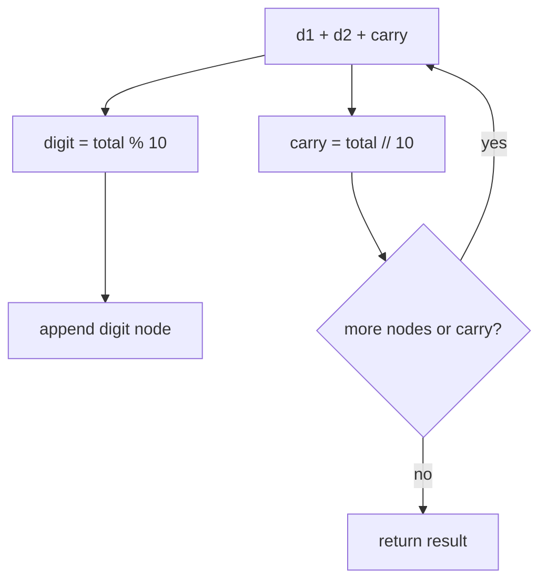

# Add Two Numbers

| Meta | Value |
|------|-------|
| Source | LeetCode #2 |
| Difficulty | Medium |
| Topics | Linked List, Math, Carry Simulation |
| Link | https://leetcode.com/problems/add-two-numbers/ |

---

## Problem Statement
Two non-empty linked lists represent non-negative integers with digits stored in **reverse order**
(least significant digit first). Add them and return the sum as a linked list, also reverse-ordered.

**Example**
```
l1 = 2 -> 4 -> 3   (represents 342)
l2 = 5 -> 6 -> 4   (represents 465)
sum = 7 -> 0 -> 8  (represents 807)
```

---

## Grade-School Addition, Digit by Digit

Reverse order is a gift: the **heads are the least significant digits**, exactly where you start
manual addition. Walk both lists together, summing digit pairs plus a **carry**:

$$
\text{digit} = (d_1 + d_2 + \text{carry}) \bmod 10, \qquad
\text{carry} = \left\lfloor \frac{d_1 + d_2 + \text{carry}}{10} \right\rfloor
$$



```python
def addTwoNumbers(l1, l2):
    dummy = ListNode(0)
    cur = dummy
    carry = 0
    while l1 or l2 or carry:                 # continue while digits remain OR carry left
        v1 = l1.val if l1 else 0
        v2 = l2.val if l2 else 0
        total = v1 + v2 + carry
        carry = total // 10
        cur.next = ListNode(total % 10)
        cur = cur.next
        l1 = l1.next if l1 else None
        l2 = l2.next if l2 else None
    return dummy.next
```

```cpp
ListNode* addTwoNumbers(ListNode* l1, ListNode* l2) {
    ListNode* dummy = new ListNode(0);
    ListNode* cur = dummy;
    int carry = 0;
    while (l1 || l2 || carry) {              // continue while digits remain OR carry left
        int v1 = l1 ? l1->val : 0;
        int v2 = l2 ? l2->val : 0;
        int total = v1 + v2 + carry;
        carry = total / 10;
        cur->next = new ListNode(total % 10);
        cur = cur->next;
        l1 = l1 ? l1->next : nullptr;
        l2 = l2 ? l2->next : nullptr;
    }
    return dummy->next;
}
```

A **dummy head** avoids special-casing the first appended node. The loop condition
`l1 or l2 or carry` elegantly handles unequal lengths **and** a final carry-out (e.g. `5 + 5 = 10`
→ `0 → 1`).

---

## Trace — `l1 = [2,4,3]`, `l2 = [5,6,4]`

| step | v1 | v2 | carry in | total | digit (%10) | carry out | result so far |
|------|----|----|----------|-------|-------------|-----------|---------------|
| 1 | 2 | 5 | 0 | 7 | 7 | 0 | 7 |
| 2 | 4 | 6 | 0 | 10 | 0 | 1 | 7→0 |
| 3 | 3 | 4 | 1 | 8 | 8 | 0 | 7→0→8 |
| end | — | — | 0 | — | — | — | **7→0→8** |

Result `807` = `342 + 465`. ✓

**Carry-out example** — `l1 = [9,9]`, `l2 = [1]`:

| step | v1 | v2 | carry | total | digit | carry out |
|------|----|----|-------|-------|-------|-----------|
| 1 | 9 | 1 | 0 | 10 | 0 | 1 |
| 2 | 9 | 0 | 1 | 10 | 0 | 1 |
| 3 | 0 | 0 | 1 | 1 | 1 | 0 |

Result `0 → 0 → 1` = `100` = `99 + 1`. The trailing `carry` makes the loop run one extra time to
emit the leading `1`.

---

## Complexity

| Metric | Value |
|--------|-------|
| Time | O(max(m, n)) |
| Space | O(max(m, n)) for the output list |

where `m`, `n` are the two list lengths.

---

## Variants
| Problem | Difference |
|---------|-----------|
| **Add Two Numbers II** (445) | digits in **forward** order → reverse lists or use a stack |
| Multiply two lists | grade-school multiply, accumulate partial sums |
| Add in base `b` | replace `10` with `b` |

## Takeaway
Reverse-order digit lists make addition a direct simulation of **grade-school carry arithmetic**.
The trio of (dummy head) + (loop condition `l1 or l2 or carry`) + (modulo/divide for digit/carry)
handles unequal lengths and final carry without any special cases.
