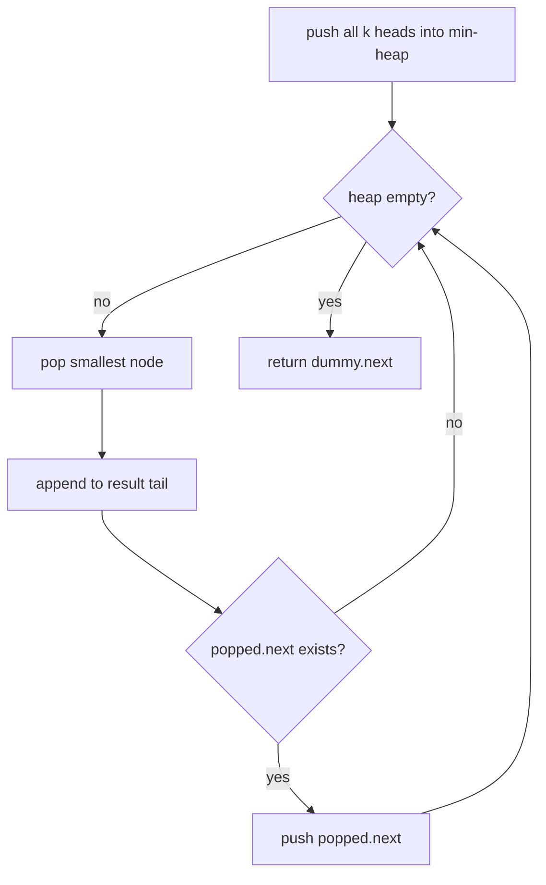

# Merge k Sorted Lists

| Meta | Value |
|------|-------|
| Source | LeetCode #23 |
| Difficulty | Hard |
| Topics | Linked List, Heap, Divide & Conquer |
| Link | https://leetcode.com/problems/merge-k-sorted-lists/ |

---

## Problem Statement
Merge `k` sorted linked lists into one sorted linked list.

**Example**
```
Input:  [1->4->5, 1->3->4, 2->6]
Output: 1->1->2->3->4->4->5->6
```

---

## Approach 1: Min-Heap — O(N log k)

At any moment, the next node in the merged list is the **smallest among the current heads** of
all `k` lists. A **min-heap** of size `k` gives that smallest in O(log k). Pop it, append it,
then push its successor.

- `N` = total number of nodes across all lists.
- `k` = number of lists.



```python
import heapq

def merge_k_lists(lists):
    heap = []
    for i, node in enumerate(lists):
        if node:
            # (value, tiebreaker index, node) — index avoids comparing nodes
            heapq.heappush(heap, (node.val, i, node))
    dummy = tail = ListNode(0)
    while heap:
        val, i, node = heapq.heappop(heap)
        tail.next = node
        tail = node
        if node.next:
            heapq.heappush(heap, (node.next.val, i, node.next))
    return dummy.next
```

```cpp
#include <queue>
#include <vector>
using namespace std;

ListNode* mergeKLists(vector<ListNode*>& lists) {
    // min-heap of (value, tiebreaker index, node) — index avoids comparing nodes
    using Item = tuple<int, int, ListNode*>;
    priority_queue<Item, vector<Item>, greater<Item>> heap;
    for (int i = 0; i < (int)lists.size(); ++i) {
        if (lists[i])
            heap.push({lists[i]->val, i, lists[i]});
    }
    ListNode* dummy = new ListNode(0);
    ListNode* tail = dummy;
    while (!heap.empty()) {
        auto [val, i, node] = heap.top();
        heap.pop();
        tail->next = node;
        tail = node;
        if (node->next)
            heap.push({node->next->val, i, node->next});
    }
    return dummy->next;
}
```

> The tiebreaker index `i` prevents Python from trying to compare `ListNode` objects when two
> values are equal (nodes aren't orderable).

### Why O(N log k)?
Each of the `N` nodes is pushed and popped from the heap exactly once. Heap operations cost
`O(log k)` because the heap never exceeds `k` elements (one live head per list).

$$
N \text{ nodes} \times O(\log k) = O(N \log k)
$$

---

## Approach 2: Divide & Conquer — O(N log k)

Pair up lists and merge them two at a time, halving the number of lists each round — like merge
sort's merge tree.

```
Round 0:  L1 L2 L3 L4 L5 L6
Round 1:  (L1+L2) (L3+L4) (L5+L6)   -> 3 lists
Round 2:  (...)   (...)             -> ...
Round log k:  single merged list
```

```python
def merge_two(a, b):
    dummy = tail = ListNode(0)
    while a and b:
        if a.val <= b.val:
            tail.next, a = a, a.next
        else:
            tail.next, b = b, b.next
        tail = tail.next
    tail.next = a or b
    return dummy.next

def merge_k_lists_dc(lists):
    if not lists:
        return None
    while len(lists) > 1:
        merged = []
        for i in range(0, len(lists), 2):
            a = lists[i]
            b = lists[i + 1] if i + 1 < len(lists) else None
            merged.append(merge_two(a, b))
        lists = merged
    return lists[0]
```

```cpp
ListNode* mergeTwo(ListNode* a, ListNode* b) {
    ListNode* dummy = new ListNode(0);
    ListNode* tail = dummy;
    while (a && b) {
        if (a->val <= b->val) {
            tail->next = a;
            a = a->next;
        } else {
            tail->next = b;
            b = b->next;
        }
        tail = tail->next;
    }
    tail->next = a ? a : b;
    return dummy->next;
}

ListNode* mergeKListsDC(vector<ListNode*> lists) {
    if (lists.empty())
        return nullptr;
    while (lists.size() > 1) {
        vector<ListNode*> merged;
        for (int i = 0; i < (int)lists.size(); i += 2) {
            ListNode* a = lists[i];
            ListNode* b = (i + 1 < (int)lists.size()) ? lists[i + 1] : nullptr;
            merged.push_back(mergeTwo(a, b));
        }
        lists = merged;
    }
    return lists[0];
}
```

### Why O(N log k)?
There are `log k` merge rounds. In **each** round, every node is touched exactly once during the
two-way merges → `O(N)` per round. Total: `O(N log k)`.

---

## Complexity Comparison

| Approach | Time | Space |
|----------|------|-------|
| Naive: merge one by one | O(N·k) | O(1) |
| Concatenate + sort | O(N log N) | O(N) |
| **Min-heap** | **O(N log k)** | O(k) |
| **Divide & conquer** | **O(N log k)** | O(1) (or O(log k) recursion) |

Both optimal approaches beat the naive "fold in one list at a time," which repeatedly re-walks
the growing merged list (`1k + 2k + ... = O(Nk)`).

---

## Edge Cases
- Empty input list array → return `null`.
- Some lists empty → skip them (heap simply doesn't get those heads).
- Single list → returned as-is.

## Takeaway
"Pick the smallest among k sorted sources" is the **k-way merge** pattern — solved either by a
size-k heap or by a divide-and-conquer merge tree. It generalizes to external sorting of files
too large for memory.
