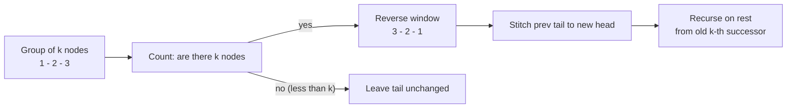

# Reverse Nodes in k-Group

| Meta | Value |
|------|-------|
| Source | LeetCode #25 |
| Difficulty | Hard (FAANG) |
| Topics | Linked List, Recursion, Reversal, Pointers |
| Link | https://leetcode.com/problems/reverse-nodes-in-k-group/ |

---

## Problem Statement
Given the head of a linked list, reverse the nodes **k at a time** and return the modified list.
`k` is a positive integer $\le$ the list length. If the number of remaining nodes is **less than
k**, leave that leftover tail **as-is** (do not reverse it).

You must reorder the actual nodes — values may not be swapped.

**Example**
```
Input:  1 -> 2 -> 3 -> 4 -> 5 -> null,   k = 2
Output: 2 -> 1 -> 4 -> 3 -> 5 -> null
        (5 is alone -> < k -> untouched)

Input:  1 -> 2 -> 3 -> 4 -> 5 -> null,   k = 3
Output: 3 -> 2 -> 1 -> 4 -> 5 -> null
        (4,5 form a group of only 2 -> < k -> untouched)
```

---

## The Why — Reverse a Bounded Window, Then Stitch

A single full-list reversal is the building block. Here we reverse only **windows of exactly k
nodes**, and the difficulty is bookkeeping the *seams* between consecutive reversed groups.

The core idea, group by group:

1. **Count k nodes ahead.** Walk a probe pointer `k` steps. If you cannot reach `k` nodes (you
   hit `null` first), the remaining tail is `< k` — leave it **unchanged** and stop. This is the
   guard that protects the leftover tail.
2. **Reverse exactly k nodes.** Run the three-pointer reversal but stop after `k` iterations
   rather than at the end of the list. After reversing, the group's **new head** is the old
   `k`-th node and the group's **new tail** is the old first node.
3. **Connect the seams.** The previous group's tail must point to this group's new head, and this
   group's new tail must point to the head of the *next* group (which we obtain by recursing or by
   continuing iteratively from the saved `k`-th node's successor).

### Why count first, reverse second
If you reverse blindly and only afterward discover the group was short, you would have to undo the
reversal. Counting up front lets us decide cleanly: a full group gets reversed; a short tail is
returned untouched. This keeps the leftover-tail rule trivial to satisfy.

### Recursion makes the seam-stitching elegant
After reversing the first `k` nodes, the original head becomes the group's tail. Its `next` should
be **the result of recursively reordering the rest of the list** starting at the `k`-th node's old
successor. The recursion returns the already-correct head of the remainder, so one assignment
stitches everything.

For $n$ nodes the recursion depth is $\lceil n/k \rceil$. An iterative version achieves the same in
$O(1)$ space, shown below.

---

## Recursive Solution

```python
class ListNode:
    def __init__(self, val=0, next=None):
        self.val = val
        self.next = next

def reverseKGroup(head, k):
    # 1. check that at least k nodes exist from here
    node = head
    count = 0
    while node and count < k:
        node = node.next
        count += 1
    if count < k:
        return head          # fewer than k -> leave tail unchanged

    # 2. reverse exactly k nodes
    prev = None
    curr = head
    for _ in range(k):
        nxt = curr.next      # save next
        curr.next = prev     # flip link
        prev = curr          # advance prev
        curr = nxt           # advance curr
    # now: prev = new head of group, head = new tail, curr = head of next group

    # 3. recursively reorder the rest and stitch the seam
    head.next = reverseKGroup(curr, k)
    return prev              # new head of this group
```

```cpp
struct ListNode {
    int val;
    ListNode* next;
    ListNode(int x) : val(x), next(nullptr) {}
};

ListNode* reverseKGroup(ListNode* head, int k) {
    // 1. check that at least k nodes exist from here
    ListNode* node = head;
    int count = 0;
    while (node && count < k) {
        node = node->next;
        count++;
    }
    if (count < k) return head;        // fewer than k -> leave tail unchanged

    // 2. reverse exactly k nodes
    ListNode* prev = nullptr;
    ListNode* curr = head;
    for (int i = 0; i < k; i++) {
        ListNode* nxt = curr->next;    // save next
        curr->next = prev;             // flip link
        prev = curr;                   // advance prev
        curr = nxt;                    // advance curr
    }
    // now: prev = new head of group, head = new tail, curr = head of next group

    // 3. recursively reorder the rest and stitch the seam
    head->next = reverseKGroup(curr, k);
    return prev;                       // new head of this group
}
```

---

## Iterative Solution — $O(1)$ Space with a Dummy Node

A `dummy` node before the head removes the "first group has no previous group" special case.
`group_prev` always points to the node **just before** the group we are about to reverse.

```python
def reverseKGroup(head, k):
    dummy = ListNode(0)
    dummy.next = head
    group_prev = dummy

    while True:
        # 1. find the k-th node from group_prev
        kth = group_prev
        for _ in range(k):
            kth = kth.next
            if not kth:
                return dummy.next     # < k remaining -> done, tail untouched

        group_next = kth.next         # first node of the next group

        # 2. reverse the group [group_prev.next .. kth]
        prev = group_next
        curr = group_prev.next
        while curr != group_next:
            nxt = curr.next
            curr.next = prev
            prev = curr
            curr = nxt

        # 3. reconnect seams; old group head is now the group's tail
        tmp = group_prev.next         # this becomes the new group tail
        group_prev.next = kth         # previous group -> new head
        group_prev = tmp              # move group_prev to the new tail
```

```cpp
ListNode* reverseKGroup(ListNode* head, int k) {
    ListNode* dummy = new ListNode(0);
    dummy->next = head;
    ListNode* group_prev = dummy;

    while (true) {
        // 1. find the k-th node from group_prev
        ListNode* kth = group_prev;
        for (int i = 0; i < k; i++) {
            kth = kth->next;
            if (!kth) return dummy->next;   // < k remaining -> done, tail untouched
        }

        ListNode* group_next = kth->next;   // first node of the next group

        // 2. reverse the group [group_prev->next .. kth]
        ListNode* prev = group_next;
        ListNode* curr = group_prev->next;
        while (curr != group_next) {
            ListNode* nxt = curr->next;
            curr->next = prev;
            prev = curr;
            curr = nxt;
        }

        // 3. reconnect seams; old group head is now the group's tail
        ListNode* tmp = group_prev->next;   // this becomes the new group tail
        group_prev->next = kth;             // previous group -> new head
        group_prev = tmp;                   // move group_prev to the new tail
    }
}
```

---

## Iteration Trace — `1 -> 2 -> 3 -> 4 -> 5`, k = 2 (iterative)

`dummy -> 1 -> 2 -> 3 -> 4 -> 5`. We track `group_prev` and the reversal of each window.

| Round | `group_prev` | `kth` (k-th node) | `group_next` | Action | List after round |
|-------|--------------|-------------------|--------------|--------|------------------|
| 1 | dummy | 2 | 3 | reverse `1,2` -> `2,1` | `dummy -> 2 -> 1 -> 3 -> 4 -> 5` |
| 2 | node 1 | 4 | 5 | reverse `3,4` -> `4,3` | `dummy -> 2 -> 1 -> 4 -> 3 -> 5` |
| 3 | node 3 | walk hits null before k | — | `< k` remaining, return | `2 -> 1 -> 4 -> 3 -> 5` (5 untouched) |

Final: `2 -> 1 -> 4 -> 3 -> 5 -> null` ✔

---

## Group Processing Diagram



---

## Complexity

| Approach | Time | Space |
|----------|------|-------|
| Recursive (count + reverse per group) | $O(n)$ | $O(n/k)$ recursion stack |
| Iterative with dummy node | $O(n)$ | $O(1)$ |

Each node is visited a constant number of times: once while counting and once while reversing.
Across all groups that is $O(n)$ total. The iterative version stores only a few pointers, so it
runs in $O(1)$ auxiliary space, while the recursive version pays $O(\lceil n/k \rceil)$ for the
call stack.

---

## Takeaway
Reverse Nodes in k-Group is the **bounded-window reversal** pattern. The two ideas that make it
"hard" are: (1) **count before you reverse** so you can honor the leftover-tail rule without undoing
work, and (2) **manage the seams** — the previous group's tail must connect to the new head, and the
new tail must connect to the next group's head. A `dummy` node erases the awkward first-group edge
case, and remembering that *after reversal the old head becomes the new tail* gives you the exact
pointer you need to advance. Internalize "reverse a window + stitch seams" and the hard rating
melts into a careful but mechanical exercise.
