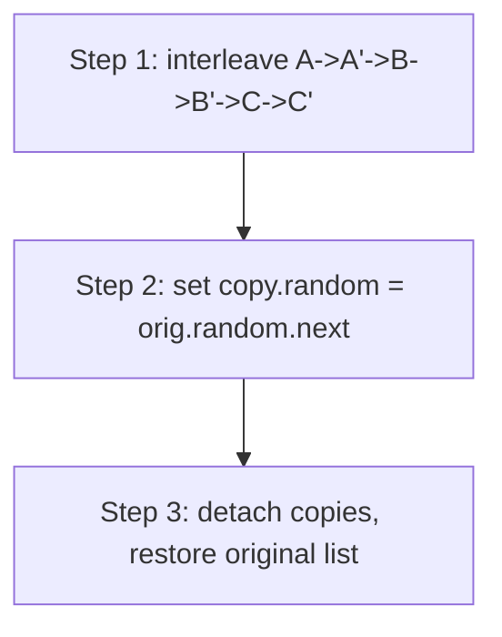

# Copy List with Random Pointer

| Meta | Value |
|------|-------|
| Source | LeetCode #138 |
| Difficulty | Medium |
| Topics | Linked List, Hash Map, Interleaving |
| Link | https://leetcode.com/problems/copy-list-with-random-pointer/ |

---

## Problem Statement
A linked list where each node has a `next` pointer **and** a `random` pointer (which may point to
any node or `null`). Return a **deep copy**: a new list with the same structure, where all
pointers reference the **new** nodes, not the originals.

**Example**
```
1 -> 2 -> 3
random: 1.random=3, 2.random=1, 3.random=2
Copy must have node1'.random = node3' (the copy), not node3 (the original).
```

---

## The Challenge — Random Pointers Break Linear Copying

If we copy nodes left to right, a `random` pointer may target a node **not yet created**. We need
a way to map each original node to its copy. Two clean strategies:

### Approach A — Hash Map (O(n) space)
Map `original -> copy` in a first pass (create all clones), then a second pass wires up `next`
and `random` using the map.

```python
def copyRandomList_map(head):
    if not head:
        return None
    clone = {}                              # original node -> copied node
    cur = head
    while cur:                              # pass 1: create clones
        clone[cur] = Node(cur.val)
        cur = cur.next
    cur = head
    while cur:                              # pass 2: wire pointers
        clone[cur].next = clone.get(cur.next)
        clone[cur].random = clone.get(cur.random)
        cur = cur.next
    return clone[head]
```

```cpp
// struct Node { int val; Node* next; Node* random;
//               Node(int x): val(x), next(nullptr), random(nullptr) {} };
#include <unordered_map>
using namespace std;

Node* copyRandomListMap(Node* head) {
    if (!head)
        return nullptr;
    unordered_map<Node*, Node*> clone;       // original node -> copied node
    Node* cur = head;
    while (cur) {                            // pass 1: create clones
        clone[cur] = new Node(cur->val);
        cur = cur->next;
    }
    cur = head;
    while (cur) {                            // pass 2: wire pointers
        clone[cur]->next = cur->next ? clone[cur->next] : nullptr;
        clone[cur]->random = cur->random ? clone[cur->random] : nullptr;
        cur = cur->next;
    }
    return clone[head];
}
```

### Approach B — Interleaving Trick (O(1) extra space)
Weave each copy **right after** its original, so a copy is always reachable as `original.next`.



```python
def copyRandomList(head):
    if not head:
        return None
    # Step 1: insert each copy right after its original
    cur = head
    while cur:
        nxt = cur.next
        cur.next = Node(cur.val)
        cur.next.next = nxt
        cur = nxt
    # Step 2: assign random pointers using interleaving
    cur = head
    while cur:
        if cur.random:
            cur.next.random = cur.random.next   # copy's random = orig.random's copy
        cur = cur.next.next
    # Step 3: separate the two lists
    cur = head
    copy_head = head.next
    while cur:
        copy = cur.next
        cur.next = copy.next                 # restore original
        copy.next = copy.next.next if copy.next else None
        cur = cur.next
    return copy_head
```

```cpp
Node* copyRandomList(Node* head) {
    if (!head)
        return nullptr;
    // Step 1: insert each copy right after its original
    Node* cur = head;
    while (cur) {
        Node* nxt = cur->next;
        cur->next = new Node(cur->val);
        cur->next->next = nxt;
        cur = nxt;
    }
    // Step 2: assign random pointers using interleaving
    cur = head;
    while (cur) {
        if (cur->random)
            cur->next->random = cur->random->next;   // copy's random = orig.random's copy
        cur = cur->next->next;
    }
    // Step 3: separate the two lists
    cur = head;
    Node* copy_head = head->next;
    while (cur) {
        Node* copy = cur->next;
        cur->next = copy->next;              // restore original
        copy->next = copy->next ? copy->next->next : nullptr;
        cur = cur->next;
    }
    return copy_head;
}
```

---

## Why Interleaving Works

After step 1 the list is `A → A' → B → B' → C → C'`. For any original node `X`, its copy is
**exactly `X.next`**. So if `X.random = Y`, then the copy's random should be `Y`'s copy = `Y.next`.
That's the single line `cur.next.random = cur.random.next` — no hash map needed.

---

## Trace — `1 → 2 → 3` with `1.random=3, 2.random=1, 3.random=2`

**After Step 1 (interleave):**
```
1 → 1' → 2 → 2' → 3 → 3'
```

**Step 2 (random pointers):**

| node | node.random | copy random = random.next |
|------|-------------|----------------------------|
| 1 | 3 | 1'.random = 3' |
| 2 | 1 | 2'.random = 1' |
| 3 | 2 | 3'.random = 2' |

**Step 3 (detach):** restore `1→2→3` and extract `1'→2'→3'` with random pointers fully inside the
copy. Result is an independent deep copy.

---

## Complexity

| Approach | Time | Space |
|----------|------|-------|
| Hash map | O(n) | O(n) |
| **Interleaving** | **O(n)** | **O(1)** extra |

---

## Takeaway
When you must copy a structure with **arbitrary cross-pointers**, either (a) map old→new with a
hash table, or (b) **interleave copies inline** so each copy is one hop from its original — turning
"find the clone of node X" into the O(1) lookup `X.next`. The interleaving trick is the elegant
constant-space solution.
