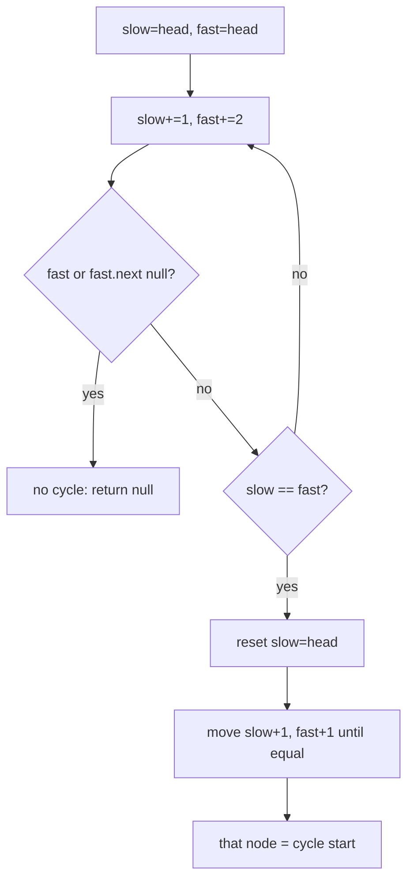

# Linked List Cycle II (Find Cycle Start)

| Meta | Value |
|------|-------|
| Source | LeetCode #142 |
| Difficulty | Medium |
| Topics | Linked List, Two Pointers, Floyd's Algorithm, Math |
| Link | https://leetcode.com/problems/linked-list-cycle-ii/ |

---

## Problem Statement
Given the head of a linked list, return the node where the **cycle begins**. If there is no
cycle, return `null`. Do it with **O(1)** extra space.

**Example**
```
3 -> 2 -> 0 -> -4
     ^---------|     cycle starts at node with value 2
```

---

## Floyd's Tortoise and Hare

Two phases:
1. **Detect** the cycle: slow (+1) and fast (+2) pointers. If they meet, a cycle exists.
2. **Locate** the start: reset one pointer to head; advance both by 1; they meet at the cycle
   entrance.



---

## The Mathematics (Why Phase 2 Works)

Let:
- `L` = distance from head to cycle start.
- `C` = cycle length.
- `x` = distance from cycle start to the meeting point (measured along the cycle).

When slow and fast meet, slow has traveled `L + x` and fast has traveled `L + x + nC` for some
integer `n ≥ 1` (fast looped the cycle `n` extra times). Since fast moves twice as fast:

$$
2(L + x) = L + x + nC
$$

Simplify:

$$
L + x = nC \quad\Longrightarrow\quad L = nC - x = (n-1)C + (C - x)
$$

Interpretation: `L` (head → cycle start) equals `(C − x)` (meeting point → cycle start, going
forward) plus whole loops. So a pointer starting at **head** and a pointer starting at the
**meeting point**, both moving one step at a time, will **arrive at the cycle start
simultaneously**. That is exactly phase 2.

---

## Code

```python
def detect_cycle(head):
    slow = fast = head
    # Phase 1: find meeting point
    while fast and fast.next:
        slow = slow.next
        fast = fast.next.next
        if slow is fast:
            break
    else:
        return None              # loop exited normally -> no cycle

    # Phase 2: find entrance
    slow = head
    while slow is not fast:
        slow = slow.next
        fast = fast.next
    return slow                  # == fast == cycle start
```

```cpp
ListNode* detectCycle(ListNode* head) {
    ListNode* slow = head;
    ListNode* fast = head;
    bool hasCycle = false;
    // Phase 1: find meeting point
    while (fast && fast->next) {
        slow = slow->next;
        fast = fast->next->next;
        if (slow == fast) {
            hasCycle = true;
            break;
        }
    }
    if (!hasCycle)
        return nullptr;          // loop exited normally -> no cycle

    // Phase 2: find entrance
    slow = head;
    while (slow != fast) {
        slow = slow->next;
        fast = fast->next;
    }
    return slow;                 // == fast == cycle start
}
```

---

## Trace — `3 -> 2 -> 0 -> -4 -> (back to 2)`

Nodes indexed: `A(3) B(2) C(0) D(-4)`, with `D.next = B`. Here `L = 1` (A→B), `C = 3` (B→C→D→B).

**Phase 1:**
| step | slow | fast |
|------|------|------|
| 0 | A | A |
| 1 | B | C |
| 2 | C | B (D→B then B→C... fast does 2) |
| 3 | D | D |  ← meet at D

They meet at `D`. **Phase 2:** reset `slow = A`.
| step | slow | fast |
|------|------|------|
| 0 | A | D |
| 1 | B | B |  ← meet at B = cycle start ✓

Answer: node `B` (value 2).

---

## Why Fast Can't "Skip Over" Slow

Inside the cycle, the gap between fast and slow shrinks by exactly **1** each step (fast gains 2,
slow gains 1, net +1 closing on a circular track). A gap that decreases by 1 every step must hit
**0** — they cannot leap past each other. This guarantees detection.

---

## Complexity

| Metric | Value |
|--------|-------|
| Time   | O(n) — phase 1 and phase 2 are each linear |
| Space  | **O(1)** — just two pointers |

### Alternative
A hash set of visited nodes detects the cycle start in O(n) time but **O(n) space** — Floyd's
is preferred for the constant-space constraint.

## Takeaway
Floyd's algorithm is a beautiful marriage of **two-pointer technique** and **modular
arithmetic**. The identity `L ≡ C − x (mod C)` is worth internalizing — it also solves
"find the duplicate number" (LeetCode 287) by viewing the array as a linked list.
